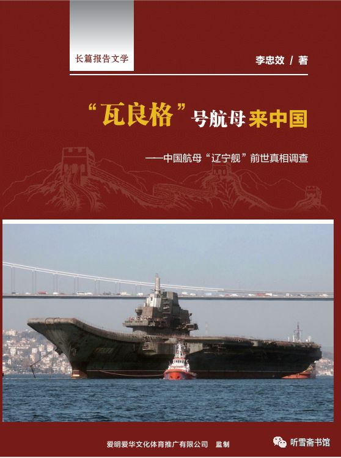
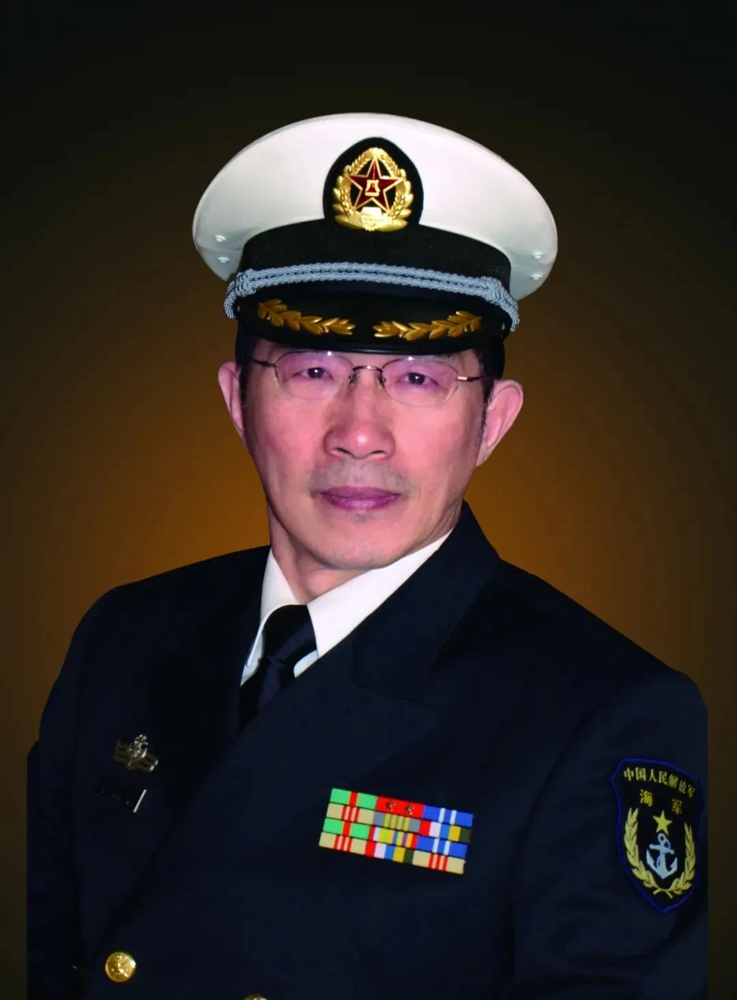

# 纪实文学报告

无意间发现，有更专业的人，整理出了，关于瓦良格号来中国的详尽历程：

* 长篇报告文学
  * “瓦良格”号航母来中国
    * 中国航母“辽宁舰”前世真相调查
  * 作者：李忠效

现在整理如下供参考。

## 作者 李忠效 简介

李忠效，笔名：钟笑。

海军政治部创作室一级作家，中国作家协会会员，中国报告文学学会理事。

1955年11月出生，1969年12月入伍，历任潜艇轮机兵轮机班长、轮机军士长、宣传干事、创作员、潜艇副政委、创作室主任等职。1974年开始发表文学作品，1978年开始从事专业创作，1989年毕业于解放军艺术学院文学系。

主要著作有：长篇纪实文学《我在美国当律师》、《我在加拿大当律师》、《联合国的中国女外交官》、《丹心素裹－－中共情报员沈安娜口述实录》、长篇小说《酒浴》、《冀上家园》、《从海底出击》，作品集《升起潜望镜》、《蓝色的飞旋》、《核潜艇艇长》等20余部，并有电影《恐怖的夜》（编剧），电视连续剧《海天之恋》（编剧）、文献纪录片《刘华清》（总撰稿）等影视作品多部。
