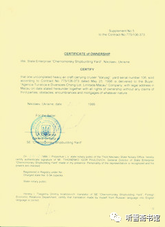

# 第九章 黑海船厂

## 一

1999年8月28日，戴岳和张勇以及刘继律师从北京飞抵乌克兰首都基辅。常驻乌克兰的华商杨秋实到机场迎接他们。

杨秋实原为哈尔滨一所学校的老师（另有一说是哈尔滨一家工厂的副厂长），俄语很好，“文革”期间受到冲击，后来就去了苏联，在乌克兰开了一个小公司，主要是为来乌克兰做生意的中国人联系业务，兼做俄语翻译。戴岳和张勇出国之前，经戴岳的朋友介绍，联系上了杨秋实这个“乌克兰通”。

杨秋实在乌克兰多年，认识很多乌克兰工商界人士。他给张勇和戴岳介绍了一家乌克兰中介公司――马什公司。据杨秋实介绍，马什公司背景比较特殊，该公司老板原是苏联克格勃特工，与俄罗斯总统普京曾是同事。张勇和戴岳与马什公司的业务经理萨沙进行了接触，该公司愿意作为代理公司在乌克兰处理与“瓦良格”相关事务。

戴岳和张勇还根据邵淳的指示，带去了一位造船研究所的专家崔正雄。崔正雄的任务是勘察一下“瓦良格”号航母的状况。他因故晚走一天，于9月1日到达基辅。

9月2日，张勇和戴岳在杨秋实和萨沙的陪同下，与崔正雄一起前往乌克兰黑海造船厂。刘继律师留在基辅处理之前徐增平遗留的荷兰拖船欠费问题。

1998年，徐增平曾与荷兰的拖船公司签订了租赁使用协议，但是荷兰拖船到了黑海造船厂以后，一直没有使用，也一直没有付款。荷兰公司提出：立即支付大笔的拖船费和罚息；如果不付款，就准备向法院申请扣押这条船。刘继律师是东方汇中公司的常年法律顾问。他熟悉国际法，又在美国做过航运公司的运营主管，熟悉贸易和运输业务，与荷兰拖船公司谈判欠费的事情，就由他留在基辅来处理了。

张勇和戴岳一行乘坐长途大巴，经过数小时的颠簸，来到黑海造船厂。他们都是第一次与造船厂的有关人员见面。船厂办公室主任仔细打量了张勇和戴岳等人陌生的面孔，露出一种不信任的表情。他拿着澳门创律公司的授权书，对着以前双方签订的协议，把澳门创律公司的两个图章重叠在一起，迎着窗外的阳光进行认真的比对。

厂办主任的这个举动，让戴岳感到很奇怪，就问张勇：他们这是干什么？

张勇便把他如何发现徐增平给的印章是假的，如何连夜加急重刻了一枚新章的情况小声说了一遍。戴岳和张勇对望了一下，会意一笑。

很显然，徐增平已经提前通知了船厂，让他们认真检查印章，如果印章对不上，中国来的这伙人就是冒牌儿的。

张勇心想：好悬！多亏出发之前多了个心眼儿，要不然这一趟乌克兰就算白跑了！

厂办主任看完印章，没有发现问题，就在厂长的耳边小声嘀咕了几句什么，厂长这才郑重其事地表示欢迎中方人员的到来。接着双方开始正式商谈“瓦良格”善后事宜。

戴岳和张勇此行的主要任务是弄清楚徐增平在“瓦良格”项目上到底还欠对方多少钱，还有哪些未尽事宜需要处理。

厂办主任搬来一大堆帐本给张勇等人看。戴岳起身走到窗前，往外看了一眼，意外发现楼下有一个中国人走来走去，感到很可疑，就问杨秋实：认不认识那个人？

杨秋实说：他是澳门创律公司派驻乌克兰的代表。平时住在基辅。

“听说徐增平在基辅有个代表处，你知道么？”戴岳问。

“知道，也不算什么代表处，就一个人，住在宾馆里，香港公司有人来了，他就负责接待一下。”杨秋实说。

戴岳走下楼去，想问问他在这里探头探脑地想干什么，那人看到戴岳，就匆匆躲开了。戴岳通过跟他下楼来的杨秋实向船厂保安询问：这个人在这干什么？

保安说：他在打听你们的情况。

戴岳给了保安100美元，对他说：明天我不希望再见到他。

保安说：没问题，你放心。

第二天，这个人果然就没在这里出现。

这次到乌克兰，张勇带了一部新款的摩托罗拉牌“掌中宝”手机，船厂厂长见了，很是羡慕，就说：“张先生，我看一下。”厂长拿在手里把玩，爱不释手的样子，张勇一下就看出了苗头：对方喜欢，想要又不好意思开口。

当时乌方参加谈判的有乌克兰政府的官员和船厂厂长、副厂长、总工程师等一共8个人，张勇当即表态说：“厂长先生，下次我们来，在场的这些人，每人送一部手机给你们。”杨秋实把张勇的话翻译成俄语，对方听了非常高兴，热烈鼓掌。

## 二

在此之前，张勇只是负责帮助协调北京华夏证券公司与香港创律公司的关系，监督徐增平在“瓦良格”项目上的操作，并未介入拖带航母的具体技术事务。这次到了黑海造船厂他才知道，要把“瓦良格”拖走，有一系列的工作要做：首先要联系过土耳其海峡的手续，其次要租一艘大马力的拖船，还要打通尼古拉耶夫港务局的关系，等等，而这些工作，徐增平都没做完。邵淳天天期待“瓦良格”归航，这些工作不落实，何谈航母离码头？

在了解了具体情况之后，张勇深深感到，要把这样一艘没有动力的航母从黑海拖到中国，远非澳门创律这种民营公司力所能及。但是，事已至此，骑虎难下，只能继续摸着石头过河――走一步算一步了。

船厂办公室主任交给张勇一份“瓦良格”号航母的清单，一共有三页纸，100多项内容，几乎把船上值钱的东西都列出来了。大到锅炉、主机，小到几米长的钛合金材料制造的管路。应该承认，黑海造船厂虽然把“瓦良格”号航母当废铁出售的，却把不是废铁的东西都做了说明。

戴岳和张勇要上航母看看，船厂副厂长维尼克亲自陪同，萨沙还带了一台摄像机给他们拍录像。走到航母跟前，维尼克对张勇说：“你们不要抬头，‘瓦良格’已经被美国卫星固定了，每个上航母的人，卫星都能照得清清楚楚。”

航母的船舷上有两个登舰的舷梯，每个舷梯口有一个中年妇女站岗。她们是船厂保卫处的女保安，身穿苏联红军制式服装，腰间扎着皮带，皮带上还挂着一只小手枪。她们虽已中年，倒也英姿飒爽。

戴岳和张勇等人都是第一次上航母，站在这个庞然大物的甲板上，他们感到自己非常渺小。航母的甲板有4个标准足球场那么大，到处锈迹斑斑，落满了海鸥的白色粪便，给人一种苍凉之感。

* 
  * 在黑海造船厂“瓦良格”号航母前合影（张勇提供）
    * 坐起：张勇、维尼克（黑海造船厂副厂长）、戴岳、崔正熊

图：

* 
  * 刘继在黑海造船厂“瓦良格”号航母前合影（刘继提供）

张勇要下到底舱去看看那4台主机，维尼克说：张先生，你不能下，下去就上不来了。

“为什么？”张勇问。

“这个船已经好几年没有人下去了，里面没有电源，没有照明设备，全船一共有3600多个舱室，如果走错了，就像进入迷宫，没法出来，会闷死在里面，变成一堆白骨。”

让维尼克一说，大家顿时感到浑身冷飕飕的。戴岳问张勇：你看它干啥？

张勇说：我关心这个。这是咱们国家需要的，这个主机，目前咱们做不了。据我了解，两台主机可以装一条驱逐舰。

戴岳说：别下了，上不来就麻烦了。

张勇是高级工程师，懂一些机械专业的东西。他本来想对照清单进行验收，既然下不去，就拿出清单对维尼克说：你要签字，保证清单上的东西都在，没有缺失。

“我保证。”维尼克痛快地在清单上签了字。

张勇想：苏联解体了，航母没人管了，能拆的东西都拆了，主机在7甲以下，就因为拿不出来，所以还在。不看也罢，反正丢不了。

张勇和戴岳的这次乌克兰之行，与乌方签订了两个文件。

1999 年8月31日签订了关于购买“瓦良格”航母的附加协议书。主要是将前期澳门创律公司所欠黑海造船厂的滞纳金和靠港费确定下来。

1999年9月2日签订了解决关于购买和交付瓦良格的一些争议的议定书。

据张勇回忆，协议盖章的时候，还有一段有趣的花絮。黑海造船厂的印章很大，船厂办公室主任拿着印章在张勇和戴岳的眼前晃了晃，有些炫耀的意思。印章外面有个不锈钢框架，定位之后，再用力一按中间的印章，“咔嗒”一声，像盖钢印一样。船厂办公室主任盖完章，还朝张勇一笑，那意思好像是说：看看，你们的章子没有我们的响吧？轮到张勇盖章了，他也学着对方的样子，用力一按，“咔嗒”一声，声音并不比对方的小。大家都笑着鼓掌。

* 
  * 张勇代表澳门创律公司在协议书上盖章（张勇提供）

签完协议，戴岳向乌方提出要看看航母图纸，维尼克带他们去了图库。图库很大，图纸很多，都是施工图。

“瓦良格”是由苏联时期的涅瓦设计局设计的，苏联解体以后，设计图纸留在俄罗斯，施工图纸留在乌克兰。

请读者注意，此时是1999年9月初，“瓦良格”的施工图纸还静静地躺在黑海造船厂的图库里，并不像香港《南华早报》发表的《中国秘密航母交易：大事回顾》所说：“1998年3月20日──航母的蓝图（重40吨）由陆路再经空运至北京。”

关于图纸的重量，在《济南时报》刊登的《徐增平：买回“瓦良格”的山东人》一文中，则是20吨，而非40吨。

《山东人》关于图纸的描述非常“生动”，给人以身临其境之感：

厂长告诉徐增平，那些资料起码有近20吨重，他们用了两个大资料库来放它。如果中方运回去再翻译的话，仅专业翻译就要一百人干两年，还要数十名其他技术人员再去核对校准，工作量之大难以想象。

来到船厂，经过一番仔细验证审核后，在警卫军官跟随下，徐增平和船厂总工程师来到六楼的航空母舰专用资料库。徐增平注意到，资料库内每层楼都有有线电视监控系统和红外线报警装置，还有两人组成的巡逻队定时逐层巡逻检查。来到六楼后，只见保管员和警卫军官各取出一把钥匙，两人各自插入上下的锁眼，然后各自旋转密码盘核对密码，同时分别用右手放在两个电脑触摸屏上，不一会儿电脑发出声音：“密码正确，掌纹无误，欢迎进入第×资料库。”

一进资料库，徐增平就感受到这个资料库的宽大和标准：每个资料柜都是铁制的，整齐地分行排列着，柜上用俄文标注着物品名单，窗户都用厚厚的窗帘遮挡着，室内温度适宜，柔和的日光灯管发出轻轻的嗡嗡声，房间内几乎一尘不染。保管员随手打开一个柜子，只见柜内整整齐齐排放着纸质封皮的资料档案。徐增平问“不知资料都还齐全吗？”总工程师自豪而有把握地说：“凡是我们乌克兰掌握的资料都在内，我保证，因为这是我们的国宝，我们没有任何理由不好好保护它。”

让徐增平难忘的是，当天等到所有的资料柜都装上车，由海关的人封固好车厢后，只见刚才还面无表情的警卫军官们，突然一声号令，立刻所有警卫人员都从楼里跑了出来，列队在卡车前。随着又一声口令，所有的人都严肃地向卡车敬礼，船厂厂长和海关商检人员也都不由自主地举起右手行礼。徐增平当时看到身旁的船厂厂长和总工程师等人的眼眶慢慢红了，流出了大颗大颗泪珠。这些图纸资料加上铁箱子总重量约有四五十吨，当天运走时整整装满了8辆大卡车。8辆卡车当晚直奔基辅机场，资料连夜运回国内。

这些图纸运回来后，经过仔细查对，发现30多万张设计图纸中，有部分关键部位的图纸缺失。后来徐增平经过多重渠道了解得知，原来在徐增平他们到船厂之前，乌克兰国防部和俄罗斯的情报人员已取走了那部分关键图纸。后来，徐增平再赴乌克兰，通过私人关系，终于说服了黑海造船厂厂长和总工程师，将船厂工艺室保存的另一套完整的图纸拿了回来。

也许是这段文字太“逼真”了，后来被网友大肆转发，并被一本编者自称为“中国航母第一书”的《中国航母》引用（参见《中国航母》第105页）；另外还有一本编者宣称为“还‘瓦良格’以真实的历史面目”的“权威”出版物《瓦良格迷局》，以此为依据，进行了更为“生动”的描写（参见《瓦良格迷局》第96－100页）。不知是该书作者补充采访了徐增平，还是作者自己想象出来的。

后来北京电视台“档案”栏目制作了一期节目：《圆梦航母“辽宁舰”》，主持人绘声绘色地又把徐增平虚构的故事讲述了一遍。再后来徐增平竟然以此为依据说：北京电视台的《档案》节目，正面准确还原了历史……（有关“瓦良格”图纸一事，请参见本书附录二：《纠正媒体在“瓦良格”报道中的错误》之三《关于徐增平买回20吨“瓦良格”图纸的问题》）

我发现，多年来，徐增平把自己对媒体说的话再拿来当作证明自己的证据，已经成为惯用的伎俩。

我在采访张勇时，对照资料读了三段给他听，然后向他求证：“你们看到的图库，是不是像网上说的这样？”

张勇马上表态说：那都是他们胡编的。乌克兰很穷，那个年代也没有这么先进的技术。我们去看的图库，就是一个很普通的存放图纸的房间，里面有很多架子，没有电视监控系统和红外线报警装置，也没电脑触摸屏和掌纹识别器，什么都没有。可能很长时间没有人进去了，到处都是灰尘，很多灯泡不亮了，黑咕隆咚的，我们随便看了一下，也没往里面走，就出来了。

后来我又向多人求证图纸问题。据了解情况的人说，徐增平根本没有买过什么图纸。那些图纸是2002年中船重工集团公司买回来的（请参见本书附录四《关于购买“瓦良格”号航母图纸的真相》）。

很显然，这个用8辆卡车运送20吨图纸的情节完全是杜撰的。只是不知道是徐增平“杜撰”的，还是作者“杜撰”的。

张勇和戴岳当时看过航母图库之后，张勇悄悄提醒戴岳：不要轻易提要求，防止被他们敲诈。就是他把图纸给了你，乌克兰海关也不会让出境，这不是他能决定的。

戴岳点头表示同意，然后告诉对方：图纸的事情以后再说。

二人带着新签的两份协议回到北京，向邵淳汇报了乌克兰之行的收获，也谈了他们了解到的一些难处。邵淳听说在过去的一年多时间里，“瓦良格”项目几乎毫无进展，还因此增加了几十万美元的码头停泊费用，气就不打一处来，忿忿地说：徐增平这个骗子！我们让他给坑苦了！

## 三

张勇回到香港，徐增平连续给他打电话要求见面，并希望他向有关领导汇报。1999年9月7日晚，张勇根据邵淳的指示，到徐增平办公室，与他进行会晤。随后，张勇将与徐增平的谈话整理出来，发往北京。

以下是张勇整理的不做文字修饰、也不加评论的《徐增平谈话纪要》－－

“我希望我们双方共同努力把航母拖回来，对大家都有利，不希望别人看笑话……”

“北京的合作伙伴都不错，高老板、邵老板等都很好。可怎么不相信我呢？把事情弄成这样，不理解……”

“我确实想尽快把船拖回来，但我确实当前自身困难很大，天天有人上门催债，若我不在，别人以为我跑了，那么事就闹大了。我处在生死关头，若北京高老板（指高增厦）等像吴总（指吴巍）承诺我的那样，帮助我一下，比如，我把20%股份转出去，先给我20%中的20%，大约1500万港币，我把火救一下，马上配合去拖船。等船回来后，再分期给我钱都可以。到时我有了钱，我真不想把20%股权转出去，目前是无办法之办法……”

“若北京真能考虑支持我一下，我会首先向高老板检讨我的问题，同时我会由香港律师出一份大授权书，请北京你们全权处理此船之事，但土耳其我亲自负责解决，保证通行，费用由我支付……”

“老张，我说心里话，我可不愿意大家搞得你死我活，这是一个非常有利的项目，大家又都是很不错的朋友，希望你能把我的想法尽快（今晚）转告北京领导，希望在9月10日前有个明确结果。”

“我希望近日到北京与高老板、邵老板、戴老板（指戴岳）、吴总等会晤。”

“若不能理解我的困难，不能支持我眼前的燃眉之急，那我就不顾一切采取以下行动：我已经准备了10天左右，也有人给我出主意：一、我将由我的大律师给乌克兰船厂发一份律师信，告知我们船东内部有法律纠纷，该船不得拖走，来阻止你们。二、我又准备了一封给上层有关领导的信，是报告全部具体过程，包括谁出资金，给谁去买船等，这样就会牵涉到许多人，但我也没办法。如果大家斗到底，我就要你死我活。假如你们打狗，也应最后给它一条路，让它跑了为好，若死逼打它，狗也会临死之前咬你一口。三、我已与有关方面准备卖船，9月10日为限，因此你们应在此时做出决定。否则10日后，我不会再与你们有任何联系，我做我的，你做你的。四、我的律师也研究了与泰信达签的股权协议，在甲乙丙三方的责权利条款中，是你们丙方违约。我们将采取法律行动，我会闹得大家都不太平。五、我知道你们的计划，我将在你们拖船之前，采取有关行动，看你怎么办！”

“老张，我不希望逼得我去这样做，因此希望你，也只有你来协调这些关系，我也不想与北京方面弄得不快。请你尽快把我的意见通报过去，尽快解决。”

据张勇回忆，徐增平要求谈话的中心意思是要向华夏证券公司借钱，你不借钱，我就给你毁了！

从张勇的原始记录中，徐增平提到“打狗”，并称“应最后给它一条路，让它跑了为好，若死逼打它，狗也会临死之前咬你一口”。话语之中，真有点“狗急跳墙”的味道。

当时邵淳已经认清了徐增平的面目，自然不会再借钱给他了。他与张勇这次带有威胁性的谈话，让邵淳对他产生了更大的警惕性。之前1999年8月3日的特别股东大会，邵淳为了照顾徐增平的情绪，还给他留了一个普通经理头衔。而他近期的表现，越来越不像话，居然向北京“联合领导小组”发出“狗也会临死之前咬你一口”的威胁。邵淳认为，必须把他彻底清理出去，以免后患。

1999年9月中旬，乌克兰方面给澳门创律公司发来邀请函，邀请戴岳和张勇去洽谈“瓦良格”交船事宜。为了保证下一步的交船谈判顺利进行，1999年9月23日，刘继以澳门创律公司的名义起草了一封致黑海造船厂的函，由戴岳签名发出。该函主要内容是申明我方付款义务已完成，分别是：2000万美元购船款已于1999年4月30日之前付清，617.7177万美元滞纳金也已于1999年9月19日付清。该函还承诺，1999年9月30日后每天向乌方支付1万美元的停船费。

由于乌方多次重申，购船合同10月底到期，为防止差错，戴岳专门安排了第二次乌克兰之行。

当时张勇正忙于准备两个法律文件，一个是与乌克兰谈判用的文件，一个是召开澳门创律公司股东大会的文件。

戴岳对张勇说：“张总，你在香港准备法律文件，我先去，需要签字的时候，你再飞过去。”

戴岳和刘继先到土耳其，见到了乌克兰马什公司介绍的一个土耳其富豪，向其咨询下一步“瓦良格”号航母过土耳其海峡的有关事宜，之后抵达黑海造船厂。戴岳与乌方敲定了交船日，并使乌方认可和接受了他需提交的所有证明文件，排除了交船之前的所有障碍。戴岳和刘继的乌克兰之行取得圆满成功。同时戴岳也发现，对方有个别人态度有些冷淡。戴岳很奇怪，回来以后对张勇说：“张总，这次×××态度很消极，不知怎么回事。”

张勇忽然想起自己答应送手机的事了，就说：“我曾经说每人送他们一部手机，你没有带礼品，我又没去，肯定人家以为我故意回避了。下次去一定要带上。”

就在这时，东方汇中公司发生了一件事，高增厦被迫辞去公司董事长职务。所谓“被迫”，就是徐增平在背后搞的鬼。

1999年4月，东方汇中公司接手“瓦良格”项目以后，高增厦开始利用他的一些资源展开工作，并对徐增平进行短兵相接的面对面斗争。经与徐增平进行几个回合的交手，高增厦明确提出：目前不要和徐增平纠缠，先把航母弄回来再说。等航母一拖到中国口岸，再找徐增平算账！

在东方汇中公司介入“瓦良格”项目的同时，邵淳派出吴宇和吴巍找徐增平谈判，迫使徐增平用澳门创律公司的股权冲抵他挪用的购船款，最后经吴巍的不懈努力，成功获得了超出预期的80%的股权，并将徐增平从董事会驱逐出去，剥夺了他运作“瓦良格”项目的资格，邵淳把项目交给东方汇中公司运作。

因此，徐增平对高增厦的态度不言自明。

1999年9月中旬，徐增平给中央军委某领导写信告了高增厦一状，说高增厦作为一个将军，参与买航母这个项目，政治上很敏感，影响巨大，如果美国联合东南亚各国对我国实行经济制裁，将会给我国造成巨大经济损失……云云。这位领导将此信转给总后勤部。总后派人调查此事，还曾找吴巍等人了解过情况。

吴巍对调查人员说：“别信徐增平的，我知道怎么回事。”吴巍如实将有关情况做了介绍。

虽然东方汇中是个民营公司，但是公司董事长是退役将军，另外公司高管中还有几位退役校官，给人的印象是一个有军方背景的公司，常常被人误以为东方汇中就是一个军方的公司。

在这种情况下，为了避免外界产生误解。1999年9月18日，高增厦向公司董事会提交了辞呈。但是董事会并没有马上接受他的辞呈。董事会认为，公司业务很忙，很多工作暂时离不开他。一直到10月21日，在高增厦的多次口头催促下，董事会才接受他的辞呈。董事会决定：高增厦、王广平不再担任“东方汇中投资控股公司”董事。委派刘兴元、张勇接替其董事职务。并决定，刘兴元出任该公司董事长，戴岳继续担任总经理，张勇出任副总经理。

刘兴元是何许人？按照中国国际新闻传媒集团发表的《历史真相：“辽宁舰”前身“瓦良格”号航母不是徐增平购买的》一文的说法，刘兴元为“有关部门涉外机关”的关系人。

但是，购买“瓦良格”的“金主”是华夏证券公司，是邵淳。虽然表面上是东方汇中公司在运作，实际控制权仍然在邵淳手中，因为钱是华夏证券公司出的，邵淳有监督指导权，不会再像前期那样，任由徐增平胡来的事情发生了。

高增厦虽然退出了东方汇中公司董事会，邵淳却要求高增厦继续担任联合领导小组组长。邵淳说：公司董事长可以不当，联合领导小组组长要继续干，这是我们协商的，别人也管不着。因此，高增厦在辞去东方汇中公司董事长之后，又继续负责“瓦良格”项目一段时间。

按说，徐增平给中央军委副主席写信，把高增厦的董事长告下来，他的目的达到了。可是不知为什么，不久他又委托公安部的一个局长、林则徐的后裔林强给高增厦带话，向高增厦表示歉意。高增厦没有接受。

接着，徐增平又委托小品演员朱时茂带话，向高增厦表示歉意。朱时茂对高增厦说：你原谅他吧！

高增厦说：我又没惹他，主要责任在他。他要真心表示歉意，就写一个书面的道歉信。

徐增平可能不愿把道歉的内容落到纸上，一直没有写这个信。后来，徐增平又委托总参某部的顾局长，约高增厦到深圳阳光酒店见面。徐增平请高增厦吃饭，当面道了歉。

笔者采访高增厦时，不解地问他：徐增平为什么三番五次要找你道歉呢？

高增厦说：我也不知道他是什么目的。也许是为了维护他的利益吧！

我仍然不明白，向高增厦道歉能维护他徐增平什么利益呢？也许是他觉得没有必要得罪高增厦吧？可是他把高增厦从东方汇中公司董事长的位置上拉下来，就已经把高增厦得罪了，简单地道个歉也于事无补啊！这个问题只有徐增平知道答案。 

1999年10月9日，澳门创律旅游娱乐公司股东大会在澳门友谊大马路置地广场23楼2301室林笑云大律师楼召开，会议由大股东代表张勇主持，议程和决议内容以及所签署文件由刘继会同林笑云律师制定。会前，董事会通过律师刘继通知了徐增平等人开会的时间、地点和议程，徐增平方面的董事一个也没有到会。股东大会表决通过“免去徐增平在澳门创律公司一切职务的决议”，张勇在股东大会律师文件上签了字。律师证明这个决议合法有效。从此，徐增平被彻底踢出澳门创律公司“瓦良格”项目。

股东大会授权戴岳和张勇赴乌克兰尼古拉耶夫市黑海造船厂，洽谈、办理有关“瓦良格”交易付款、签署资产移交等法律文件及其他手续，并规定必须二人联签的法律文件方能生效。

## 四

1999年10月17日，东方汇中公司聘请的船舶专家崔正雄先期动身去乌克兰；23日，戴岳、张勇随后赶到；刘继律师则是从美国纽约飞往奥地利首都维也纳，然后转飞乌克兰第二大城市敖德萨，然后与戴岳和张勇在黑海造船厂会合。

这次张勇和戴岳带去了8部摩托罗拉牌“掌中宝”手机，对方见了小巧精致的手机非常高兴。这些礼物的兑现也表示了中方的诚意。

不过，这次对方参加谈判的官员多出一人，手机分发到最后，船厂副厂长维尼克没有得到。张勇和戴岳上次来，大部分时间是由维尼克陪同，张勇对他比较熟悉，认为他为人诚恳，同时也了解到他的家境比较困难。张勇一看他没分到，就对刘继说：“刘继，先把你的手机给他吧！”

刘继的手机是公司刚给他买的，和礼品手机属于同一款式。在场的人都得到了同样的礼物，于是皆大欢喜。

当时在香港，一部摩托罗拉手机不到1000元港币，9部手机，也就不到9000元港币。戴岳悄悄对张勇说：“这次他们的态度，比上次热情多了。”

送完了礼物，双方开始谈判。

谈判的场面很壮观，乌克兰国防部军工局的官员和黑海造船厂的专家一共有十七八人，中方正式代表只有戴岳和张勇，加上俄语翻译杨秋实、律师刘继、船舶专家崔正雄一共才5人。

正式签协议之前，戴岳、张勇、崔正雄、杨秋实和刘继一起来看“瓦良格”。

漫步在“瓦良格”的甲板上，戴岳的心情很复杂。“瓦良格”的甲板很大，有三四个足球场那么大。因为常年无人养护，甲板上锈迹斑斑。戴岳对于这样一个破船到底能不能用，心存疑问。他问一起在甲板上漫步的崔正雄道：老崔，你说航母咱们能不能造？

崔正雄回答：能造。

戴岳一听中国能造，就想：大老远地跑到这里来买这个破船干什么？接着又问了一句：需要多长时间？

崔正雄回答：20年。

戴岳心里说：这不是大喘气嘛！既然需要20年，那还是把这个破船买回去

1999年10月24日，双方签订了“瓦良格”号航母正式交船议定书。

（合同复印件参见本书附录一：《本书正文中涉及的有关文件》之七《1999年10月24日中乌双方正式签署编号为77501“瓦良格”号航母买卖合同》）

* 
  * 1999 年10月24日，中乌双方正式签署编号为 77501“瓦良格号航母交船议定书
    * 左起：俄语翻译杨秋实、船舶专家崔正雄、律师刘继、张勇、戴岳、黑海造船厂外经处副处长霍特鲁彼、厂长季赫宁科 (张勇提供)

这个文件签订之后，造船厂向澳门创律公司移交了船主证、造船证、单程出航许可证、无债务纠纷担保书、商会原产地证书、海事登记局验船证明、船舱水流结构分布图、船体结构图、购船发票等10份文件资料。这些文件资料是“瓦良格”号航母来中国的海上通行证，缺一不可。

* 
  * “瓦良格”船主证复印件（张勇提供）

这次在黑海造船厂，维尼克告诉他们：“从英国租来的拖航母的拖船到了。”

他们来到码头，戴岳找了半天没看到拖船在哪里。经维尼克指点，他才发现两条很小的拖船停在航母旁边的暗影里，怪不得没看见。

两艘拖船挂着英国的“米”字旗，一些水手正在用海水冲洗甲板。

张勇说：这个拖船太小了吧？能拖动航母么？

维尼克说：大拖船，租金很贵的。

戴岳说：拖船的吨位太小。如果遇到风浪，拖船可能就被航母拖走了！

张勇说：我们中国有句俗话，‘买得起马，就备得起鞍’。你们还是帮助联系大拖船吧！

维尼克耸耸肩膀说：好的，我们马上叫他们走。

维尼克在与张勇的交往中渐渐建立了友谊，交流起来也就比较放松。有一天，维尼克对张勇说：张先生，航母的资料都装在我的脑子里，中国方面如果需要我的话，我愿意到中国去。在我手里建造的航母不下10艘了。

张勇说：好的，需要的时候一定邀请你去中国。

回国途中，戴岳、张勇、刘继一起去了一趟土耳其，目的是想了解一下把“瓦良格”拖回来过土耳其海峡的问题。

乌克兰马什公司帮助他们联系的那个土耳其富豪，介绍了一个在土耳其海关工作的原海军退役少将，双方在土耳其伊斯坦布尔机场贵宾室见面。

退役少将首先强调了这件事情的难度，他说：土耳其海峡是重要的国际航道，每天从这里经过的船只很多。你们这个船很大，又没有动力，很难操纵。海峡有的地方很窄，如果大船搁浅，就会把整个航道堵上。另外，海峡两岸的名胜古迹很多，一旦大船失控，撞上去，土耳其的损失就大了。不过……退役少将停顿了一下，拍着自己的胸脯说，给我500万美元现金，我会把上上下下所有的关系打通，让你们顺利通过。

张勇说：500万太多了，二三百万怎么样？

退役少将坚定地摇头。

张勇对戴岳说：咱也不了解他的情况，不知到底能办到什么程度，这事咱俩定不了，以后再说吧！

戴岳点头表示同意。

张勇对退役海军少将说：很高兴认识将军阁下。我们下午还有事，回头我们向家里请示一下再谈。

当天晚上他们就离开了土耳其。在飞往敖德萨的飞机上，张勇对戴岳说：要把‘瓦良格’拖回来，难度比我们预想的要大。这一趟买路钱恐怕少不了。

戴岳说：回去向邵总汇报，让他定吧！

船舶专家崔正雄两次赴乌克兰，回来以后都写了报告交给邵淳和高增厦，报告称，航母的动力机械保护情况良好，可以利用的价值很高，并对该船提出三种处置方案：一是按照原设计续建，建造成一艘战斗舰；二是可以改造为一艘训练舰；三是将其拆解，进行研究，为中国建造航母形成技术储备。邵淳看了这个报告很高兴。他和高增厦决定派专家去乌克兰考察“瓦良格”号航母的目的，就没想要改造成赌船，所以专家的报告中根本没有提到赌船的事情。

崔正雄在1999年9月16日撰写的《对〈瓦良格〉舰技术考察的简报》中，特别提到“关于提供资料情况”。

崔正雄的报告说：一、工厂只提交供拖运所需的文件、图纸共21份。二、“瓦”舰施工设计图纸工厂存量很大（据过去了解有18000－20000份），但这次按合同一份也不提供。三、技术含量很高的“库”舰（即“库兹涅佐夫”号航母－－笔者注）技术设计资料工厂都有。但未让借阅图纸目录。在厂期间，查阅了“库”舰的型线图、总布置图和动力装置说明书等三份技术设计绝密资料。上述技术设计和施工设计资料，根据合同（原合同未要求）不提供买方。以后如果买方需要，要另行谈判签合同。

这份报告充分证明，那些报道中所说的那20吨图纸是虚构的故事。

* 
  * 1999年11月15 日在“瓦良格”飞行甲板上合影
    * 前排左起：崔正雄、维尼克、杨秋实 (崔正雄提供)

