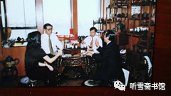
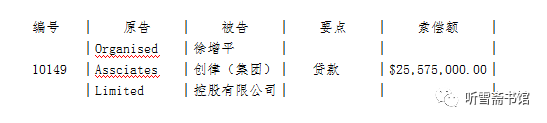

# 第八章 心急如焚

## 一

1999年5月8日凌晨，以美国为首的北约悍然轰炸了我国驻南斯拉夫联盟共和国大使馆，造成我方3人死亡，20多人受伤，其中多人伤势严重，使馆馆舍也遭到严重损坏。

美国和北约的这一野蛮行为，激起中国人民的强烈义愤，媒体上连续报道了各地群众抗议示威的活动。邵淳看了电视新闻，心情像一年前看“印尼排华事件”一样沉重。尽快把“瓦良格”拖回来的心情更加迫切。

根据徐增平此前的承诺，将800万美元尾款付给乌克兰，他就立即把航母拖回来。可是又一个星期过去了，仍然没有动静。邵淳给张勇打电话，让他继续催促徐增平。

5月14日，徐增平约张勇到他的办公室去，说是有重要的事情，张勇马上过去了。

徐增平拿出一份《船务代理合约》，对张勇说：老张，我与新加坡新华快捷船务公司签订了一份拖船合同。

张勇接过合同，仔细看了一下，其中“备航合约的应付利息”18万美元，“与土耳其海港局处理过境批文”费用20万美元，租用SABI E CAPF LTD（萨比卡夫）拖船公司拖船租金57.5万美元，“内河使用费、拖船码头费及辅助拖轮等费用”201,938美元。各种费用共计1,156,938.00美元。这个协议是当天刚刚签订的，时间为1999年5月14日，而且协议规定的付款时间是“一九九九年五月十五日前”。

这也太心急了点儿吧？张勇在心里说。

鉴于此前徐增平的种种表现，张勇对这个《船务代理合约》表示怀疑。从1998年10月10日召开澳门创律公司新董事会到现在，已经过去了半年多，从来不见徐增平为“瓦良格”项目着急过，现在可好，不动则已，一动就这么急。用得着这么急么？从签订合同到付款时间只有一天！

4月29日，香港达程投资公司一共收到8400多万港币，汇往乌克兰800万美元，折合港币是6400万元，又借给徐增平1000万港币，一共支出7400万元，账上还剩1000万元左右。徐增平这次要支出的115.6万美元，折合港币约900多万元，徐增平几乎是要把账上剩下的钱全部卷走啊！

张勇不动声色地对徐增平说：老徐啊！我一次次帮助你，北京对我不信任了，认为我的工作没做好。你在这方面也诚意不够。为了给你以后办事铺平道路，你得把事情做好。你能不能保证“瓦良格”尽快启航？

徐增平说：我保证！可以准时回拖。

张勇说：你注明一下，我向北京也好交代。

徐增平高兴地说：我给你写一个保函！

接着，徐增平就让秘书打印了一份“保函”，签字之后交给张勇。

保函全文如下：

```
                    保　函

  本人徐增平对澳门创律旅游娱乐有限公司交付新加坡快捷船务有限公司1,156,938美元的款项后，保证“瓦良格”号启航决不受影响，否则本人愿意承担全部责任。
  特此保函
      创律（集团）控股有限公司      
      徐增平　总裁（签名）      
      一九九九年五月十四日        

（保函复印件参见本书附录一：《本书正文中涉及的有关文件》之四《1999年5月14日徐增平的借款保函》）
```

张勇看到“本人愿意承担全部责任”，禁不住笑了。心里说：你能承担什么责任啊！

徐增平这样做，进一步加重了张勇的怀疑。他在商场上打拼了这么多年，只有欠债到期要还钱了才这么急，给别人钱去办事，没有这么急的。

张勇说：“徐总，我得向上级汇报一下，争取尽快给你答复。”

张勇拿着“保函”走了，回去之后就给邵淳打了电话。要租拖船了，“瓦良格”要启航了，按说这是一个好消息，邵淳却没有表现出兴奋，只是淡淡地说：“我知道了。”

张勇和邵淳一样对此事没有信心，因此就没有马上给徐增平汇款。徐增平那边催得很急，天天催。5月17日，张勇才签字，让财务人员把115.6万美元划到徐增平的账号上。

钱一到手，徐增平就“失踪”了，不再与张勇联系。几天过去，一点动静也没有，张勇给徐增平打电话，手机关机，办公室座机没人接。张勇打电话问创律公司董事会秘书梁启洪，租拖船的事情怎么样了？梁秘书说他不清楚，不是他经手办的。

张勇心中有些恼火，徐增平把钱骗走了，连面也不露了。1999年5月26日，张勇怒气冲冲，郑重其事地给徐增平写了一封措辞强硬的亲笔信：

```

                    关于我们支付115.6万美金后仍无行动

徐总：
  有几句话我不能不说，请你三思。
  首先别为了你公司目前的困难而影响了启航之大事，更不能在这紧急关头打资金的主意。既解决不了你公司的问题，反而误了大事，这个责任及分量你是十分清楚的。
  也请你重新看看你5月14日的有关支付115.6万美金的“保函”内容，不要忘记一年来你多次承诺。
  目前大家都明白，但不去说，为了大局。李×就是犯了他自以为是的毛病，最后自己倒台。老徐，我了解内幕，我们既是伙伴又是老乡，我应向你尽以实言，请你三思为上。
  希尽早到乌克兰安排启航，是头等大事，那时大家都得以解放。

      达程投资有限公司　张勇
              99.5.26              

（此函复印件参见本书附录一：《本书正文中涉及的有关文件》之五《1999年5月26日张勇致徐增平的催促函》：《关于我们支付115.6万美金后仍无行动》）
```

张勇把徐增平的“保函”复印了一份，在空白处写道：“小梁：请徐总重新解释5.14保证书的内容，事到如今怎么办？张勇，5.26”

张勇派人把信件送到香港创律公司，结果仍然没有回音。

张勇给香港创律公司的董事会秘书梁启洪打电话，问他：信转给徐总没有？

小梁说：转了。

张勇问：徐总怎么没有回音？一开始小梁吞吞吐吐，后来张勇火了：你们创律公司到底是怎么回事？老板说话不算数，秘书说话吞吞吐吐，以后还怎么和你们打交道！

小梁最后只好实言相告：新加坡的船务公司说，搞不定，又把钱退回来了。

“钱呢？”

“这得问我们老板。”

“船务公司收不收钱？”

“只收个手续费。”

张勇又给徐增平打电话，问他钱哪去了？徐增平公开说：花了。别的开支没有钱，把这笔钱划走了。

张勇心里骂道：骗子！真是厚颜无耻！

张勇事后查明，徐增平付给那个新加坡船务公司18万美金，剩余的97.7万美金全部落入徐增平腰包。

* 
  * 1999年5月，张勇在徐增平办公室商谈“瓦良格”号航母尽快启航事宜（张勇提供）
    * 左起：徐增平秘书、徐增平、香港议会议员、张勇

1999年5月29日，香港一家报纸刊登了一条徐增平购买豪宅的消息，张勇一看，恍然大悟，徐增平此前那些令人费解的行为，一下有了答案。

```
                  去年2.5亿购入　余数1.8亿昨付清
                        创律完成购深水湾37号

  ［本报讯］去年底以二亿五千万售出深水湾道三十七号的独立大屋，乐声电子执行董事谭学林指出买家已于昨日在最后限期完成交易，据中资背景创律集团徐增平正式入主这座有港版凡尔赛宫之称的独立大屋。

  （下略。全文参见本书附录一：《本书正文中涉及的有关文件》之六《1999年5月29日香港报纸关于徐增平购买豪宅的报道》）
```

张勇迅速将此消息转告邵淳、戴岳、吴宇等人。大家认为，徐增平买豪宅的时间是1998年底，航母迟迟不能启航，肯定是徐增平把钱拿去买豪宅了。

## 二

1999年6月的一天，吴宇打电话对张勇说：张总，这个股份咱不扛了。邵总说，为了稳住东方汇中，让他们和咱一起搞“瓦良格”的事，股份都转给他们。

吴宇话是这么说，心里却是不愿意的。16年后，吴宇接受我的采访时坦诚说道：邵总想把股权给东方汇中，我一开始心里就不同意，但是不好跟邵总说。他想的是能把这个事办成就行，可我不这样想。这个项目是用我隆泰源公司出的钱，融资也我去融的，冒着这么大的风险，凭什么拱手交给别人？我可以给你利润，却不能失去主动权。邵总说要给他们，我就跟着演戏，最后虽然协议签了，但转股手续一直没办。实践证明。我不办是对的。股份在华夏证券公司全资子公司香港达程的账上，证明国有资产没有流失。

后来随着事态的不断变化，高增厦退出了东方汇中公司董事会，变更股权的事便不了了之了。

高增厦为什么退出东方汇中公司董事会呢？是因为徐增平把高增厦告了一状。此为后话。

在华夏证券公司拿到澳门创律公司80%股份之后，华夏证券公司就成了澳门创律公司的大股东，有绝对的话语权。邵淳决定：要集中保管“瓦良格”项目的所有文件。在此之前，几乎所有文件都由徐增平的香港创律公司管理。现在大股东变了，大股东提出保管文件的要求是合情合理的，邵淳指定张勇负责找徐增平索要“瓦良格”项目的有关文件和印章。这个看上去并不复杂的工作，操作起来居然非常艰难。

按说，张勇和徐增平属于“瓦良格”项目的同一个团队，但是各有各的利益，各有各的想法，各有各的目的，于是就失去了默契配合的基础。徐增平由澳门创律公司的大股东变成小股东之后，正憋着一肚子气，要想让他把文件交出来，就像从他身上剜肉一样不情愿，极尽搪塞、推诿之能事。

张勇的达程公司在香港会展中心，徐增平的创律公司在香港世贸中心，两处距离不远，张勇每天从自己的公司步行到徐增平公司去“上班”，张勇戏称为“联合办公”。有时在徐增平那里一坐就是半天。

张勇每次去，徐增平都是笑脸相迎，客客气气地陪他喝茶，抽古巴大雪茄。张勇知道古巴大雪茄很贵，以前从未品尝过，在徐增平这里第一次体验到了。徐增平眉飞色舞地告诉张勇，古巴大雪茄和别的雪茄不同，它不但尼古丁很少，还可以清痰。如果吸一口放在烟缸上，它会自然熄灭，不会像别的雪茄那样自己一直烧完。什么时候想吸了，可以重新点燃，如果烟瘾不是很大的人，一只古巴大雪茄可以抽半天。

张勇问：多少钱一支？

徐增平说：要120元港币。

张勇听后感觉吃惊。当时他吸的香烟每包才20多元港币。

徐增平喜欢抽烟斗。他手握大烟斗，轻松喷出一口青烟，问张勇道：你知道我的大烟斗多少钱吗？

张勇说：不知道。

徐增平把大烟斗递给张勇看，得意洋洋地说：5000港币。他把手向室内陈列烟斗的架子上一挥：好的有几十万的。

张勇扫了一眼那些陈列架上的烟斗，对徐增平说：咱们还是谈谈正经事吧！

徐增平说：还有什么正经事？

张勇说：交文件的事。

徐增平若无其事地说：有的文件存档了，有的找不到了，还有的正在用……

他深深地吸一口烟，然后很享受地吐出一个个烟圈，眯着眼睛陶醉地欣赏着，然后再一挥手，把烟圈打散，悠然自得地说：放心吧！误不了事的。

张勇最看不惯他的这种表情，严肃地说：徐总，北京催得很紧，请你三天之内，把文件备齐，派人送到达程公司。拜托徐总费心了。

徐增平说：应该可以的，请张总放心吧！

就这样，半天过去了，一张纸都没有拿到。

三天期限已到，徐增平派人给张勇只送来几份没什么用的材料。张勇再去徐增平的办公室，徐增平仍然笑脸相迎，继续陪他喝茶、抽雪茄。徐增平仍然谈笑风生，一张口都是天南海北关于“瓦良格”的好消息。

“再有一周航母就开拖了。要再多出些钱就更快了。”徐增平说。

其实那时徐增平已经失去“瓦良格”项目的话语权，更没有指挥权。不了解内情的局外人还以为他仍在掌控局面，而张勇属于局内人，又了解徐增平的为人和底细，很难理解他说这些东西是什么意思。

张勇不接他的话茬，只是问：文件找得怎么样了？

张勇在徐增平办公室耗了半个月，在此期间，经常会碰到债主登门要债，每逢遇到这种情况，徐增平都会对张勇说：我和朋友到里面谈点事。然后就到隔壁房间去了。徐增平经常和“朋友”说着说着就吵了起来，从他们的争吵中，张勇偶然听到只言片语，几乎都与香港创律公司欠债有关。

“你不知道，每要一份文件有多难呀！”张勇后来对笔者说，“一些没用的先给你，有用的一推再推。”

事实证明，澳门创律公司80%的股份被华夏证券公司拿走了，徐增平的心情很不爽。故意拖延交出文件的时间，也不难理解。让我感到惊讶的是，据邵淳介绍，2003年初春的一天，徐增平来北京开会，打电话约邵淳见面，邵淳带着吴宇去了。徐增平见到吴宇，如同见到了仇人，上去就是一脚，把吴宇踹了一个跟头，吴宇差点和徐增平拼命。

徐增平的这个举动，吴宇没有对我提起过。可能是吴宇忘记了，或者是他不好意思讲述这种被人踢的遭遇。在我看来，这一脚踢出了徐增平的性格，也踢出了他做人的水准。

## 三

1999年6月下旬的一天，张勇在办公室里翻报纸，无意中发现1999年6月24日的《东方日报》上刊登了徐增平欠债的消息。《东方日报》上有一个“高院入禀状”栏目，专门刊登企业讨债信息。平时张勇不大看这个版，那天也不知怎么鬼使神差，居然把目光在这个版面上停了片刻，这一停，他的目光像被什么东西蜇了一下，他在“高院入禀状”栏目中看到了如下信息：

* 

张勇看到徐增平欠债打官司的消息，感到问题严重。以前只是外界在传徐增平到处欠债，被债主告到法院并登报，这还是第一次看到。可见债主对他已经失去信心和耐心了。张勇马上给邵淳打电话通报信息。

邵淳并没感到意外，只是气愤地说：这家伙在外面欠了一屁股债，他一定把买航母的钱也拿去还债了！

企业负债经营，按说也正常，但是把买航母的钱用来还债、买豪宅，就有点不地道了。

徐增平买的那所豪宅，曾经起到很大的广告效应。当时香港正处于亚洲金融危机最艰难的时期，能在此时花巨资购买豪宅的人自然会被媒体关注。

17年后，香港《南华早报》2015年5月1日发表《中国成功收购航母的“不幸功臣”－－徐增平》一文时还说：“徐增平最为人所知的，是在香港太平山拥有一幢凡尔赛宫式的豪宅。”

另一篇香港报纸文章则说：“徐增平曾在1997年亚洲金融危机后投资2.1亿港元买下有‘港版凡尔赛宫’之称的深水湾37号山顶豪宅而享誉一时。”

在徐增平“享誉一时”之际，邵淳则因为“瓦良格”项目被延误而“愤怒之极”。如果“瓦良格”不能拖回来，华夏证券公司的借款就有流失的危险，邵淳的处境就更被动了。那段时间，邵淳心急如焚。

1999年7月，邵淳决定重新调整澳门创律公司的管理层。

经过联合领导小组研究决定：东方汇中公司总经理戴岳任澳门创律公司总经理，香港达程公司总经理张勇任澳门创律公司副总经理，吴宇、吴巍、徐增平为经理。

1999年8月3日上午10：30时，澳门创律旅游娱乐有限公司在位于澳门友谊大马路置地广场23楼2301室力图律师事务所召开特别股东大会，会议的唯一议程为：改组公司管理层的有关成员。

张勇主持会议，林笑云大律师见证会议过程，并出具法律《证明书》。

会议做出如下决议：

```
一、将现有经理部成员全部免职。
二、委任以下人士为“创律”经理部的新成员：
1.总经理：非股东戴岳先生；
2.副总经理：非股东张勇先生；
3.经理：
  A）非股东吴宇；
  B）非股东吴巍；
  C）股东徐增平。
```

徐增平没有参加此次会议。因张勇代表的华夏证券公司持有澳门创律公司80%的股权，具备多数法定权力人资格，可以做出有效决议。

笔者在写作本书时，查阅了很多资料，发现一个很有意思的现象，在很多写“瓦良格”和徐增平的文字中，都写到一个“瓦良格”离开黑海造船厂的时间：1999年7月。

《南华早报》的《“不幸功臣”》一文说：

> 北京办公室运作了18个月，1998年3月徐增平与乌克兰当局签署航母交易协议后，该办事处随即关闭。基辅的办公室则继续运作，直至该航母于1999年7月驶离黑海造船坞。

《瓦良格迷局》一书说：

> 1999年7月，澳门创律公司雇用ITC公司（International transport contractors,国际运输承包商）的sable cape号拖船，拖着“瓦良格”号开始了漫长的航程。

为什么这些文章不顾事实把“瓦良格”归航的日子说成是1999年7月呢？肯定是受了徐增平的误导。至于徐增平为什么这样说，只有他自己知道。

“瓦良格”离开黑海造船厂的确切日子是2000年6月14日，与媒体说的“1999年7月”相差甚远。具体情况我会在本书“下部”中详细介绍。

## 四

1999年8月3日，也就是张勇在澳门力图律师事务所召开澳门创律公司特别股东大会那天，乌克兰黑海造船厂给澳门创律公司发来电子邮件，告知澳门创律公司：你们不尽快把“瓦良格”拖走，每月将损失15万美元码头停泊费。

邮件是发到香港创律公司的，徐增平的秘书梁启洪将邮件转给张勇，张勇立即向北京汇报，邵淳指示他抓紧落实。第二天，张勇给梁启洪写了一封亲笔信：

```
梁启洪董事：
  您好！
  北京电话告知，请您今天与乌克兰取得联系，由您与乌克兰船方解释有关情况，我们多次督促徐老板到乌克兰去，他都不去，这样就不顾全大局，拖延了大事，我们不得不从维护国家利益以及我们大家的事业考虑，以澳门创律公司的名义出面与乌克兰对话。我们相信船方也会积极接受的，除非船厂厂长与徐老板有不可告人的非法行为。我们相信大家共同面对，去努力把事情办好，什么问题都可以解决的，只要大家真诚配合，不去设障碍。你们老板提出卖转20%股份以及借钱，都可以在考虑之中，但前提是船先启航。原因是徐老板过去的“运作”，实使我们及朋友感到疑虑，因此我下午听你与乌克兰联系的情况，请您一定联系。

                    张　勇
                          1999.8.4
```

张勇信中所说“你们老板提出卖转20%股份以及借钱”，是因为当时徐增平缺钱，曾与张勇等人说过，他想把他持有的澳门创律公司20%的股份变现。张勇向邵淳汇报过，邵淳说：他已经彻底没信誉了，他说的任何话我们都不会信了。

这一次，梁启洪倒是没有让张勇失望，经过沟通，张勇终于和乌克兰黑海造船厂直接取得联系。

在此期间，张勇费了九牛二虎之力，总算把有关“瓦良格”项目的文件从徐增平那里都要来了。最后还缺一枚澳门创律公司的印章。从徐增平交出的文件来看，买船的正式合同还没签，造船证、船主证等很多手续还没有办，原来徐增平所说的“几号离码头”、“几号拖回”全部都是谎言，正式买船合同都没签，人家怎么可能让你把船拖走？邵淳得知这个情况，指示戴岳和张勇尽快赴乌克兰办理相关手续。但是，去乌克兰与黑海造船厂签订正式买船协议，没有印章怎么行？

张勇再次找到徐增平，对他说：徐总，现在的澳门创律，你没有话语权了，什么都交出来了，公司章子放在你那，还有什么用呢？放在你那只能耽误事！

徐增平嘴里叼着大烟斗，双手插在腋下，不断地吞云吐雾，不说话，神情很尴尬。

张勇接着说：我们去乌克兰的机票都买好了，马上要出发，难道你不希望我们把“瓦良格”这个项目搞成？

张勇的这番话让徐增平无法再推托下去了。他从口中拿下烟斗，长舒一口气说：好，我让梁秘书找出来，给你送去。

很难得，这一次徐增平没有失言，第二天就派香港创律公司的董事会秘书小梁把图章送来了。

按说，终于把图章拿到手，张勇应该高兴才是，可是不知为什么，他并无欣喜之感。他拿着图章反复端详，总觉得哪里有点不对劲儿。前面要了那么长时间，徐增平一直不给，这次怎么突然变得这么痛快？

张勇把澳门创律公司与“瓦良格”项目有关的文件拿出来，仔细查看上面的印章，将手里的印章和文件上的图章对了一下，果然发现了问题――这枚印章比文件上的图章小了一圈儿！

张勇马上把这个情况向远在北京的邵淳做了通报，邵淳很生气：徐增平搞什么名堂！

张勇和戴岳去乌克兰的机票已经订好了，第三天就要起程，时间紧急，如果再找徐增平要原章他不一定配合，反而会打草惊蛇。邵淳当机立断，对张勇说：马上按照原来的样式重新刻一个。

张勇连夜在香港找了一家“24小时电子快刻”刻章社，花了300港币，按照原来文件上图章的大小，重新刻了一枚“澳门创律旅游娱乐有限公司”的印章。第二天取回来一对比，正合适，并用这枚新的印章在澳门创律公司的授权书上盖了章，总算没有耽误他们的行期。

与此同时，张勇在香港的报纸上发表声明：“澳门创律旅游（娱乐）有限公司原公章已丢失，现我司正式宣布作废，从1999年8月1日起，有人用该章对外签署的一切行政文件及业务合同、协议、承诺、担保等均无效，我司对上述可能发生的一切纠纷及法律责任均不承担责任。”

徐增平先是失去了大股东身份，接着又失去了运作“瓦良格”的权力，并被剥夺了澳门公司的领导权，他自己与“瓦良格”项目渐行渐远，再加上催债的债主盈门，使他对“瓦良格”项目的前途失去了信心，他想把手中的“瓦良格”20%（徐增平18%，庄立祥2%）股权卖掉。

1999年8月18日，徐增平给戴岳写了一封信，用传真发出。他要把澳门创律公司的20%股权传让给东方汇中公司，开价1200万美元。

据东方汇中公司办公室主任王毅民回忆，由于前期徐增平连续违约，黑海造船厂当时要求澳门创律公司再支付1400万美元罚金和滞港费。

戴岳看了此信，对王毅民等人说：船还没拖回来，他欠了人家造船厂一屁股债，公司现在哪有钱给他啊！

对于此事，邵淳的态度是：现在还不能放他走。必须让他扛着那20%股份。

鉴于此，徐增平要求转让股权的事情，邵淳和戴岳未予理睬。

从徐增平要求转让20%股份的这一动向来看，一是徐增平已经对这个项目失去信心，二是太缺钱，急于将股份变现。

