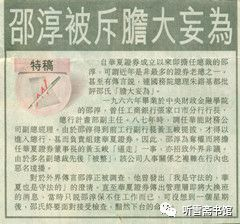

# 第十章 胆大妄为

## 一

自戴岳和张勇从乌克兰获得了“瓦良格”号航母的船主证等法律文件之后，华夏证券公司和东方汇中公司之间的关系，也发生了微妙的变化。

按照邵淳的说法，这是因为高增厦被迫辞去董事长职务，具有“涉外机关”背景的刘兴元将其取代，东方汇中公司出现了明显的取消合作、摆脱监督的迹象，于是引起华夏一方的警惕和戒备。

与此同时，华夏证券公司总经理助理罗×ד冲”了出来，多次与东方汇中公司进行接触，目的是想把“瓦良格”的船主证要走，遭到东方汇中公司的拒绝，双方关系搞得很僵。

罗××是何许人？他又为什么这样积极参与此事呢？

一年前，根据国家的有关规定，国家安全部门给华夏证券公司派来一个工作小组，一共三个人，组长为罗××。华夏证券公司给他的公开身份是总经理助理。

在邵淳参与“瓦良格”项目以后，保密工作做得很好，除了他和吴宇、刘素红知道有个航母的存在，别人都不知道。

当初是徐增平负责“瓦良格”项目的运作，邵淳只管出钱，别的事情不管。但是在发现徐增平挪用船款，并把他踢出项目，剥夺了他的运作权之后，邵淳就不得不考虑“瓦良格”项目的运作问题了。比如，这么大一条船，将来拖回来，入关手续谁来办？将来把它交给谁？华夏证券公司不过是一个出资单位而已，对即将面临的一系列问题都没有能力解决。

这时邵淳想到了罗××。他对罗××说：“跟你说件事，我买了一条航母……”接着把购买“瓦良格”的来龙去脉介绍了一遍。

罗××说：“你怎么才说？”

邵淳说：“现在说也不晚哪！”他希望国家安全部能把这条船接过去。

罗××很高兴，很快就把分管港澳台的两个局长找来和邵淳见了面。邵淳把“瓦良格”项目的全套资料交给他们，他们表示愿意接收该船，但是这么大的事情，需要回去向部领导汇报。结果很快回话：部长不同意他们沾手此事。很显然，部长知道中央高层对航母问题的态度，不想引火烧身。

虽然国家安全部领导不愿沾手，罗××却不想放手，而且紧追不舍。他几次找东方汇中公司索要“瓦良格”的船主证，都被对方严词拒绝。东方汇中的不配合态度惹怒了罗××。

1999年11月的一天，罗××拿着一个关于“瓦良格”的报告找到邵淳，对他说：“东方汇中公司搞航母是诈骗。”希望邵淳在报告上签字。

邵淳非常严肃地对他说：“你别瞎搞，东方汇中是我请来帮助处理这个船的，并不是他们来诈骗。所有船的后期操作，都是我们一起研究一起定的，人家没有用太长的时间，就把船的主权拿回来了，下一步就是怎么拖回来的问题。人家做了很大的贡献，你怎么能说人家是诈骗呢？”

罗××本来是邵淳比较信任的助理，他可能觉得证监会已经派来了赵大建，邵淳大势已去，就转身投向了赵大建。他把邵淳买航母的事情向赵大建做了汇报，赵大建如获至宝：这回可抓到邵淳的把柄了！立刻上报给有关部门。

## 二

1998年10月，邵淳被人匿名举报，列举了他“九大问题”，上级派出调查组进入华夏证券公司，对邵淳和公司可能存在的问题进行调查。前前后后调查了一年，“九大问题”均查无实据。

1999年11月，调查组准备结案。在调查组汇报对邵淳调查情况的时候，证监会副主席陈××突然发难：邵淳的问题你们都查清楚了么？

调查组的古树林处长说：清楚了。都清楚了。

陈××说：那他还有一个航空母舰的事情，你们知道么？

古树林等人一下被问懵了。这个事情他们确实不知道。

陈××说：你们查了一年，这么大一个航母都没查出来，还说查清楚了！

随后，古树林找邵淳谈话，问他道：你还有航母的事么？

邵淳痛快地回答：有。

古树林说：我们怎么查不着？

邵淳说：那是子公司的经营项目。我也不是要瞒你们，你查的范围内的事情我都说清楚，就完了呗！

古树林说：你把这件事的经过写一下。

1999年11月14日，邵淳就写了一个材料，大意是：这个事是国家行为，部队找我们，希望提供帮助，我就提供了。

邵淳最后建议，由国防科工委或中船重工或其他部门接管“瓦良格”项目，对该项目加强领导、指导和协调。

调查组将此事汇报上去，有关方面回函称，军方没有任何单位和个人委托企业和个人购买航母。

这个结果是邵淳没有料到的。这样一来，本来说是“国家行为”的“瓦良格”项目，就变成邵淳的“个人行为”了。那一刻，邵淳感到天昏地暗。

邵淳被金融工委调查的情况，张勇知道一点，但不十分了解。他远在香港，几乎感受不到华夏内部整顿对“瓦良格”项目的影响。有一天邵淳给他打电话，跟他商讨聘请国际评估公司对“瓦良格”进行价值评估的事情。

按照金融业的行规，不管收购公司还是实物，都要估一下值。之前因为这个项目情况特殊，没有做这项工作。

邵淳对张勇说：张总，“瓦良格”的事前期让徐增平给耽误了，最近几个月才有实质性进展。我想了一下，华夏为“瓦良格”已经花了很多钱，它到底能值多少钱，我们心里还没有数，你和戴岳到乌克兰去一趟，找个评估公司估一估，看看“瓦良格”的价值到底是多少。

张勇非常理解邵淳，他为之做出了这么大牺牲的“瓦良格”，连它是什么样都没看到，光看照片，锈迹斑斑，让人心里没有底儿啊！

于是，张勇开始紧锣密鼓地筹划去乌克兰联系国际船务评估公司的事情。

就在这时，他意外发现，邵淳停职的事情被香港报纸披露出来了。

1999年12月9日（星期四），香港《东方日报》刊登消息，《华夏三要员突遭撤职》。消息称，中央金融工作委员会与中国证监会上周五突然迳赴华夏证券，宣布取消董事长兼总裁邵淳、副总裁魏必中与王卫国三人的高级管理层人员的任职资格，并即日起撤职，同时决定对邵淳展开停职检查……

张勇看到这个报道，心里产生了一种不祥的感觉。虽然此前上级就对邵淳进行过调查，但并未撤职。现在“突遭撤职”，说明问题很严重。他把这张报纸剪下来，想告诉邵淳，又一想，这个时候告诉他香港报道他被撤职了，只能破坏他的情绪，就没给他打电话。

过了两天，香港《大公报》又登出一篇“特稿”《邵淳被斥胆大妄为》。所谓的“特稿”，其实篇幅很小，只比火柴盒大一点点：

自华夏证券成立以来即担任总裁的邵淳，可谓近年是非最多的证券老板之一。甚至有传言说，连国务院总理都批评邵氏“胆大妄为”。

一九六六年毕业于中央财政金融学院的邵淳，曾任工商银行张家口市分行行长、总行计划部副主任。八七年时，调任华能财务公司副总经理。由于邵淳得到前工行副行长黄玉峻的提拔，才得以进入总行，甚而负责组建华夏证券。因此，邵淳为夺权而将担任华夏证券董事长的黄玉峻“逼走”一事，亦招致外界非议。由于多名副总裁先后“被整”，该公司人事关系之复杂在行内也恶名远播。

对于外界传言邵淳被调查，他曾发出“我是守法的，华夏也是守法的”的澄清。直至华夏证券传出管理层即将大换班的消息，当时只说邵淳保不住工作而已，可没想到一个星期后，邵氏终要面对接受检查，黯然下台的命运。

这个报道非同小可，张勇觉得应该跟邵淳说一声，就马上给邵淳打电话：邵总，香港报纸发表了一个消息，说你“胆大妄为”。你要注意了。

邵淳在电话里不方便多说，只嘱咐张勇一句话：想法看住徐增平，我拿出去的钱，一分都不能出问题啊！要再出问题，就麻烦了。

当晚，张勇把报纸剪下来，用传真发给邵淳。

* 
  * 1999 年 12 月香港报纸报道《邵淳被斥胆大妄为》复印件

中国很多事情都是境外媒体先报道出来的，好像境外媒体比境内媒体消息灵通，或者是境内媒体得到消息也不便刊登吧，只能境外先登，然后再转到国内来。新闻“出口转内销”，也是中国的一大特色，早年新华社主办的《参考消息》就是新闻“出口转内销”的典范。

## 三

1999年6月，在上级调查组到华夏证券公司调查期间，中国证监会副主席陈××对邵淳说：“我们准备给你派一个助手。”

邵淳说：“这个得有程序吧？我可以向董事会汇报。”

陈××说：“不用，又不是任职，就给你派个助手，不用向董事会汇报。”

邵淳心里清楚，华夏证券是股份公司，你派个高管到公司来，按说应该向董事会汇报，可是证监会副主席说不用，他也顶不住。于是这个证监会派来的助手，就在没有履行任何程序的情况下到华夏证券公司来上任了。这个人叫赵大建，原是国泰证券公司副总裁。

表面上说是赵大建到华夏证券公司“协助”邵淳工作，实际上是上级在给华夏证券公司“掺沙子”。

早在1999年初，邵淳就得到消息，证监会有关领导想把邵淳换掉。华夏证券公司有个女员工，和证监会的人比较熟。有一天，她慌慌张张地对邵淳说：邵总，我有重要的事情向你汇报！

原来，头天晚上她和证监会的几个人一起吃饭，其中有证监会主席的秘书。席间说起证券界的情况，有人说到邵淳。据证监会某领导说，邵淳不买他们的账（其实是邵淳不拍他们的马屁），要把他换掉。

邵淳听了女员工的话，哈哈笑道：“哎呀，我干的也不是什么好差事，快点来换！我正累得要命，烦死了，不想干了！”

过了几个月，证监会就派来了准备接替他的人－－赵大建。后来华夏证券公司的倒闭，就是从这个时候埋下的隐患。

1999年11月，上级调查组对邵淳的调查基本结束，没有查出邵淳什么问题，倒是对邵淳的优秀品质有了更多的了解。比如公司分房子，邵淳第一步先分业务骨干（当时各证券公司互相挖人，把业务骨干放在第一位是为了拴心留人），第二步再分中层领导，第三步才分公司副总，邵淳把自己放在最后。副总的房子是1.2万元/平方米，邵淳的房子是8000元/平方米，和业务骨干一样。房子的位置和建筑质量都不如副总。再比如发奖金，邵淳给下级定奖金标准，他自己只拿全公司的平均奖。他当时的工资不是年薪，是月薪，税前8000元，税后5600元。

曾经有湖南一个分支机构的总经理，很神秘地提着一个密码箱走进邵淳办公室，把门反锁上，打开密码箱，里面全是现金，说是要给总公司领导发奖金。邵淳大怒：都是总公司领导给下级发奖金，哪有下级给领导发奖金的？这不是胡闹么？拿回去！

邵淳认为：无事献殷勤，非奸即盗啊！邵淳派人一查，查出这个人很多问题，马上把他开掉了。这是华夏证券公司第一个被开除的分支机构总经理。

还有福建的一个总经理，送给邵淳两条烟，邵淳转送给了他的司机。第二天，司机把烟退回来了。邵淳很奇怪，以前他经常把别人送的烟转送给司机，从没退回来过。这次是怎么了？

司机说：邵总，你自己看吧！邵淳打开一看，烟盒里面装的是钱！邵淳对司机说：你给他寄回去。一定要通过邮局，要留收据。司机就把两条烟寄回去了。

除此之外，邵淳还严格遵守国家规定，他的家人和家族都不做股票。他有一个观点：该赚的钱赚，不该赚的钱坚决不赚，一个共产党员，赚那种昧良心的钱，失党性，丢人格。

我问邵淳为什么会这样？他说，与多年受党的教育有关，与常年受中国传统文化教育有关。比如文天祥的《正气歌》，他年轻的时候可以全文背下来：天地有正气，杂然赋流形。下则为河岳，上则为日星。于人曰浩然，沛乎塞苍冥……

有人感叹：像邵淳这样的好干部真不多啊！

调查组这次来，也查出来一些问题：总公司有个基金部，他们居然有个1500万元的小金库（之前总公司发出的“110号文件”，主要是查下面，没有查总部）；另外还查出一个副总经理有经济问题。

上级调查组对邵淳的调查做出初步结论：举报信中所反映的个人经济问题并不存在，但作为董事长、总裁，“负有投资决策失误的责任”。

这个结论对于邵淳来说，无疑是一种道德上的解脱。不犯“谋取个人私利”的错误，就是好干部。“决策失误”不属于品质问题，“失误”的原因可能是多方面的，涉及决策者的知识结构、对未来形势的判断能力，涉及国家政策的调整，乃至某些不可抗力，如亚洲金融危机，等等。调查组按照程序，将调查结论与邵淳见面。邵淳提出意见，并签了字。

当时调查组提出，邵淳要尽快让出一个职务，不能董事长和总经理一肩挑。邵淳也表示同意。如果邵淳的事情到此为止，他还有“重出江湖”的希望。

就在调查组准备宣布调查结果的时候，公司总经理助理罗××从背后捅了邵淳一刀，让邵淳的问题突然“升级”了。

## 四

1999年11月30日，邵淳得到消息，新的联合调查组进驻华夏证券公司之后就要对他进行“双规”。晚上回到家里，他想，“瓦良格”项目从没和夫人说过，马上就要被“双规”了，得让她知道怎么回事。

邵淳的夫人叫纪根云，他们是大学同学。邵淳来华夏证券公司任职之前，她是华夏证券公司的总经理，后来因为工作太累，身体吃不消，调到别的单位去了。

据纪根云介绍，平时邵淳下班以后，吃过晚饭就钻进书房看书看材料了。那天吃过晚饭，纪根云坐在厅里看电视，邵淳没进书房，在她旁边走来走去，像是有什么事情。纪根云就问他：有什么事么？

邵淳说：还真有个事儿。

纪根云问：什么事儿？

邵淳平静地说：过几天要来个调查组，我可能被“双规”。

纪根云有些吃惊：啊？你怎么了？

邵淳说：我买了个航空母舰。

纪根云更为吃惊：什么？怎么回事？

邵淳把过程简单说了一下，纪根云急了：这么大的事情，你都敢干！这又是政治，又是经济，又是军事，又是外交，该你干么？

邵淳说：是不该我干，但是这事碰到我头上了，我不干，它可能就没有了！ 你说我干不干？

纪根云说：那你为什么事先不跟我说？出了事才跟我说！

邵淳说：事先跟你说，这个事还干得成么？你肯定反对啊！

纪根云问：你个人有没有问题这里头？

邵淳说：你想啊！

纪根云想了想，说：也是，你不可能为了钱，这点我倒相信。这么着吧！反正要“双规”了，明天我赶紧给你买药去！

邵淳身体不好，有多种疾病，糖尿病、高血压、失眠等等，第二天，纪根云去药店买了很多药，为了减少体积，把包装盒都拆掉了，还给他准备了毛巾、牙刷、换洗的衣服，装了满满一包。

纪根云对邵淳说：我相信你没什么事，“双规”你，也得把你放出来。我跟你结婚这么多年，你这么对待我，这么大的事，你在家里不说，我还有什么位置！

邵淳只能向夫人道歉，然后提着满满当当的大包上班去了。

12月3日，联合调查组进驻华夏证券公司。这个调查组要比前一个调查组的规格高，人员也比前一个多。中央金融工委组织部部长邓××、中央金融纪工委副书记车××等人找邵淳谈话，宣布：即日起，邵淳停职接受组织调查。

邵淳说：你们来，我能理解，调查组升格了，据说中央很重视，你们就严格检查吧！我一定积极配合。但是我有两个要求，不知能不能说？

邓××说：你说吧！

邵淳说：第一，华夏证券公司是个好公司，你们调查的时候，一定注意工作方法，别弄得动静挺大，让外界以为公司怎么着了，别把公司查垮了；第二，“瓦良格”项目后期的操作，希望你们调查组接手，因为这个船很重要，我认为是很重要的战略资源。你们来了，我们所有人被调查，我肯定不能继续操作了，现在这个船还在乌克兰，我们原来和乌克兰谈了一个方案，现在不能兑现了，需要你们接过去，把它拖回来。

邓××说：这个我们不管。

邵淳说：那你们不管谁管？我还继续管么？

邓××说：你当然不能管！

邵淳问：你为什么不能接呢？

邓××说：我们没这个任务，这是领导定的，我们的任务就是查你！

邵淳说：那你回去把我的意见报告给领导，这个船不能扔在那，这要出了问题，谁负责任哪？今天以前，这个船如果有问题，我负责。今天开始我不能管了，你们又不管，那出了问题怎么办？

邓××说：那不是我们的事情。

那天谈完话，调查组也没说要“双规”的事。邵淳很奇怪，就问：那我就回家了？

邓××说：回吧！

邵淳回到办公室，把装满药品和换洗衣服的提包又拎回家了。纪根云见丈夫没有被“双规”，很奇怪：哎哟！回来了！

邵淳笑道：人家没说“双规”。

后来邵淳听说，本来是要“双规”他的，在调查组临来之前才改变决定。在一次会上，前期参加调查邵淳的一个人反映说：根据我们这一年对邵淳的调查情况看，这个干部自律还是比较严的，没发现他有个人经济问题，如果进门就“双规”，理由不充分。现在这个船到底是怎么回事，我们还不清楚。

领导生气地说：你们查了一年，这么大个船，居然没查出来！

调查组成员说：这个船是华夏证券子公司的业务，不在我们调查的范围之内。我们的意见，先停他的职，发现问题，立即“双规”。

领导说：那也行。你们根据实际情况去办吧！

如果不是这位调查组成员提出不同意见，邵淳可能就真被“双规”了。

邵淳当时并不十分清楚上层对航母的态度，尽管工业和科研部门还在对航母项目进行预研，而在中央和军队，已经上升到“政治问题”的高度。据邵淳回忆，当时调查组副组长车××找他谈话时说：你一直是个业务干部，怎么参与政治问题了呢？

邵淳感到莫名其妙：我怎么参与政治了？航母和政治什么关系？是对国家不好还是怎么？和政治什么关系啊？

车××问邵淳：是不是海军副司令贺鹏飞叫你出的钱？

邵淳说：我们就吃过一顿饭，是我请他，因为我听说他上过“瓦良格”号，我就问他“瓦良格”上面的技术状况怎么样，这个船能不能用，还能不能接着续建。我就问这个。

这个时候，邵淳就不想把贺鹏飞扯进来了。

原来的“国家行为”，现在变成了“个人行为”，这样一个天大的事情，要由邵淳自己来扛，他一点心理准备也没有。但事已至此，他只有硬着头皮来扛了。

证监会高层领导亲临华夏证券公司，召开紧急会议，宣布华夏证券的严重违规“最近又有新的发展”，邵淳停职接受调查，同时宣布公司处于临时整顿状态，由赵大建、程炳仁、林义相、冯征四人组成公司“临时领导小组”，赵大建任组长，全面负责华夏证券的日常经营管理工作。

当时正处于亚洲金融危机的时期，涉及金融的问题很敏感，据说国务院领导闻知此事，大怒：“一个证券公司，买什么航空母舰？他肯定个人有好处，10%这是国际惯例啊！”然后就派了一个“六部委联合调查组”进驻华夏证券公司。当时领导人还在一份报告上写下了振聋发聩的16字批示：胆大妄为，严肃查处，以正国法，以儆效尤。

邵淳本来属于北京市的市管干部，因为“案情重大”，中纪委、监察部的领导亲自挂帅当组长，可见上层对邵淳一案是非常重视的。

联合调查组用了半年时间，对华夏证券进行了彻查，发现“瓦良格”这个项目的账目很清楚，除了被徐增平挪用的经费和项目运作经费外，其他所有的钱都汇到乌克兰去了，邵淳并没有拿“好处费”，一分钱没有拿。

这个结果让调查组成员很意外，估计也让上级领导很意外。多亏了那位调查组成员有先见之明，没有对邵淳“双规”，不然真的不好收场了。

很多人不理解邵淳的所作所为到底是为了什么。在“一切向钱看”社会风气下，人们已经形成了一种思维惯性，你不为了捞钱，你买这个东西干什么？你有病啊！

调查组副组长车××曾找邵淳谈话，问他：你为什么要干这个事儿？

邵淳说：因为对国家有好处啊！

车××说：这事该你办么？

邵淳说：是不该我办，该国家办，可找到我头上了，怎么办呢？正好有这么个机会，他们让我帮帮忙，我也可以帮，就帮了。而且航空母舰这个东西，用贺鹏飞的话说，这次是中国唯一的机会。因为以前不会有人卖给我们，以后也不会有。他说：这是最后的机会，如果错过这个机会，我连自己都不会原谅。我是被贺鹏飞感动了。

其实，他不仅仅是被贺鹏飞所感动，他有自己的思想和情怀。甲午海战博物馆的印象和“印尼排华事件”在他心底掀起的波澜，使他成了一个“海军迷”、“航母迷”。为写此书，我在网上查找邵淳的有关资料，在一个人的博客中看到这样一段话：

今年（2012年）4月参加一个会议，与邵淳当年一位老部下、现在打理华夏资产的熟人，谈起华夏购买航母的事。他说：“邵总那时候都成航母专家了，什么内部结构、动力系统、飞行系统、反潜系统，弹射起飞，门儿清。”

当时邵淳已不年轻，如果不是内心涌动着一种激情，仅凭别人的一席话就被感动，做出如此“胆大妄为”的事来，其行为依据是不充分的。

在邵淳被停职以后，华夏证券公司派出“四人临时领导小组”成员之一程炳仁负责“瓦良格”项目。说是程炳仁负责，其实他也没有能力继续推动项目往前走，只是找张勇等人了解一些有关“瓦良格”的情况而已。

联合调查组经过半年的内查外调，没有查出邵淳从“瓦良格”项目中获取任何私利，就撤出了，没有宣布任何调查结果，也没有向邵淳宣布任何处分决定。过了很久也没有人再来找他。

邵淳购买航母案，成了一个悬案。

联合调查组曾说，邵淳参与“瓦良格”项目，存在“违规操作”问题，对此，邵淳有不同看法。他说：“规”是为了某一种、某一类事情定的规矩，比如金融、交通都有行业法规，但是买航母是国家的事情，它要高于行业规章。衡量它对不对，就要看对国家有利还是有害。不能用行业规章去否定国家的利益。就像不能用行业法规去否定国家宪法一样。它们不是一个层面的东西。

再比如古代“信陵君窃虎符救赵”的故事，谁是谁非？就看是站在什么角度上看问题了。

回头再说邵淳在“瓦良格”项目上的“违规”。不管怎么说，航母是个极特殊的情况，不是我们日常生活中经常发生的故事。如果没有邵淳的“违规”，中国就没有“辽宁舰”了。

孰是孰非，让历史去评判吧！

## 五

和邵淳一起被停职的，还有吴宇。

1999年12月16日上午，吴宇正在去天津的路上，突然接到联合调查组古树林处长打来的电话。

古树林问：“小吴，你在哪里？”

吴宇说：“在去天津的高速公路上。”

古树林又问：“什么时候回来？”

吴宇说：“如果有急事，我现在就可以回去。”

古树林说：“有个会，想请你参加。下午两点吧！在总公司会议室。路上小心点。”

吴宇让司机掉头往回开。回到家，吃过饭，慢慢悠悠去了总公司。

联合调查组12月3日进驻华夏证券公司，已经过去两个星期了，关于“瓦良格”项目的调查一直没有进展。吴宇想，这次让他到总公司去，肯定还是“瓦良格”的事情。

下午两点，吴宇来到总公司的会议室，推门一看，里面一个人也没有。他就靠在会议室的沙发上准备休息一会儿，这时，外面传来一阵脚步声，接着，就呼呼啦啦进来七八个人。吴宇连忙站了起来，为首的一位年长的领导见到吴宇，愣了一下。有人介绍说：这就是小吴。

古树林说：岁数不大呀！

吴宇当时31岁。

领导问：你是吴宇同志？

吴宇说：是我。

领导和他握握手，也没坐下，站在那里对吴宇说：你也都知道了吧？

吴宇说：我知道了。是不是“双规”？

领导说：你知道什么叫“双规”？

吴宇说：规定的时间，规定的地点，接受组织调查。

领导说：别的就不说了，需要跟家里说一声么？

吴宇说：不用。到时可以打电话么？

领导说：可以打电话，不过要经组织批准。还要跟你强调一下，未经批准，不得与第三方交流。

这时旁边过来一个人，伸出手来对吴宇说：手机。

吴宇当时有两个手机，都交上去了。

领导对吴宇说：小吴，七八天，配合调查调查。

然后调查组的人就把吴宇带走了。上电梯的时候，正好吴宇的师傅刘素红走出电梯，刘素红一看那阵势，就知道是怎么回事，她故意和吴宇开玩笑说：“好好交代啊！”

吴宇被带到渔阳饭店，住进一个套间，他住里间，看守人员住外间。晚上睡觉的时候不能关灯，床脚的位置，一个墙角坐一个人。卫生间的门也被卸掉了，卧室和卫生间里都装有摄像头，据说这都是为了当事人的安全。

晚上，经过调查组的允许，吴宇给妻子严丽打了一个电话。事先他预感到调查组要找他作为调查邵淳的突破口，就跟妻子编了几句暗语，比如说“出个差”，就是被“隔离审查”，不能回家了。他在电话里对妻子说：“我要出个差。”

严丽一听就明白了，对他说：“多保重。”

吴宇知道自己没事，君子坦荡荡，晚上倒头就睡，呼噜打得山响，在外屋休息的警卫却睡不着了。

邵淳听说把吴宇“双规”了，很生气，马上带着秘书王中去找调查组交涉，他说：本来你们是来查我，“规”他不就是找突破口么？那你“规”我算了！我是决策人，他就是跑跑腿儿。

调查组没有理他。

吴宇一共被“双规”136天，最后也没有查出他有什么问题。调查组解释说，对他不是“双规”，是为了他的人身安全，进行“保护居住”。这段故事我将在后面具体介绍。

吴巍和张勇作为“瓦良格”项目的参与者，也被调查组找去谈话。

当时吴宇已经被“双规”，调查组找吴巍谈话的时候，吴巍说：吴宇被“双规”了，我是不是也得准备准备？

调查组说：你不是我们“双规”的对象，你不是党员。

等调查组说明找他的原因，吴巍说：这个案子，你们不了解情况。

调查组说：这个案子是上面领导批的。

吴巍说：领导批的不一定对，因为领导也不了解情况。我全力配合你们，希望你们尽快查清。

调查组说：我们也希望如此。

吴巍说：我认为，你们好像是说我给邵淳送钱了，好像是说我们没买航母，这是一个诈骗案。实际情况是，我们真买了航母，不是诈骗；我们还给国家弄来了80%的股份，你们千万不要忽略了这个股份的重要性。这80%的股份是我主谈的，也应算一份功劳吧？我不喜欢给人送钱，再说邵淳有的是钱，好几百亿资产的大公司老板，小钱恐怕也看不上。”

后来吴巍和调查组的人员一起查账，他对调查组负责查账的人说：你们必须加班。

一位来自国家审计署的工作人员大惑不解，问他：为什么？我们查这么多账，没有谁叫我们加班的。

吴巍说：航母是我们给国家买的，至于国家要不要，是另一回事。钱已经出去了，你早查一天，早结束一天，航母早拖回来一天，可以省很多钱，也可以让中央尽快拿主意。你明白了吧？

吴巍给调查组写了很多材料，调查组很满意，一位调查组的工作人员对他说：吴总写的材料，我们都能核实。

意思是说吴巍写的材料有根有据。

张勇也被调查组找去谈话，地点是在华夏证券公司专门为调查组提供的办公室里。调查组副组长车××亲自找他谈话，让他如实说出“瓦良格”项目的问题。并“启发式”地对他进行引导。

张勇有些不快地对车××说：我是香港人，我只是以民间的形式参与这个项目，你问我北京的那么多事，我怎么会了解？

车××对他毫无办法。

高增厦虽然已经退出了东方汇中公司，因为他曾经是“瓦良格”项目联合领导小组组长，调查组也找他了解情况。由于他的身份在那里，调查组对他比较客气，甚至还请他吃了一顿饭。

据高增厦介绍，中纪委副书记、总政治部副主任、军纪委书记周子玉原来和他是一个部队的，他们很熟，周子玉知道他参与了买航母的事情，还保护过他。

高增厦说：和调查组谈过话之后，我就不再管“瓦良格”的事了。

## 六

在香港报纸报道《华夏三要员突遭撤职》这一天，1999年12月9日，香港还发生了一件事情：张勇签字汇给徐增平的香港创律公司3,108,000元港币（40万美元），用以收购徐增平4%的澳门创律公司股权。

这次收购股权是怎么回事呢？

12月初的一天，徐增平来找张勇，要借40万美元。由于徐增平的信誉太差，张勇实在是不敢再借给他了，而刘兴元则打电话对张勇说：老徐有困难，你借给他吧！

张勇担心从他手里借出去的钱，将来要不回来不好交代，便想出一个主意：继续从徐增平手里收购股份。尽管“瓦良格”是个希望渺茫的项目，如果拖不回来，澳门创律的股权将一文不值，但是拿着股权毕竟比什么都没有强，一旦“瓦良格”回来了，股权就是钱。

张勇对刘兴元说：老徐以前借了很多钱都没有还，要不然就让他出让澳门创律的股份吧！

刘兴元说：也好。我负责跟他签个协议，你就不用管了。

过了两天，徐增平拿着一份协议来找张勇取钱。协议全文如下：

```

                    股权转让协议

  甲方：徐增平先生（CHENG ZHEN SHU）
  乙方：刘兴元先生
  丙方：汇中投资发展有限公司
  根据汇中投资发展有限公司12月6日董事会协议（原文如此），经三方协商同意，将甲方所持有“瓦良格”号船20%股份，其中4%转让给乙方，作价贰佰肆拾万美元，乙方同意受让，贰佰万美元乙方受甲方委托已支付大德公司，此款已收妥。余下肆拾万美元另行结算。
  三方一致同意以上转股事宜。本协议一共六份，自签字之日起生效。
  甲方：徐增平先生（签字）
  乙方：刘兴元先生（签字）汇中投资发展有限公司（章）
  丙方：汇中投资发展有限公司（戴岳签字）
      一九九九年十二月七日

(参见附录一:《本书正文中涉及的有关文件》之八《1999 年 12月 7 日徐增平转让 4%股权协议复印件》)
```

这份协议问题很多：一是行文不规范，除了文不从字不顺，关于股权的表述也不准确，正确的表述应该是“将甲方持有的澳门创律公司20%股份其中的4%转让给乙方”；二是格式不规范，根据签名来看，乙方和丙方是一家，不知为什么要分开；三是借贷关系不清楚，汇中投资发展有限公司用240万美元购买徐增平持有4%股权，怎么让华夏证券全资子公司、张勇主持的香港达程有限公司出40万美元呢？即便是邵淳委托汇中公司操作“瓦良格”项目，那也应该由出钱的香港达程公司来签协议，不应由汇中公司来签协议啊！协议说，乙方（刘兴元）受甲方（徐增平）委托，已将200万美元支付大德公司，我认为不可信，因为当时汇中公司根本没有钱，否则东方汇中公司也不可能随后就用“瓦良格”做抵押去融资了－－这是后话。再说200万美元不是个小数目，让捉襟见肘的汇中公司拿出200万美元去替华夏证券公司买股份，可能么？

后来经邵淳证实，这份协议根本不具有法律效益。但是当时刘兴元和戴岳是汇中公司的董事长和总经理，既然刘兴元和戴岳都同意了，张勇也不好再说什么，就于12月9日把钱汇到了徐增平的账户上。为了证明这笔钱的去向，张勇一直保留着有关单据。

从以往刘兴元对徐增平的态度，张勇感觉，他们二人的关系不一般。钱不是刘兴元的，他没有任何压力，拿着华夏证券的钱做“顺水人情”，何乐而不为？

只是这个4%股份最后并没有落实，从张勇这里出去的40万美元也“泥牛入海”了。不过在“瓦良格”项目中，这都是小钱，可以忽略不计。但在这笔钱的操作过程中，徐增平真是煞费苦心，不妨看作是徐增平和刘兴元表演的“双簧”。

后来我在采访戴岳时，曾向他提起这4%股份的事，他说是刘兴元搞的，最后那个协议也没有拿到东方汇中公司归档，自然也就没有移交给国家了。那40万美金不知最后落入了谁的腰包。

