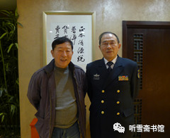

# 第二章 曲线买船

## 一

要想说清楚“瓦良格”号航母来中国的故事，就必须从大陆第一家真正接触“瓦良格”项目的公司说起。这家公司名为北京泰信达科技发展有限公司（简称泰信达公司），创始人、董事长及法定代表人为吴巍。

吴巍是吉林省榆树市人，1968年出生，1988年毕业于榆树市实验中学，1992年毕业与中国金融学院。

泰信达公司是一家1997年8月才成立的民营公司。这样一家新成立不久的小公司，怎么会和购买“瓦良格”号航母这样一件大事扯上关系呢？这要感谢一个人，那便是香港创律集团公司董事局主席徐增平。

关于徐增平，自从“瓦良格”被国家确定在大连造船厂续建以来，有关他的信息真是满天飞。

我在写“辽宁舰”报告文学时，曾经采访了200多人，其中有一部分人在“瓦良格”号航母来中国的过程中与该项目有过交集，除了吴巍，还有原华夏证券公司公司董事长兼总经理邵淳、原海南隆泰源实业投资有限公司董事长吴宇、原华夏证券公司资产管理部总经理刘素红、原香港达程有限公司总经理张勇、原（北京）东方汇中投资有限公司董事长高增厦、原东方汇中公司总经理戴岳、原东方汇中公司办公室主任王毅民、中国驻土耳其大使馆前大使姚匡乙、中船重工集团公司原董事长黄平涛、中船重工原总工程师兼军工局局长胡基政、大连造船厂原副厂长唐士源、原国防科工委办公厅主任马鸿琳、交通部救捞局原局长宋家慧、国家安全部原副部长高以忱、交通银行原监事会主席华庆山，以及原总参二部北京局局长顾国强等。

为写此书，我曾经试图采访徐增平，但苦于没有他的联系方式。2014年春节后的一天，我去看望我在潜艇上当水兵时的老艇长、前海军司令员张连忠。他问我：“你最近在写什么？”

我说：“写‘辽宁舰’。”

他说：“我这次在广州见到那个买‘瓦良格’的香港老板了。”

原来，张司令在广州时，退休的南海舰队司令员王永国要请张司令吃饭，王司令对张司令说：“有个香港老板想见你，你见不见？”

张司令很奇怪：“他见我干什么？”

王司令说：“他听说你当海军司令的时候，是主张搞航母的。他就是买‘瓦良格’的那个老板。”

张司令一听是这么回事，便说：“那就见见吧！”

于是，徐增平参加了前南海舰队司令员与前海军司令员的饭局，并送给张司令一些资料。我对这些资料很感兴趣，就让张司令拿给我看。张司令刚从南方回来，那些刚带回来的资料就堆在客厅的桌子上。

“都给你吧！”张司令说。

我一看，有一本书、两个光盘、几张照片。书是《瓦良格迷局》，我有，就没要；照片是徐增平与一些什么人的合影，大部分人我不认识，也没要；我不知光盘里是什么内容，就把光盘拿走了。

我对这两张光盘寄予厚望，结果让我大失所望。一张光盘是广东一家市级电视台做的关于“瓦良格”的专题节目，没有对徐增平的现场采访，解说词是我早就熟悉的网上的那些内容，画面也是早就看过的几张徐增平在乌克兰船厂拍摄的照片，翻来覆去地展示一遍又一遍。另一张光盘是一个级别不高的干部去拜访徐增平的录像，没有剪辑，没有解说，就是一盘素材，画面效果也很差，关键是看不出这次拜访有什么意义。也不知徐增平把这种东西当礼物送人是什么意思。

后来我找张司令的秘书衡大鹏处长要徐增平的电话，衡大鹏说：“他给了我一张名片，我看首长对他不感兴趣，我就把名片扔了！”

我问：“司令对他怎么不感兴趣？”

衡大鹏反问我：“首长说没说徐增平还送给他一包钱？”

我说：“他没说。什么钱？多少？”

衡大鹏说：“应该是港币吧！一个信封装的，很鼓。我没打开看，不知道多少钱。首长让我退回去。我给徐增平打电话，我说首长不要，你必须取走。后来他派司机来取的。又给首长送来两件衬衣。等司机走了，我向首长汇报，首长让把衬衣也退回去。我说衬衣不值钱，不值当的。就没退。”

不收礼品，这是张司令的一贯作风，别说是赤裸裸地送钱了，他肯定不会收的。

一个很鼓的信封，能装多少港币呢？我曾收到过一笔5万元港币的稿费，50张千元大钞，装在信封里，很薄。这次采访，有几个人跟我说过，徐增平出手很大方，我没好意思问徐增平“大方”到什么程度。都是将军级的人物，以徐增平的办事风格，我估计三万两万他是拿不出手的。我猜测，那个很鼓的信封应该是10万港币。

衡大鹏从南海舰队退休司令员的秘书那里给我找来徐增平的电话，我怕贸然打过去不礼貌，就给他发了一个短信：

徐增平先生：您好！我是海军作家李忠效，我从我的老艇长、海军张连忠司令员处找到您的电话。他还给了我您送他的两个光盘。我去年接受海军首长派的写“辽宁舰”报告文学的任务，目前已采访一百五十多人（作者注：当时采访尚未结束），各方面的都有，因为没有您的联系方式，没能找到您。我希望您能接受我的采访，方便时请给我回电。我的资料您可以在网上查到。

4分钟后，我收到徐增平的回复：

收到，可能我正式采访要在年底才可以，之前我们可以先见个面认识一下，应大力宣传辽宁舰强军梦，唤醒国人加强国防建设才是根本，谢，徐增平。

一晃就过去了半年多，到年底了，该是可以采访徐增平的时候了，于是我于2014年12月10日给徐增平发了一个短信：

徐增平先生：我是海军作家李忠效，5月8日你曾回复我短信，说到年底可以接受我的采访，不知你何时有空？

没有回音，也不知他收到我的短信没有。一晃又过去了半年，我于2015年5月16日又给徐增平发了短信：

徐增平先生：我是海军作家李忠效，两年来，我已完成写航母的书《辽宁舰》（写该舰续建工程）、《陆上航母》（写舰载机陆上试验训练机场建设工程），马上要写《“瓦良格”来中国》（写购买和拖带工程）。前期参与此事的主要人员，除了你，大部分我都采访到了，各种说法都有，我也希望能听听你的一家之言。我看到网上关于你接受媒体采访的报道，不知真假，很多内容与我掌握的情况不一样，希望与你核实。我的书将作为航母的历史留下来，我希望这部历史能接近真实事件原貌。如果近期不能接受采访，可否把你的信箱告诉我？我把采访提纲发给你，请你书面回答一些问题。打扰啦！

仍然没有回音。中国有句俗话：事不过三。因此我没有再联系他。

我很认真地拟定了一个采访提纲，本来想发给他看看，可我不知道他的信箱。现在我把这个采访提纲收在书中（参见本书附录一：《本书正文中涉及的有关文件》之一《采访徐增平提纲》），如果他看到了，想接受采访了，可以按照这个提纲谈一谈，有关内容我将在本书再版时补上。

## 二

接着说吴巍。

吴巍喜欢交朋友，便与“瓦良格”项目结缘，并成为这个项目链条上的重要一环。

大约在1997年9月，经朋友介绍，吴巍认识了一位被很多人称为“大师”的人－－李×。上个世纪的八九十年代，是尊崇“大师”的年代，很多有点特异功能和仙风道骨的人都被尊为“大师”。李×就是在那个时候，因为懂点旁门左道“脱颖而出”的，成为很多高官和大款的座上宾。据说李×没有什么文化，大字不识一箩筐，除了会写自己的名字，就不会写别的什么东西了。就是这样一个人，也能成为“大师”。“大师”讲的是天赋异禀，不是文凭学历。

朋友向吴巍介绍说，李ד能力强，人脉旺”，一定会助泰信达公司财源滚滚。吴巍也想借用他的资源，为公司开展业务提供方便，对李×真诚相待，尊称他为“李叔”。李×对吴巍说，小伙子不错，泰信达公司有发展前途。并表示了真诚合作的意向。吴巍同意李×加盟泰信达公司。

1998年初，李×将他的朋友陆昆来介绍给吴巍。

陆昆来进入泰信达公司以后，在李×的安排下，为吴巍介绍了一些有实力的商界人物，这些人对泰信达公司也表示了真心诚意的合作意向。当时吴巍刚刚经商创业，经验不足，看到李×和陆昆来诚心诚意为泰信达公司介绍关系，吴巍从公司发展的长远考虑，经与李×、陆昆来多次磋商，三人达成了合伙创业的共识。

1998年6月，吴巍与泰信达公司之前的两家股东协商，签订了“关于转让公司股份的协议书”，对泰信达公司的股东进行了协议变更，由吴巍、李×、陆昆来各占三分之一的股份。经泰信达公司新一届董事会决议，由吴巍担任董事长，李×担任常务副董事长，陆昆来担任副董事长，聘任陆昆来为总裁，李×担任常务执行总裁；并聘任李×为特别高级顾问。董事长、总裁对任何重大事宜做决定时，必须报特别高级顾问审核。自此，李×取得了泰信达公司的经营管理权，吴巍名义上是泰信达公司的董事长，实际上已成为李×和陆昆来的助手。

因李×和陆昆来并无实际资金注入，无法办理工商变更登记，按法律规定，吴巍仍担任法定代表人。

大约是在1998年5月，李×介绍吴巍认识了华夏证券公司董事长兼总经理邵淳。吴巍提出能否和华夏证券公司进行合作，邵淳说，具体业务他不管，只要对华夏公司有利，他可以把具体负责业务的人介绍给泰信达公司。后经邵淳引见，吴巍认识了华夏证券公司资金管理部副经理兼海南隆泰源实业投资有限公司董事长吴宇。

据吴巍回忆，有一天，陆昆来在闲谈中提及他的朋友、香港创律公司老板徐增平，说他有背景、有实力，近期暗中“代表国家”出面在乌克兰投标购买了“瓦良格”号航母，影响很大。李×听后很感兴趣，但不大相信。陆昆来说，日后徐增平来北京，可以介绍给李×认识。

1998年7月下旬，陆昆来告诉李×：徐增平来北京了。李×让陆昆来邀请徐增平来公司谈谈。徐增平来泰信达公司那天是个周日，吴巍不在公司，李×和陆昆来等人与徐增平见了面。吴巍下午来到公司，徐增平已经走了。

李×对吴巍说：我们谈得很好，有合作的可能。徐增平暗中“代表国家”出面，在乌克兰投标购买了航空母舰，需要资金支持，泰信达公司如能参与运作，一定很有意义，对国家、对公司都有利。

吴巍说：这么大的事，需要很大的资金，泰信达公司没有实力参与。

李×说：这是国家的事，资金有办法解决。

过了两天，李×邀请邵淳到公司见面，谈及此事。邵淳对此事不大相信，提出很多疑问。

邵淳说：我想看看材料。

随后，李×让陆昆来约徐增平来公司面谈。并让吴巍通知邵淳、吴宇参加。

## 三

邵淳当时正在对华夏证券公司进行全面整顿，事情很多，如果不是要和香港老板徐增平谈“瓦良格”，他可能就不去了。冥冥之中，也许是命运的驱使，他听说要谈“瓦良格”项目，就放下手中的工作，和吴宇一起去了泰信达公司的所在地－－钓鱼台大酒店。

邵淳上次听到李×对他说“瓦良格”，就不由得心头一动。要想说清楚邵淳为什么会为“瓦良格”而心动，还要简单介绍一下他的经历和性格。

* 作者采访邵淳时合影。背景画框中的“正本清源”是无意间拍上的（康延平摄影）
  * 

邵淳祖籍辽宁省庄河县（现庄河市），1944年12月25日出生于北京。1962年考入中央财政金融学院（现中央财经大学）金融系，1966年毕业，1968年下乡到河北省衡水地区故城县农村劳动；1970年调入故城县文化馆任美术创作员，1980年到河北省农业银行工作，1984年任中国工商银行总行计划部副主任，1990年任华能集团财务公司经理，1993年至1999年，先后担任华夏证券公司总经理、董事长兼总经理。

邵淳是个充满艺术气质的人。他不但喜欢美术，还喜欢舰模，尤其喜欢看军事题材文学作品，像美国作家赫尔曼·沃克的《战争风云》和汤姆·克兰西的《追踪红十月》等军事题材小说他都看过。

1993年，邵淳在《舰船杂志》上看到一篇题为《“瓦良格”号航母花落谁家》的文章，不由得想入非非：如果“瓦良格”能“花落中国”该多好啊！

在邵淳为“瓦良格”花落谁家而“想入非非”的两年之后，他又经历了一次“心痛之旅”。

1995年春天，邵淳趁出差的机会登上威海刘公岛，参观了甲午战争博物馆。此时，正值中日甲午战争100周年，他是怀着一种探秘的心情来到刘公岛的。在他的印象中，中国自明代以来，海军一直处于积贫积弱的状态，长期有海无防，因此才会有甲午海战的惨败和北洋水师的全军覆灭。但是他在参观博物馆的过程中，发现自己对中国海军近代史并不了解。当时的中国海军是亚洲第一，世界第六（也有说第七），那艘在甲午海战中沉没的“镇远舰”，排水量为7220吨，航速为15.4节，续航力为4500海里/10节，战斗人员编制为329－363人。这样大的战舰，当时全世界都不多见。100年前中国海军的装备实力让他感到震撼。然而中国海军最终还是战败了，当然原因是多方面的。清朝政府被迫与日本政府签订了丧权辱国的《马关条约》，使中华民族陷入苦难的深渊。

此次刘公岛之行，让邵淳增强了历史知识，也让他感到心痛不已。一个国家，没有像样的装备不行；有了装备，没有训练有素的将士也不行；有了训练有素的将士，没有坚强的领导层和人民群众做后盾更加不行。今日中国已经不是100年前的中国了，历史的悲剧绝不能重演。可是，自己不是将士，不是国家领导人，能为国家做点什么呢？

让邵淳没有想到的是，在那次“心痛之旅”三年之后，他又遇到了一件更让他心痛的事情。

1998年5月13日至16日，印度尼西亚爆发了针对华人的“五月骚乱”，近1200名华人遇难，上百名华人妇女遭强暴。当时邵淳和他的部下、华夏证券公司全资子公司海南隆泰源实业投资公司董事长吴宇，以及北京泰信达科技发展有限公司董事长吴巍、总顾问李×在北京一家饭店吃饭，他们从中央电视台播报的新闻中看到了“印尼排华事件”的消息，为华侨在印尼的遭遇感到痛心，甚至义愤填膺。邵淳说，美国遇到突发事件，总统就会问：“我们的航母在哪里？”中国要是有一个航母战斗群在印尼那里就好了，一是可以对印尼的暴徒产生威慑，二是可以用航母把华侨接走。

可是，中国的航母在哪里呢？

也许是命运的安排，印尼排华事件两个月之后，一桩与“瓦良格”航母相关的生意，真的找上门来了。

## 四

邵淳在泰信达公司里见的，除了吴巍、李×和陆昆来，还有两个陌生人，一个西服革履的高个子男人，一个穿陆军军装的上校军官。

通过李×的介绍，邵淳得知，高个子叫徐增平，是香港创律公司董事局主席；陆军军官叫庄立祥。为了证实自己的身份，庄立祥还郑重其事地拿出他的军官证给邵淳看。

徐增平对邵淳等人谈起他买“瓦良格”号航母的情况。 

徐增平说，这个项目是军方具体负责。他是“代表国家”暗中出面依民间商业形式运作。这是为国家、为民族做的一件大事……

邵淳说：重要性我都知道，这个船我听说过。但是为什么要你来办这个事？

徐增平说：买航母这是个秘密的事情，不能公开买，不能以国家的名义买。要以国家的名义买，那就贵了，我们作为小公司，名义上就是买回来改成赌船，这是小生意。乌克兰现在反正卖不出去，我们买就比较便宜。

邵淳问：你买多少钱？

徐增平答：2000万美金。

“2000万美金？”邵淳深感意外。

“是的，2000万美金。”徐增平说。

“你这个价钱买航母，我有疑问。美国的‘尼米兹’级航母几年前的造价是33亿美元，这是对外公开的。33亿美元和你这2000万美元相比，差距太大了！”邵淳说，“当然，你没有它大，你这是6万吨，人家那是9万吨；你这没造完，人家那造完了。但你算他三分之一的钱行不行？五分之一的钱行不行？十分之一的钱行不行？你毕竟造了三分之二了，你怎么会是2000万美元？说不过去啊！”

徐增平和庄立祥对邵淳如此了解航母造价的情况感到吃惊。

徐增平解释说：这个船虽然说是造了三分之二，实际上后来停工以后，又把船上很多的设备拆下去了，电缆都割走了，现在是当废铁卖的。

“还有一点我不明白。”邵淳说，“既然是国家的事情，那国家有的是机构部门可以办，怎么会找到你们呢？再说了，如果是2000万美元，这对国家来说，算什么呀！一个小芝麻粒儿啊！”

徐增平解释说：是国家的事，国家很多部门可以办，但是不管哪个部门出面，都代表国家，那就成了国家对国家了，那乌克兰就会狮子大开口了。另外，这个项目有“三性”：重要性、紧迫性、保密性。尤其是第三条，要严格保密。为了不让国外情报机构觉察，在船到之前，不能按正常渠道安排资金，资金的每一个环节必须与国家和军方无关。只有通过我们这样的不起眼儿的公司，偷天换日给它弄过来。船到之后，国家自然会给予解决。

邵淳问：你有没有红头文件啊？

徐增平说：此事属于高度机密。不过前期只能以海上娱乐城项目运作，时机成熟时军队回接手的。现在的困难是资金紧缺，时间很紧，一旦资金不到位，造成与乌克兰方面的合同违约，担心航母落入印度、台湾之手。

最后，徐增平又说：别看这个船是花2000万美元拍下来的，实际上要打点各种关系，暗中花了不少钱。现在需要办理相关的手续，如澳门政府的批文、进口许可证等，因此急需2000万元人民币，希望你们能否考虑，先以借款形式支持一下，待办完航母项目前期手续后，再谈下一步的合作？如果你们不想参与后期运作，我可以按时归还借款。

邵淳此时的心情有些矛盾，内心希望徐增平的话是真的，毕竟他对航母这个事情太有好感了，但是徐增平的话又不足以让他相信，顶多是半信半疑。

邵淳问：你们怎么证实这个事啊？

徐增平说：我们有投标的文件，我们已经搞掂了。这个事情很敏感，机会也难得，是利国利民利军的大事，一开始我也不敢接，既然接了，就得做好。现在资金有点缺口，也不多，就2000万人民币，看你能不能帮帮？过了年就能回来，我就用半年左右。

邵淳心想，钱倒不多，时间也不长，就说：你们把中标文件拿来，我先看看文件吧！

徐增平说：文件在香港，需要回香港去拿。

可能是为了说明此事的可靠性，徐增平还特地介绍和他一起来的上校军官庄立祥：他是我们公司的副总。在公司里头，我领导他；在航母的事情上，他领导我。我听他指挥，还监督我。

庄立祥还客气了一番。

第一次见面，就这样结束了。

邵淳后来回忆说：“第一次见面，对徐增平的感觉并不太好，说话口气很大，吹吹乎乎的，很张扬，就像广东那边的暴发户的感觉。这些年我也接触了一些商场上的人，徐增平这种人，可靠性上要大打折扣。庄立祥给我的印象比较好，一种知识分子的样子，话不多，待人很谦和。”
