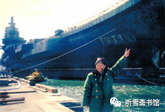

# 第十二章 移交国家

## 一

就在“瓦良格”项目由“民间商业行为”变成“国家行为”的时候，德国评估公司对“瓦良格”所做的评估报告也出来了，3月下旬，乌克兰马什公司的萨沙将评估报告寄到香港达程有限公司，张勇按照协议，把余下的30多万美元评估费汇往乌克兰。

评估报告是按照国际惯例编写的，厚厚的一大本，装订很精致。根据评估公司的严格评估，“瓦良格”当时的价值是2.8亿美金。

邵淳得到这个消息，非常高兴，对张勇说：你为公司立功了！

华夏证券公司为“瓦良格”支付的经费，一共3.6亿多人民币，约合4400万美元（包括被徐增平挪用的1800万美元）。也就是说，船还没拖回来，身价就已经升值约两亿多美元。虽然将其拖回来还要花钱，但是回来以后，可能还会升值。

2000年4月2日，张勇在深圳接到北京华夏证券公司负责人程炳仁的通知，要求他立即办理“瓦良格”号航母的船籍证。

船籍证是轮船在公海上航行必须携带的证件，由国际权威海事机构办理。去年10月下旬，张勇、戴岳和刘继从乌克兰回国以后，张勇即按照戴岳的吩咐，开始着手办理船籍证事宜。

按照国际惯例，船籍证可以选择任何一个国家进行注册，比如，香港某海运公司的船只，可以在巴拿马注册，也可以在希腊注册。张勇选择了圣文森特和格林纳丁斯。这是一个由几个小岛组成的北美洲国家，地处加勒比海，国土面积只有389平方公里，首都设在金斯敦。

由于该国的船务业在国际上享有盛誉，一般国际上的特殊船只都在该国注册船籍证。为了使“瓦良格”能平安顺利归航，张勇在该国注册船籍证无疑是最好的选择。

1999年11月12日，“瓦良格”船籍证注册完毕，船主为香港汇中发展有限公司。现在要由中船重工集团公司以澳门创律公司的名义进行运作，就必须把船籍证的船主变更为澳门创律公司。此事只能由具有香港身份的张勇办理。

张勇在深圳的事情还没结束，暂时无法离开，而北京又催得很急，为了加快办证时间，张勇让公司人员把“瓦良格”有关文件送到深圳，又把香港“S.V.G云洋海事”的陈主任请到深圳，双方在深圳办理船籍证的相关手续。

2000年4月5日，张勇又接到程炳仁通知：根据上级指示精神，要将全部有关“瓦良格”项目的文件和印章送交北京。

张勇立即从深圳赶回香港，整理与“瓦良格”项目有关的文件，然后带着文件和澳门创律公司的印章赶往北京。为此，华夏证券公司相关人员程炳仁、夏志良、邵淳、郝君还专门签署了一份《关于“瓦良格”文件调用和印章的调用》文件。夏志良和郝君当时是联合调查组成员。

2000年4月8日，北京市举行了一个“瓦良格”项目文件交接仪式，国防科工委主任刘积斌、中船重工集团公司总经理黄平涛、中船重工集团公司总工胡基政以及华夏证券的有关人员参加。程炳仁代表华夏证券公司将澳门创律公司所有与“瓦良格”相关的文件，包括购买合同、公司印章等，全部移交给中船重工集团公司，黄平涛代表中船重工集团公司签收。

张勇没有参加正式的文件交接仪式，不过心里还是非常欣慰：“瓦良格”的全部资料都是从我手里交出去的，等于把“瓦良格”交给国家了。自己忙了这么长时间，虽然个人没有获得什么经济效益，但是帮助国家把这个海军曾经想买却没有买成的航母买回来了，这也算是为国家做了一点贡献吧！

交出“瓦良格”文件之后，张勇得到来自香港“S.V.G云洋海事”的消息：船籍证办好了。张勇拿到船籍证后，亲自把它交给中船重工集团公司总工兼军工局局长胡基政。胡基政告诉他，在香港打电话要注意别被人窃听，发传真不能明发，通话必须先约定时间。

程炳仁也向张勇交代说：你不要叫别人参与这个事，你和国防科工委保持“单线联系”。以后我们也不问了，没有什么事，就不用来华夏汇报了。该跟我汇报的，你来北京我给你安排酒店住下来，管吃管住。

张勇说：我已经把有关‘瓦良格’的文件资料都交出去了，估计以后也不会有什么事情找我了。

其实，有关“瓦良格”的事情还很多，不像张勇想象的那么简单。

2000年5月14日晚，张勇接到通知，让他尽快赶到澳门某某大律师楼去，有重要文件要办。15日一大早，他就从香港乘坐飞翼艇赶到澳门，见到从北京来的一个叫罗××的人，对方自称是华夏证券公司总裁助理。罗××告诉张勇，马上以“以澳门创律公司的名义给胡基政和牟安成两位先生做一份法律大授权书”。

张勇此前只是听说过罗××，在吴宇被“双规”以后，华夏证券公司曾通知他，由罗××出任香港达程投资公司董事长，但他们从来没见过面。张勇给胡基政打电话核实此事，得到确认后，他便在澳门的律师楼办理了一份《授权书》：

签署人声明如下：

现透过本公证文件，代表公司委托胡基政先生及牟安成先生作为公司代理人，……全权代表公司负责办理与“瓦良格”号船有关的全部事宜。

授权人：罗××、张勇（签名）

公证员：赵鲁（签名）

为何大授权书要张勇去办，并要他签字？因为他一直是澳门创律公司80%大股东华夏证券公司的代表，律师文件说他“有资格和足够的权力代表公司做出此行为”。

张勇办完这件事，感到很兴奋，甚至有些自豪：把“瓦良格”交给国家的授权书是我办的！是我代表澳门创律公司授的权！

## 二

华夏证券公司把“瓦良格”项目交给国家以后，一晃就过去了两年。这两年间，又发生了很多故事，这些故事我将在本书的“下部”详细介绍。

2002年2月20日，“瓦良格”拖带船队进入中国领海。中船重工集团公司军工局副局长牟安成给邵淳打电话，预计“瓦良格”在月底之前到达大连港，邀请邵淳到大连去看“瓦良格”。邵淳非常高兴，带着夫人和秘书从北京开车去大连。

2月28日，“瓦良格”到达大连港外锚区，由于天气的原因，不能进港。邵淳每天让司机开车到海边去看海，海上大雾弥漫，什么也看不见。历经磨难的“瓦良格”，终于拖回来了，却迟迟不肯撩开神秘的面纱。

3月3日早晨，天终于晴了，邵淳一大早就赶到大连港码头。中船重工集团公司派了一个摄影师，来给“瓦良格”拍录像，大连造船厂给摄影师派了一条拖船，邵淳就跟着这条拖船，来到大连港外的三山岛锚地。远远地看到“瓦良格”的身影，邵淳的心里便开始翻腾。从1998年7月初次接触“瓦良格”项目至今，魂牵梦萦将近四年，他还是第一次看到它的真面目。自从他被徐增平拉上了“瓦良格”这艘战船，他的命运发生了巨大的变化，一开始是操心、牵挂，与徐增平周旋，直至最后获得航母的80%股权；接着是被停职、被审查、被边缘化。现在“瓦良格”终于回来了，终于可以为他的“侠肝义胆”之举正名了，这怎能让邵淳不激动呢？

拖船在急速前进，距离航母渐渐地近了，航母的体积也在邵淳的眼中渐渐地变大，最后整个挡住了邵淳的视野。

巨大的“瓦良格”就像一座山似的耸立在邵淳面前。拖船围着锈迹斑斑的航母转了好几圈儿。看着这个远道而来的庞然大物，邵淳心中感慨万千。他在“瓦良格”身上寄托了太多的情感，也因此受尽了磨难。现在，邵淳有一种如释重负的感觉。虽然暂时还不知道它将来能干什么用，但它毕竟回来了，有了这个大家伙，起码华夏证券公司为之投入的资金就不会“打水漂”了。就是卖废钢铁也不至于亏本儿啊！更何况它还有四台主机，那四台主机就值8000万美元呢！

这时，他心中油然升起一种从来没有过的豪气：我邵淳这一辈子，能与这么一个大家伙产生交集，也是一种独特的不可多得的人生经历啊！

一条船拉来很多人，是海关、边防、防疫部门的工作人员。他们费力地从航母的尾部用软梯往上爬。有人问邵淳：要不要上船去看看？

邵淳说：那么老高，我可爬不上去。

于是错过了一次上船看看的机会。

中午，历经坎坷的“瓦良格”号航母终于靠上大连港码头，邵淳本来想登船看看，但是大连港的海关、边防、检疫等部门的工作人员要登船检验，负责管理该船的大连造船厂副厂长唐士源忙得焦头烂额，暂时谢绝其他人参观，他只好退避三舍，准备以后再找机会，但是后来就一直没有再去了。

* 
  * 邵淳在大连港：我们买的航母回来啦！（邵淳提供）

在大连等待“瓦良格”归来的一周时间里，邵淳了解到，大连造船厂和大连市为迎接“瓦良格”的到来，做了大量的准备工作。他意识到，这条船，交给“国家队”操作是最好的结局，如果是公司操作，别说开不回来，就是开回来了，连个停靠的地方都没有。徐增平原来说要停靠在澳门港，那就更不可能了，澳门港的水深只有6米，而“瓦良格”的吃水是10米，除非专门给它另挖一条航道。这些都不是一个小公司可以做到的啊！

“瓦良格”虽然拖回来了，并且已经交给了国家，按说不会再有邵淳什么事了，但是在国家准备收购“瓦良格”的过程中，又出现了波折。

原来，邵淳被撤职以后，华夏证券公司在赵大建的领导下，不断出现经营失误，公司形势每况愈下，已经接近破产的边缘。2001年5月，周济普接替赵大建出任华夏证券公司董事长。不久，“瓦良格”被“国家队”拖回来了，周济普在清理隆泰源公司的账目时，趁机把一大批与“瓦良格”项目无关的票据都装了进去。

为“瓦良格”项目算账，一共搞了两次，第一次是2002年，“瓦良格”刚刚拖回来不久。北京市“瓦良格”项目处置领导小组想了解一下该项目的支出情况；第二次是2004年初，国家准备收购“瓦良格”的时候。

2002年春，北京市“瓦良格”项目处置领导小组收到华夏证券公司送来的账目，没有人说得清楚那些账目是怎么回事，怎么办？有人提出，请邵淳和吴宇“出山”。“解铃还需系铃人”嘛！

华夏证券公司（隆泰源公司）在“瓦良格”项目上的投资虽然数额巨大，但是比较简单，很容易梳理清楚。邵淳带领吴宇，把几笔大的款项一拢，就把账目理清了。

但是在2004年春，国家准备收购“瓦良格”的时候，华夏证券公司迟迟拿不出“瓦良格”的账目。国家负责牵头此事的国防科工委对周济普的工作很不满意，建议北京市把周济普换掉。不久，黎晓宏出任华夏证券公司董事长。

后来“瓦良格”项目又出现了新的问题。一家评估公司最后出的评估报告是3.6亿人民币。华夏证券公司出了多少钱，就给华夏证券公司补多少钱。

华夏证券公司新任董事长黎晓宏对邵淳说：老邵，上面只能给3.6个亿。

邵淳一听就急了：那不行！凭什么呀？

黎晓宏说：凭××事务所的评估报告啊！

邵淳问：这个事务所是谁聘的？

黎晓宏说：上面指定，咱们掏钱聘的。

邵淳说：既然是华夏证券公司聘的就好办了，建议你把他辞了，不用他了。我们另找一家，找谁都行。

华夏证券公司另找了北京另一家评估公司。第一次见面，是邵淳去和他们谈的，主要目的是想让他们了解“瓦良格”是一条什么样的船。

邵淳说：这个船，德国一家船务公司有一个评估报告，是2.8亿美元，这个评估是客观的。这个船有3万多吨废钢铁，有2700吨钛合金。我3万吨钢铁不算钱，技术含量不算钱，就算2700吨钛合金值多少钱。如果用钛合金做眼镜框，8克是2000元，10克是3000元，2700吨是多少钱？我把废钢铁当拆船费和做眼镜的加工费，2700吨钛合金起码十几个亿。

邵淳的一番话，使在场的人都吃惊地张大了嘴巴。

邵淳接着说：这些钛合金是从哪里来的呢？船上有8台锅炉，4台主机，还有两个声纳罩，都是钛合金的，加起来就是2700吨。买船的清单上有这些东西，是没有被拆掉的。这种钛合金装备，是美国和法国的航母上都没有的。船上还有一些金、银、铜等金属，就不算了。你们说，这条船值多少钱吧！

邵淳说这些的目的，不是让人家按着他的算法对航母进行评估，人家也不会这么做，他只是想告诉他们，别小看了这条船。

据吴宇介绍，当时的评估方法有三种：一是造一个航母需要多少钱，二是废钢铁值多少钱，三是投资成本是多少，这其中包括：本金＋利息成本＋融资成本＋适当利润（通常是5%）。

评估公司依据第三种方法进行评估，最后的评估结果是8.78亿元人民币。国家采纳了这个评估意见。

## 三

在“瓦良格”项目中坚守到最后一刻的澳门创律公司管理人员，只有张勇一人。交完文件、办完船籍证、授权书，他的使命就基本结束了，与“瓦良格”项目渐行渐远。倒是早就被澳门创律公司董事会踢出管理层的徐增平，因为他还持有澳门创律公司16%股权。总想在“瓦良格”上多要一些钱，因此一直在利益分割问题上纠缠不清。

实际上，华夏证券公司分给徐增平的股份比例不是16%，而是20%，为什么呢？1999年12月9日，徐增平和刘兴元趁邵淳1999年12月3日被停职之际，以出售4%股份名义从张勇那里拿走的40万美金（折合港币310多万元）。刘兴元对张勇说，由他和徐增平签订股权协议，后来他把这份协议书隐匿起来。因此华夏证券公司方面并不知道这件事，由东方汇中公司上交的文件中也没有这份协议书。只有张勇那里有一份复印件，在他记的“流水账”中有一笔“付徐增平转让股权费用”的开支。

采访邵淳时，我给邵淳看张勇提供给我的账单，他问我：“‘付徐增平转让股权费用’的这笔钱是怎么回事？”我把我了解的情况告诉他，他说，“这310万是说不清了，是用华夏的钱买的股份，不知买到谁头上去了。按说，张勇不应该接受刘兴元的指令，他应该接受华夏的指令。当时我被停职了，还有别人。应该是程炳仁管。”

后来我把邵淳的这番话转告张勇，希望听听他的看法。张勇说：“刘兴元当时是（北京）东方汇中公司和香港汇中发展公司的董事长，我当然要听他的指令。根据联合领导小组关于‘双签制’的规定，他和我有在银行的签字权。别人也不知道这里面的情况。”

不管怎么说，华夏证券公司的这310万港币是“打水漂”了。邵淳说：“也许是让刘兴元和徐增平两人私分了。”

不久，张勇居然找到了刘兴元和徐增平签名的协议复印件。他已记不清这个复印件当年是怎么到他手中的了。

由于华夏证券公司没有这4%股权的合同（甚至没有人知道这个事），就得从国家收购“瓦良格”号航母拨付给澳门创律公司的8.78亿中按20%股权支付给徐增平。

胡基政、邵淳和吴宇都对我说过，“瓦良格”号航母移交国家以后，国家拨付华夏证券公司8.78亿元人民币，按照徐增平的持股比例，扣除他1999年4月30日借用的1000万港币、1999年5月17日以新加坡船务公司拖船费名义骗走的116万美元，以及1999年12月9日以转让股份名义骗走的310万元港币等费用，最后核定分给他1.2亿元人民币。徐增平嫌少，向国家索要32亿元人民币。

邵淳回忆说：当时听到这个数字，我吃了一惊。这个人太贪得无厌了！你到底是爱国还是爱钱啊？你要钱总得有个依据吧？即使这个船全部是他拿的钱，他也没理由要这么多！”

我问邵淳：“他要的这32亿是指整个船吧？”

邵淳说：“他不认80%和20%的股份，不是说32亿给我们80%那个意思，他自己向国家要32亿！”

这种要求显然有些过分。真是没有底线了！

《瓦良格迷局》一书中，有一节《周济谱三见徐增平》，写的就是这一段。该书是这样介绍的－－

在国家准备收购“瓦良格”时，时任华夏证券公司董事长的周济谱约见徐增平谈股权。第一次见面，徐增平说：“创律的股权没有4个亿不卖。我说的是4亿美元！”

第二次见面，徐增平说：“还是4个亿。上次我说的是4亿美元，今次我说的是4亿人民币。这个价你们再不要压我了。”

第三次见面，周济谱对徐增平说：“告诉你一个消息――你的股权不用转让，我们兄弟之间也不用讨价还价。政府已经放弃了收购澳门创律股权的做法，转而直接收购‘瓦良格’。”这也就是说，国家给多少钱，澳门创律公司按股权比例分割就是了。

按《瓦良格迷局》一书中的说法，徐增平第一次是要4亿美元，第二次改为4亿人民币，这个变化可是够大的。但是在邵淳和胡基政的口中，徐增平是要32亿人民币，那等于还是4亿美元。

我在采访吴宇时，我问他《瓦良格迷局》书中的描述是否属实，他说：那本书里写的东西大部分是胡扯。最后处置“瓦良格”的事情是在黎晓宏出任华夏证券公司董事长的时候办的。黎晓宏和我一起召开了三次澳门创律公司的董事会。

据吴宇回忆，从2004年初开始，他作为香港达程有限公司的董事长、澳门创律旅游娱乐有限公司80%股权的持有人，曾经多次飞到广州，当面与徐增平沟通过。这时徐增平已撤出香港豪华办公室，在广州南湖酒店租了两间普通办公室，很简陋。

吴宇对徐增平说：公司股份要卖，希望你配合。

徐增平说：不行，要卖就卖你们的。

吴宇说：老徐咱说清楚，我们要卖了，你可就没人管了。

徐增平说：不可能，我的股份，你卖不了。

吴宇说：那你可真不懂法了，咱们走着瞧吧！

之后，吴宇主持召开了三次澳门创律公司董事会。第一次是在澳门大律师赵鲁的律师事务所，北京市政府秘书长董宏和华夏证券公司董事长黎晓宏参加。开会之前，赵鲁律师分别通知了澳门创律公司20%的持有人徐增平和庄立祥，但是他们都没有到场。吴宇在律师的见证下，宣读了董事会《关于确认“瓦良格”号航母资产价值的决议》。现场有录音、录像，吴宇作为80%的大股东，一举手，就通过了。律师宣布程序合法，第一次董事会结束。

30个工作日之后，第二次公司董事会仍然在澳门大律师赵鲁的律师事务所召开，华夏证券公司董事长黎晓宏参加，徐增平和庄立祥仍然没有到场，所有程序与上次一样，吴宇在律师的见证下，宣读了董事会《关于出让澳门创律公司股权的决议》。吴宇一举手，表决通过。

又30个工作日之后，准备召开第三次公司董事会，议题是授权吴宇与某公司签订“瓦良格”号航母的转让合同，徐增平和庄立祥接到通知，表示要参加，原定开会地点还是澳门大律师赵鲁的律师事务所。有关部门担心会议期间突发难以控制的局面，经赵鲁律师认可，临时将开会地点改为北京亚洲大酒店二楼会议室。

双方参加会议的一共有6人：吴宇、黎晓宏、徐增平、庄立祥和双方的律师。

会议决议早已经上级审过，黎晓宏对吴宇的要求是：一个字都不许念错，也不要发挥。不管徐增平有什么反应，都不要理他。

会议开始，吴宇闷头念稿，徐增平几次想打断他，全无效果。徐增平气得直拍桌子，然后又站起来喊：吴宇，你不能这么念啊！我们付出了多少心血，你怎么能这样干呢！

吴宇毫不理会，一口气把稿子念完了。然后他一举手，就通过了。徐增平和庄立祥没有举手，他们只有20%的股份，举手不举手可以忽略不计。

接着，律师按照事先准备好的稿子念见证词。然后进入签字程序，吴宇先在文件上签了字，徐增平和庄立祥拒绝签字。由于80%的大股东已经签了，20%的小股东签不签无所谓。

徐增平看见大势已去，再喊再叫也无济于事，便拂袖而去。

两天以后，2004年4月19日，华夏证券公司将“瓦良格”号航母的产权移交给国家。

华夏证券公司处理完这笔“瓦良格”资产，便破产倒闭了。有人把华夏证券公司的倒闭归罪与邵淳，说他不搞“瓦良格”公司就不会倒闭。也有人替邵淳打抱不平，说华夏证券公司是被赵大建和周济谱搞垮的，邵淳搞“瓦良格”，用的不是总公司的钱，最后还给总公司赚了四五亿元，邵淳何罪之有？

另外还有人说，如果邵淳不搞“瓦良格”，就不会被撤职；他不被撤职，就不会有赵大建和周济谱的“乘虚而入”，公司也就不会毁在他们手里了。

不过，如果邵淳真的四平八稳地当华夏证券公司的老总，中国就不会有“辽宁舰”了。牺牲一个证券公司，获得一艘航母，哪头轻？哪头重？

