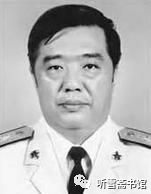
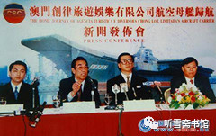

# 第五章 幕后推手

## 一

1998年国庆节之后，一个星期过去了，徐增平还没有安排贺鹏飞与邵淳见面。邵淳很着急。不过有一个人比他更急，这个人就是徐增平。因为他和乌克兰方面签订的协议，购买“瓦良格”的最后付款时间是1998年10月31日，时间在一天天迫近，留给徐增平的时间不多了。

根据1998年9月12日吴巍和徐增平签订的“转股协议”第五条之规定：双方同意承让人支付第二期投资款后7日内立即成立新的董事会。

为了加快推进项目的进程，澳门创律娱乐有限公司于1998年10月10日晚20：00时，在北京钓鱼台大酒店召开新董事会成立会议，参加会议的共18人。

这次会议有五个议题：一、公司架构；二、财务及行政安排；三、业务安排；四、资金筹措；五、其他配合。

对于这次董事会，邵淳的印象比较平淡，他只记得当时参加会的人很多，乱哄哄的。开会的时候，李×、张勇、吴巍都说，既然是邵淳负责组织资金，应该让邵淳当澳门创律公司的董事长，邵淳说：“我不干这个。我华夏证券的事情多极了。”

邵淳并没有参加会议的酝酿和准备工作。“瓦良格”项目只是华夏证券公司若干个重大投资项目之一，而且是由子公司在操作，他对于去当一个澳门小公司的董事长没有兴趣。他甚至对于自己是不是澳门创律公司的董事都不是很清楚。17年后的2015年，笔者采访他的时候，他问我：“我是澳门创律的董事么？”得到我的肯定回答，他笑道，“我还真是董事啊！”

这次董事会形成一份《会议纪要》，我从这份《纪要》中了解到，澳门创律旅游娱乐有限公司董事会共有9名公司董事：

* 徐增平（澳门创律旅游娱乐有限公司董事局主席）
* 李　斌（北京泰信达科技发展有限公司总顾问）
* 邵　淳（北京华夏证券有限公司董事长）
* 张　勇（香港达程有限公司董事长、总经理）
* 吴　巍（北京泰信达科技发展有限公司董事长、总经理）
* 庄立祥（澳门创律旅游娱乐有限公司董事、副总经理）
* 徐增顺（香港创律公司董事、徐增平弟弟）
* 刘克先（香港创律公司董事、徐增平妻子）
* 梁启洪（澳门创律旅游娱乐有限公司董事会秘书）。

9名董事中，代表华夏证券公司和隆泰源公司利益的董事为4人：邵淳、李×、吴巍、张勇。代表香港创律公司利益的董事为5人：徐增平、庄立祥、徐增顺、刘克先、梁启洪。徐增平任澳门创律公司董事会主席，李×任董事会副主席。

代表华夏证券公司和隆泰源公司利益的董事中，华夏证券公司只有邵淳一人，泰信达公司占三个名额：李×、吴巍、张勇。

这里需要特别说明的是，中国航天国际控股有限公司（航天控股）原副总经理陆昆来也参加了会议，不过他没有进入董事会，他的身份是“董事会主席特别助理”。

我在采访中据有关知情人介绍说，航天控股公司借给徐增平的钱无法收回，最后总经理跑到美国躲起来了，副总经理陆昆来也因此被解职，后经李×介绍进入吴巍的泰信达公司。在“瓦良格”这个项目上，陆昆来是徐增平和吴巍、邵淳之间的牵线人。他在泰信达公司只负责公司与徐增平的联系，不管其他具体业务。

这次董事会会议制订了公司的有关规定和各种制度，以保证资金的安全和“瓦良格”号航母的顺利归航。

会议决定，于1998年10月25日至31日，将“瓦良格”号航母从乌克兰尼古拉耶夫造船厂拖走。

因为华夏证券公司和隆泰源公司方面的董事中只有张勇一人是境外身份，别人无可替代，所以，与“瓦良格”项目有关的港澳事务都交由他来负责。

徐增平在会上又提出了要求泰信达公司提前支付款项之事。李×与徐增平就航母运作的时间安排实际需要资金的数额等问题进行了详细的商谈，并同意了徐增平的要求，初步商定向徐增平提前支付1.7亿人民币用于航母项目。

《会议纪要》的第四条是：“为确保航空母舰在本年10月底务必离港，争取在本年10月底之前筹措2000万美元，做公司应付款项。”

之后，李×请求邵淳同意继续给予泰信达公司借款支持。

由于涉及资金过大，邵淳提出：必须有上级领导出面证实航母项目是“国家的事”，才能继续向泰信达公司提供借款；如不能证实，前期提供的借款也必须收回。

但恰在此时，邵淳遇到了一件麻烦事：上级“联合调查组”进驻华夏证券公司。这个调查组是冲着邵淳来的。

1998年10月，也就是邵淳在北京钓鱼台大酒店参加澳门创律公司新董事会前后，有人给高层领导写匿名信举报邵淳，匿名信列举了邵淳的“九大问题”，其中涉及华夏证券自营投资、投行项目、实业投资等多方面，最要命的是信中还举报邵淳在这些业务投资项目中存在大量个人利益，严重损害了公司的经营发展。很快，一个庞大的调查组正式进驻华夏证券公司。

这次调查倒不是因为“瓦良格”项目。当时也没有几个人知道这个项目。

邵淳没有被停职，他一边工作一边接受调查组的调查。他让公司各部门全力配合，调查组要看什么就给什么。

## 二

李×根据邵淳的要求，一再敦促徐增平尽快安排领导人见面。

1998年10月21日晚，徐增平在国贸中心的一家饭店约见邵淳和李×。在那里，邵淳见到了海军副司令员贺鹏飞。当时在场的有贺鹏飞的夫人冯璐和另外两个随员。

“那次见面，时间很长，话题也很宽泛。”邵淳在接受笔者采访时回忆道，“除了说船的事，还谈到日本的‘88舰队’，谈到‘银河号事件’，谈到南海形势，还谈到‘青海湖’号综合补给舰访问美国。”

日本的“88舰队”，是指日本海上自卫队机动舰队即自卫舰队。早期的“88舰队”，通常由8艘战列舰和8艘装甲巡洋舰组成。如今已经打破了这种架构，大约有30余艘驱逐舰。这些驱逐舰的吨位都比较大，武器配置也比较先进。当时中国海军的军舰吨位都比较小，贺鹏飞说，如果双方发生冲突，中国海军将非常被动。

关于“银河号事件”，是在1993年7月23日，美国以获得情报为由，指控中国“银河号”货轮向伊朗运输制造化学武器原料，并威胁要对中国进行制裁。同时，美国向“银河号”所在的国际海域，派出了两艘军舰和五架直升机。“银河号”被扣留长达三周之久。9月4日，“银河号”货轮上最后一个货箱被检查完毕，没有发现任何化学武器。“银河号”被迫中止正常航运长达33天。有一种观点认为，中国的商船到哪里，中国海军的军舰就应该抵达到哪里。而那时，中国军舰的航迹还没有抵达印度洋和阿曼湾。

“他要搜查你，你没有办法，只能让他搜。”贺鹏飞说，“这也是我们国家和我们海军的耻辱啊！要是能把这个航母买回来，对咱们国家、海军能起很大的作用。”

邵淳已经被贺鹏飞说得开始动心了。

贺鹏飞接着说：“我们想搞航母，真正的作用不在东海，在南海。解放台湾用不着。现在我们有能力解放台湾。我们能够保护南海，外国就不能随便在这采油。现在那里都是别人的钻井平台，就是因为海军太弱了！眼睁睁地看着被外国公司把石油开采走了，我们海军官兵看了心里难受啊！”

贺鹏飞还对邵淳说了航母在南海存在的战略意义。

* 
  * 贺龙元帅之子、海军副司令员贺鹏飞（选自网络）

买航母这件事，在邵淳的心里意义更重大了。

贺鹏飞还讲了1997年海军舰艇编队访美的轶事。那个编队由三艘军舰组成，两艘驱逐舰（“哈尔滨舰”和“珠海舰”），一艘综合补给舰。那艘综合补给舰就是从乌克兰买回来的。据说该舰当年是为“瓦良格”号航母配套而建造，因为苏联解体，它和“瓦良格”一样被遗弃在乌克兰，当时该舰已经建造了80％。1993年中国买来以后，经大连造船厂续建，于1996年加入人民海军序列。

这次编队出访是由南海舰队司令员王永国海军中将带队，访问了美国的夏威夷和圣迭戈、墨西哥的阿卡普尔科、秘鲁的卡亚俄和智利的瓦尔帕莱索四国五港，历时98天。访美期间，美国海军太平洋舰队司令对王永国说：你这补给船怎么那么大啊？和你那两艘舰，完全不成比例啊！王永国心里想：我们这是为航母做准备的。

贺鹏飞对邵淳说：把“瓦良格”买回来，是利国利民的大事，是中国海军的梦想。

邵淳说：贺副司令，我有个事一直不明白。

贺鹏飞问：什么事？

邵淳说：既然是国家想要这个船，为什么2000万美元还要民间操作？2000万美元对于国家来说，是个小钱儿啊！ 

贺鹏飞说：航母立项很复杂。复杂到你们想象不到的程度。

贺鹏飞告诉邵淳，买航母不同于买别的船。海军的953舰，就是几年前从乌克兰买来的，这是个远洋补给舰，钱也不多，上级很容易就批准了。买航母就批不下来。另外办这种事要有个过程，要经过方方面面的论证、研究，可是现在我们不能等啊！再等机会就错过了。这是没有办法的办法。民间先把它买回来再说。以后批是肯定要批的，这个船国家肯定要用，但是我们现在不能等了。

邵淳问：这个“国家行为，民间操作”，有没有相关的文件啊？要办这个事，还是我手里拿着一份文件好一些。至少让我看看。

贺鹏飞说：文件是没有，我们内部掌握了一个精神，对外不要讲。

邵淳这时算是搞清楚了，徐增平说有文件，属于机密，不能出示，都是蒙他的。

贺鹏飞说：这条船我上去好几次，这个船确实好。设备基本完好，许多技术是我们没有的。我们20年之内恐怕造不出来。这个船海军肯定要，而且肯定会用上。就是将来不造航母，8台锅炉，4台主机，也可以装备两条大驱逐舰。

在邵淳看来，尽管贺鹏飞和徐增平讲的不一样，但贺鹏飞证实了，船是真的，海军肯定要。这就够了。

贺鹏飞最后说：这次是中国唯一的机会。因为以前不会有人卖给我们，以后也不会有。这是最后的机会，如果错过，我连自己都不会原谅。

后来邵淳在接受采访时告诉笔者，贺鹏飞当时很激动，甚至眼睛里闪着泪花。“我被贺鹏飞感动了，决定继续支持徐增平购买航母。”邵淳说。由于贺鹏飞主管海军装备工作，所以邵淳认为徐增平“代表国家”暗中购买航母的行为已得到证实。

我问邵淳：你是否知道当时中央高层对航母问题的态度？

邵淳坦言：不知道。如果知道，我也不会那么冲动了。

那次与贺鹏飞见面，邵淳决定了“瓦良格”号航母的命运，也决定了自己的命运。真可谓“成也萧何，败也萧何”。

邵淳向贺鹏飞表态：贺副司令，你放心，我会尽快把款项凑齐，绝不会影响“瓦良格”启航。

贺鹏飞很受感动，郑重地站起来向邵淳敬了一个军礼：航母回来后，我为大家庆功！

贺鹏飞与邵淳的这次会面，是一次具有历史意义的会面。贺鹏飞从1996年5月8日创造性地提出“香港老板把航母买回来”的思路，到亲自出面为“瓦良格”项目做推手，他所起到的作用是至关重要的。也许双方当事人并没有意识到其意义有多大，但事实证明，如果没有这次会面，很可能就不会有后来的“辽宁舰”了。因为在当时情况下，错过了邵淳，徐增平未必能找到像邵淳这样“愿者上钩”的人了。历史往往就是这样，一个看似很普通的事情，却能改变历史的走向。

## 三

见过贺鹏飞，邵淳心里踏实多了。他后来曾对朋友说过这样一句话：贺鹏飞一句话，胜似红头文件！

不过邵淳心里也不是一点疑问没有。有一次他问徐增平：“总参有关领导说的和海军领导说的不一样，怎么回事？”

徐增平说：你知道什么叫秘密工作么？秘密工作就是知道也不能跟你说！

邵淳想想，也是。

此前徐增平虽然说了一些假话，邵淳也将其理解为徐增平想把这件事做成，是不得已而为之，因此也就不再深究。

邵淳让吴宇继续筹措资金。为了避免节外生枝，他特别交代吴宇：隆泰源公司属于国企，只出钱，不出面。

吴宇按照邵淳的指示，将隆泰源公司的资金转给泰信达公司，再由泰信达公司转给徐增平香港创律公司在深圳的办事处。

这样做的主要目的，就是要以民间公司的面目出现，以免露出隆泰源公司的“蛛丝马迹”，给别人以“口实”。严格说起来，这属于违规操作，后来邵淳本人也为此付出了惨重的代价。不过话又说回来，如果一切照章办事，也就不会有后来的“辽宁舰”了。

如果在上级调查组进入公司以后，他畏首畏尾，就此停止参与“瓦良格”项目，自然也不会有后来的“辽宁舰”了。关于此事，不是没有人劝阻过他，可他仍然“一意孤行”。

华夏证券公司资产管理部总经理刘素红是邵淳手下的一名精明强干的女将，她作为资产管理部总经理，知道公司所有资金和项目的事情，平时邵淳是不瞒她什么事儿的。1998年10月下旬的一天，她到邵淳办公室汇报工作。当她汇报完工作，正准备转身离开时，邵淳把她叫住了，对她说：“有个事，我想跟你说说。你可千万千万不能告诉第二个人。”

刘素红暗想：什么事情这么慎重？当时调查组刚刚进驻，全公司上下笼罩在一种紧张的气氛之中，她理解邵总，此时谨慎一点是必要的。

邵淳说：“我买了一艘船，乌克兰报废的航母‘瓦良格’，让吴宇办的。”

刘素红很吃惊，不由得问：“这个事情办到什么程度了？”

邵淳说：“前期的钱已经付了8000万，但是后期的钱，包括拖船，都是问题。”

刘素红说：“在检查组在的时候，你这么干是有风险的。”

邵淳点点头说：“我知道。可是这个事是千载难逢的机会。”

刘素红问：“你为什么要干这个事？”

邵淳就把海军副司令贺鹏飞讲过的那些话说给刘素红听，也讲到上半年“印尼排华事件”对他的触动，说起当时看电视新闻播报“印尼排华事件”时的情景，他说：“如果有这么一艘大船的话，咱们至于这么受气么？”

刘素红惊叹道：“邵总啊！你是热血青年啊！只有热血青年才有这种冲动。这事该你去想么？咱们做好自己的事儿就行了！”

邵淳摸摸自己的脸说：“是不年轻了哈！不过这个事还是要做。目前的想法是，先以澳门赌船的名义搞，很快就会拖回来，只要船拖到香港，咱们就可以把这个钱还上。”

事已如此，刘素红只好说：“香港方面需要我做什么的话，尽管说。”

邵淳说：“我跟你说这个事情，因为这个项目是要吴宇操作，融资也是吴宇去融，我觉得让你完全不知道不大好，吴宇是你的副手，希望你给他提供一些方便。”

刘素红说：“我知道了。”

1998年10月23日，徐增平给泰信达公司传来“瓦良格”号航母拖船工作的具体安排。徐增平说，只要资金有保证，他负责11月中旬就能拖船。

鉴于此，1998年10月29日，吴宇又给北京泰信达公司转去1.5亿元人民币。加上前期转去的8000万人民币，华夏证券的隆泰源公司已经为这个项目投资了2.3亿人民币。

泰信达公司根据事先与徐增平协商的方案，留下500万元作为项目运作经费，给香港创律公司深圳办事处转去1.45亿元人民币，共计2.25亿人民币。

我拿到一份《关于根据转股协议支付给徐增平款项的细目》，内容如下：

* 1998年8月11日1000万，汇票号002998××
* 1998年8月27日1000万，汇票号000008××
* 1998年9月18日3000万，汇票号011611××
* 1998年9月28日3000万，汇票号011613××
* 1998年10月29日2500万，汇票号008737××（同日汇出4票）
* 3000万，汇票号008737××
* 5000万，汇票号008737××
* 4000万，汇票号008737××

（以上8张汇票是以“北京泰信达科技公司”开出，资金由华夏证券公司支付）

从这张细目表上可以看出，邵淳是在10月31日之前就把款项凑齐了。一共是2.25亿人民币，当时美元与人民币的汇率是1:8.7，2.25亿人民币约折合2600万美元。加上徐增平预缴了200万美元，一共是2800万美元，徐增平购买“瓦良格”的价格是2000万美元，加上租赁拖船、过土耳其海峡等杂七杂八的费用，2800万美元足够用了。

除此之外，吴宇根据邵淳的指示，又给泰信达公司转去5000万人民币，存在泰信达的账户上，以备急需。

邵淳为了让张勇全面掌握境内外运作情况，使他在有关单位都能有话语权，特意安排他在海南隆泰源实业投资有限公司任董事，足见邵淳对他的信任。他也确实没有让邵淳失望。

让邵淳失望的，是这个项目的“前期参与者”――徐增平。

## 四

徐增平与乌方约定的最后付款时间是1998年10月31日。徐增平对邵淳说：过土耳其海峡、过苏伊士运河都联系好了，只要购船款一到黑海造船厂，“瓦良格”11月初就可以启航。

华夏证券公司已经按时把购船款汇出去了，徐增平那边却悄无声息。邵淳很着急，吴宇也很着急，2.3亿人民币，这可不是个小数字，千万不能出问题啊！

另外，按照徐增平与黑海造船厂签订的中标协议，从11月1日起，如果“瓦良格”不能按时离开船厂码头，就要每天缴纳5000美元的停泊费；如果不能按时付清买船的尾款，还要按规定的比例支付滞纳金。

“瓦良格”为什么没有动静啊？邵淳四处打听消息。那段时间，徐增平经常和与他有债权关系的人拿“瓦良格”说事：我徐增平连航母都买得起，不差钱儿啊！于是，徐增平购买乌克兰报废航母的消息在外界传得沸沸扬扬，有的媒体煞有介事地把“瓦良格”航母与中国政府联系起来。

所有这些事情，都是邵淳不希望看到的。

1998年11月5日，邵淳、李×、吴巍、张勇等人一起商量应对措施。

邵淳说：看来“瓦良格”的事情不公开不行啊！

张勇问：你有什么想法？

邵淳说：有人提出来，应该尽快对外宣布，这个事不是徐增平一个人干的。对外不能只有他一个人的声音。

张勇问：用什么方式宣布？

邵淳说：在香港召开一个新闻发布会，你去搞。只有你的身份可以随便出入香港，你作代表最合适。你以澳门创律公司董事的身份向外界澄清一个事实：购买“瓦良格”是澳门创律公司的民间商业行为，不是大陆官方行动；另外可以给徐增平造成一点压力，让他赶快把航母拖回来。

李×和吴巍、张勇都说这个主意好。

张勇回到香港，把邵淳要开新闻发布会的事情对徐增平说了，徐增平当即表示同意。张勇事后分析说：“不排除徐增平也想利用这个机会，向外界宣传他的公司购买了航母。航母一动，就有钱了。”

1998年11月10日，张勇和徐增平一起在香港国贸中心召开了“澳门创律旅游娱乐有限公司航母归航新闻发布会”。

* 
  * “瓦良格”号航母归航新闻发布会，张勇代表澳门创律公司答记者问
    * 左起：梁启洪、张勇、徐增平、香港议会议员（张勇提供）

在新闻发布会上，徐增平和张勇向媒体宣布了“瓦良格”的航行计划，回答了媒体的提问，当场展示了“瓦良格”将来用于商业目的的图纸，介绍了具体设计内容。

张勇和徐增平还接受了路透社、BBC、CNN等媒体的专访。一共有二十几家中外媒体的近百名记者参加新闻发布会，并进行了报道。香港《文汇报》的标题是《澳商购航母推动旅游》，台湾《中国时报》的标题是《航空母舰变身海洋娱乐城》，香港《苹果日报》还刊登了《构思中的海洋娱乐城》示意图。

当时所有媒体报道的主题，都是“航母变身娱乐城”。时隔13年之后，据《济南时报》2011年9月30日发表的《山东人》一文提到的这次新闻发布会，又多了一个新的版本：

1998年11月11日，新华社香港分社曾以《徐增平表示购买前苏联航母服务国家》为题刊发消息，文中说：“创律集团主席徐增平向记者表示，一旦国家需要，我和创律将毫不犹豫地向国家献出这艘航空母舰，为国家服务。这才是我的最终目的。购买这艘航母的目的是‘以商业行为之名，行服务国家之实，希望对国家在政治、军事、经济等方面有所贡献’。”

这段文字随即被各媒体广泛引用。后来，我在《瓦良格迷局》一书中看到了这篇“新华社香港分社”消息的全文。认真研读之后，我对这篇文章的真实性产生了疑问：

一是内容与事实不符，比如“创律在购买这艘航空母舰时，已经购得它的全部30多万张设计图纸，这将可以为中国未来建造航空母舰争取时间。只要国家需要，创律可以随时提供这些图纸”，而我知道，他“已经购得”图纸的说法不属实。

二是内容与当时中央的精神不符，比如“购买这艘航母的目的是‘以商业行为之名，行服务国家之实，希望对国家在政治、军事、经济等方面有所贡献’”，当时中央的态度是不搞航母，在1995年底就已经明确了。这段话即便真是徐增平说的，新华社记者也不该这么写；即便是记者这么写了，社长、主编也不该这么签发。

为了把此事搞清楚，我到网上去查这篇“新华社消息”的出处，大部分和《济南时报》一样，用的都是“新华社香港分社曾以《徐增平表示购买前苏联航空母舰服务国家》为题刊发消息……”这种句式来表述。最后我在“加拿大华人网”上找到一则消息《网络报料：港商徐增平购前苏联航母服务国家》，其中有“新华社香港分社”那则消息的全文，而上网时间是“2009-12-09”。

……

徐增平买“半成品”的航母，名义上是搞“娱乐城”、海上酒店，其实他另有打算。1998年11月11日（第445期）《内参》，全文如下：

《徐增平表示购买前苏联航空母舰服务国家》

（“内参”正文略，参见本书附录一：《本书正文中涉及的有关文件》之二《不合时宜、内容虚假的“内参”》）

这时我才恍然大悟，原来不是公开发布的消息，是新华社的“内参”。我看过新华社的《内部参考》杂志，平时人们习惯简称为“内参”。那些“内参”的文字，一般都是内容翔实、言简意赅，概括性较强，而这篇“内参”则差点火候，其中有很多常识性错误和虚假信息。我曾经怀疑这个“内参”是假的，后来我从原总参二部某局长那里查到了这份“内参”的原件，它居然是真的！我猜测，这个“内参”的稿子是徐增平的“刀笔吏”所写，不过是用了新华社记者的名义而已，恰巧“内参”的值班编辑并不了解当时中央高层对待航母的态度，所以就稀里糊涂地发出来了。因此我说这是一篇“不合时宜、内容虚假的‘内参’”。

另外，那篇“内参”还有这样一段文字：

“当然还有一个意义是经济意义。”徐增平说，现在国家国力还有限，在集中力量搞经济建设的方针下，军费也相当紧张，因此要让国家一下拿出上亿美元去购买“瓦良格”号，经济压力很大也不合算。现在创律投资8000万美元买到了实际造价已经超过10亿美元的“瓦良格”号，对国家的经济意义显然也是相当可观的。

“瓦良格”的中标价是2000万美元，6个月后，徐增平与泰信达公司合作时已上升到6000万美元，又过了不到1个月时间，徐增平竟然把投资数额说成8000万美元了。而那“实际造价超过10亿美元”的数字是怎么来的，只有鬼知道。

纵观徐增平后来的所作所为，人们不能不怀疑，他早在1998年11月就为日后向国家要更多的钱埋下了伏笔。

## 五

“澳门创律旅游娱乐有限公司航母归航新闻发布会”弄得动静挺大。发布会之后，徐增平也确实开始了行动。他告诉邵淳等人，他租了荷兰ITC公司一条9000匹马力的远洋拖船，正从大西洋驶往黑海造船厂。

虽然这个消息比原定的11月1日启航延后了一个来月，但毕竟开始有动静了。邵淳等人每天都在关注这条拖船的消息。在钓鱼台大酒店泰信达公司的办公室里，有一张世界地图，每天有人根据徐增平公司通报的荷兰拖船航行的距离，在地图上标注一个红点。那些日子，邵淳不论多忙，一下班就会赶到钓鱼台大酒店，去观看那个每天移动一点的红色坐标。明明知道拖船要航行十多天才能到达黑海造船厂，他还是忍不住天天去看，和大家一起分享航母即将归航的喜悦。

可是，拖船到达黑海造船厂以后，红点就停在那里不动了。怎么回事？过了一周，邵淳忍不住了，让人打电话催。徐增平说：快了快了！

又过了几天，还不动，邵淳就亲自打电话问徐增平：船怎么还不动？

徐增平说：情况可能有点变化，乌克兰那边要加钱。

邵淳一听，愣住了：加钱？加多少？

徐增平回答：还没说。

邵淳问：你估计加多少才行？

徐增平说：弄不好，不少于一个亿（人民币）吧！

邵淳说：哎，不对啊！给你的钱不是足够了么？

徐增平说：原来以为是够了，可是现在……

邵淳接着问：有文字的通知么？

徐增平说：现在还没有。

邵淳说：那就等有了文字的东西再说吧！

邵淳不解，按照国际惯例，签了协议就要执行，哪有坐地涨价的道理？他要看书面通知，因为什么加钱，总得有个理由啊！原来的协议签得很规矩，按说不该出这种另外加价的事情。

又过了几天，乌方还没有书面通知，船也不动。这时邵淳的心理感觉不好。在此之前，尽管邵淳在徐增平“钓鱼”的问题上对他有些看法，但考虑到买航母是件好事，特别是在贺鹏飞出面谈话以后，邵淳对徐增平的买船项目采取了积极支持、全力配合的态度。可航母归航的日期一拖再拖，徐增平又继续要钱，邵淳开始对他越发警惕了。

年底将近，按着公司管理规定，这时都要把公司的账目理一理，清一清。邵淳对吴宇和吴巍说：通知徐增平，年底该对账了，让他把与“瓦良格”有关的账目报过来看看。

徐增平反馈的信息是，他要先清理一下。

1998年12月下旬的一天，徐增平请张勇到他的公司去一趟。

张勇到了徐增平的公司，徐增平拿出一包材料给张勇，这是一些开支的单据，徐增平让张勇报送北京。

张勇一看，在各种单据中还有一个清单，其中“顾问费”1696万美元，“公关费”430万美金，“行政财务费”871万美元。三项费用总和为2997万美元，当时相当于2.3亿人民币。

张勇有些吃惊地说：“费用这么大？”心里话：这也太不靠谱了，比买“瓦良格”的钱还多！

徐增平说：到处都得花钱啊！

张勇说：我可以往北京报，但我觉得北京不会认。

其中的所谓“顾问费”，列出一些专家名单，这个20万，那个30万，没有任何票据，这些专家谁去查啊！报表上还有一块36万的卡迪亚女式手表，徐增平说是送给一位将军夫人了，鬼知道他送给谁了，再说这和航母有什么关系？

张勇把材料报送北京，邵淳看了很生气，华夏证券的隆泰源公司给泰信达公司转去2.3亿人民币，泰信达给徐增平汇去2.25亿人民币，现在徐增平拿来一个2.3亿人民币的账单，他是要用这2.3亿人民币去冲抵华夏证券公司那2.3亿人民币啊！

邵淳对张勇说：不对，不是这个。这跟船没关系。就要他给乌克兰汇款的底单。你告诉徐增平，别耍这种小聪明！我们不予认可。

邵淳此时的处境很不好，正在接受上级调查组的调查，本来指望“瓦良格”项目能够顺风顺水，没想到徐增平不断给他添乱。他甚至怀疑，是不是徐增平听到了什么风声，故意趁机浑水摸鱼？邵淳对徐增平的看法越来越糟。当初的那点好印象都被他破坏掉了。

张勇没有把邵淳的原话转告徐增平，怕两人之间伤了和气，只是比较婉转地说：华夏证券认为，这笔开销太大，无法认定。

徐增平无奈地摇摇头说：那也不能让我自己扛啊！咱们现在都是一条船上的人。

张勇当时没明白他的意思，后来的一系列事实证明，徐增平当时的潜台词是：你们不认账，咱就一起熬吧！

在此之前，吴巍作为泰信达公司的法定代表人，曾多次建议李×对支付给徐增平的资金进行监督使用，防止徐增平不按协议规定用款，造成项目风险。李×并没有采纳吴巍的意见，致使资金失控，为日后徐增平不按协议规定用款留下了隐患。

到了1999年初，徐增平仍以资金有缺口和他正在筹集资金为由，迟迟没有“瓦良格”启程的消息。吴巍多次催促徐增平尽快拖船或来北京说明情况，李×也督促陆昆来给徐增平施加压力，可是，徐增平既不来北京，也没有拖船的举动。邵淳作为出资人也十分着急，催问张勇怎么回事，张勇就去催徐增平。

张勇来到徐增平的办公室，对他说：老徐，“瓦良格”怎么还没动啊？

徐增平对他比较客气，就说：老哥，我现在缺钱啊！你替我跟邵淳说说，再给我90万美金，我就能动了。

张勇非常不解：华夏之前给你的那些钱呢？

徐增平说：原来没想到花钱这么多，租拖船要花钱，疏通各种关系要花钱，哪里都需要钱啊！

不能说徐增平的话没道理，但也不能全信。张勇在考虑下一步怎么办，不给他钱，航母动不了，给他钱，就能保证航母会动么？前期华夏证券公司给徐增平打款，是通过泰信达公司办的，张勇没经手，具体数字他不知道，不过他听说数额很大，按照当时的汇率，也有二三千万美元了。

张勇说：徐总，不能再拖了，再拖，你的信誉就没有了。你先把“瓦良格”搞定，“瓦良格”一动，你再有什么困难，我们在北京找人帮你。华夏证券是大户，借钱不难。一两个亿，无所谓啊！

徐增平点点头，若有所思。

