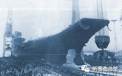
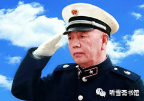
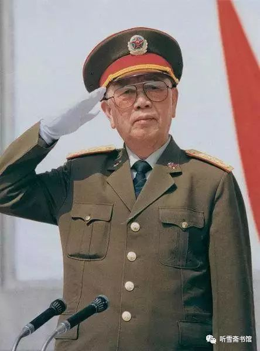
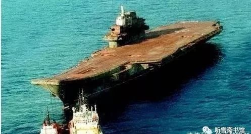

# 第一章 错失良机

［上部　购买航母］

* 建造中的“瓦良格”号航母（选自网络）
  * 

## 一

1991年底，曾经的“超级大国”之一――苏维埃社会主义共和国联盟（简称苏联），在人们猝不及防的情况下解体，就如同一座摩天大楼轰然倒塌，让整个世界为之瞠目。原来的加盟共和国白俄罗斯、乌克兰、立陶宛、爱沙尼亚、吉尔吉斯斯坦、乌兹别克斯坦等纷纷宣布独立，苏联在眨眼之间就变成了15个国家。在苏联“分家”时，国家的大部分资产被俄罗斯继承，其他另立门户的也分到了一部分。位于黑海之滨的黑海造船厂，就归属乌克兰共和国。原苏联海军在黑海造船厂建造的三艘航母面临被分割的命运：已经完成98%工程量的“库兹涅佐夫”号航母被俄罗斯海军强行开走；已经完成68%工程量的“瓦良格”号航母和尚未下水的“乌里扬诺夫”号核动力航母，则作为资产分给了乌克兰。

刚刚独立的乌克兰没有能力把“瓦良格”建造出来，更没有能力养活一艘“烧钱”的航母，因此准备将尚未竣工的“瓦良格”号作为半成品出售。

哈尔滨船舶工程学院（现哈尔滨工程大学）一位在乌克兰造船学院进行交流访问的教授将这一信息传回国内，原海军装备技术部部长、中国造船工程学会理事郑明将军得知后，立即向中国船舶总公司总经理、中国造船工程学会理事长潘曾锡作了汇报。

郑明对潘曾锡说：这个事很重要，应该当个大事来办。大家都知道这条船是真的航母啊！

当时中国造船工程学会正准备开年会。郑明建议开会的时候，请这个教授来说说此事，也请学会的名誉理事长刘华清来听听。

潘曾锡说：这是个好主意，你去办吧！

郑明去向时任中央军委副主席刘华清报告，建议他届时到会作指示。刘华清爽快答应：等开会的时候去看看大家。

1992年初，中国造船工程学会开年会时，刘华清真的来了。会议临时改变议程，请船舶工程学院的教授专题汇报“瓦良格”一事。

为什么郑明一定要请刘华清来听会呢？因为郑明知道，刘华清从1970年就开始研究航母，此后与航母结下不解之缘，特别是在1982年出任海军司令员后，曾多次提出对航母进行论证和研讨。

刘华清之所以热心搞航母，也和他的经历有关。他早年曾在苏联伏罗希洛夫海军学院留过学，后来长期主管海军和全军的科研、装备建设，熟悉海军，了解海洋，也了解世界海权形势发展情况。

## 二

由海军作家施昌学撰写的《海军司令刘华清》一书中有这样一段话：

> 早在20世纪60年代初期，刘华清任舰艇研究院院长时就十分关注世界海军强国航空母舰的发展和应用，思考过航母研制问题，并于1970年亲自主持起草了新中国历史上第一个航母工程报告。

这是一段鲜为人知的历史。

1970年早春，海军党委意外接到中央最高决策层关于研制航空母舰的指令。这项“非常光荣的政治任务”，幸运地落到了刘华清的头上。斯时，他被无端撤销国防科委副主任领导职务，撵回海军做了一个小小“船办”——“海军造船工业领导小组办公室”主任。

能够亲自主持起草中国第一个航空母舰建造工程报告，是身处逆境的刘华清备感荣幸和骄傲的一件大事。

刘华清在自己的回忆录里，未对这段往事花费太多笔墨，只是简略写道：“早在1970年，我还在造船工业领导小组办公室工作时，就根据上级指示，组织过航空母舰的专题论证，并上报过工程的方案。”

不过在知情者口中，这段最初的论证有其更丰满的一面。

刘华清的女儿刘超英回忆说：“我父亲有个特点，不管职位高还是低，他坚持他的信念。船办主任是个很小的官，但他觉得自己的职责就是让国防强大，重要的东西一定要确保。”刘超英认为，父亲开始对航母工程投注精力并非偶然，“对于航母，他的意识也会超前些。毕竟他1954年到1958年就在苏联海军学院学习，后来又在七院（舰艇研究院）做院长，对舰船的战术、技术都很熟悉”。

曾任国务院第六机械工业部军管会委员的郑明回忆说，随着1970年5月5日中央命令正式下达，七院成立了班子，“本地的、外地的，从各个研究所调人来，集中几十个人灯火通明地搞论证工作”。

《海军司令刘华清》一书这样记述：

1970年5月16日，是应该被载入中国航母发展史的一个具有特殊纪念意义的日子。这一天，刘华清主持完成了题为《关于建造航母问题的初步意见》的报告。

这份收存于海军档案馆的报告，文字不长，但对于研究中国当代海军发展史而言，却是一份不可多得的珍贵文献。上溯自1866年，历经晚清、中华民国和中华人民共和国，中国近现代海军走过整整100年艰难苦涩的历程后，中国航母终于从梦想进入高层决策视野，并由刘华清构思出第一个“概念模型图”。

1971年9月13日，林彪摔死在蒙古的温都尔汗，震惊中外的“九一三事件”，让刚刚起步的中国航母预研工作突然搁浅。

直到此时，刘华清才获悉：一年半之前下达建造航母令的中央首长是林彪！政治气候一变，科研也就难有作为了。

时隔五年之后，刘华清第二次向中央建议，中国应该建造航母。

1975年5月，毛泽东主席对海军第一政治委员苏振华作出“努力奋斗，十年达到目标”的指示后，6月，在苏振华的主持下，海军会同六机部向国务院、中央军委联合上报《关于海军舰艇十年发展规划的请示报告》。

当时刘华清没有参与这个发展规划的研究、编制工作。8月下旬，刘华清看到了这份“规划”。看过之后，非常失望。感觉既缺乏国际视野，又缺乏严谨科学论证。后来得知，这份“规划”报告是在短短20多天时间里仓促写成的。

刘华清后来回忆说：“好几天睡不着觉呵，这是关乎海军和国防建设的大事……想来想去，我觉得再也不能沉默了。”

刘华清针对海军会同六机部上报的“规划”，伏案疾书整整一周，抱病写出《关于海军装备问题的汇报》，从八个方面阐述了海军装备存在的问题和今后发展方向，并针对“十年规划”中缺乏战略思考，观点鲜明地亮出自己的主张。

1975年9月3日，刘华清把长达万言的《关于海军装备问题的汇报》呈送时任中央军委副主席的邓小平，大胆建言道：“为了解决水面舰艇和潜艇到中、远海作战的空中掩护、支援配合等问题，有必要尽早着手研制航空母舰！”

邓小平在收到刘华清报告的第二天，就批转给海军第一政治委员苏振华：“振华同志：请你考虑一下，我看有些意见值得重视。”

无奈当时中国政治时局正值风云变幻之际，刘华清的这个《汇报》最终难逃被束之高阁的命运，未能促使《海军舰艇十年发展规划》进行调整。后来随着邓小平再次被“打倒”，刘华清也被打入另册。

实现航母构想的机会出现在1982年刘华清被任命为海军司令员之后。

* 海军司令员刘华清
  * 

1983年5月，海军装备论证研究中心成立，刘华清明确交代：要把航空母舰作为重要研究论证课题。

1984年1月11日，在海军第一次装备技术工作会议上，刘华清投放了一颗“重磅炸弹”：

“海军想搞航母的时间也不短了。由于国家经济能力不行，看来90年代以前已没有这个可能了。但是，航空母舰总是要造的。”

这是刘华清1982年8月就任海军司令员以来，首次就建造航空母舰问题在公开场合表态。

1986年，刘华清正式提出“海军战略”理论。他把“近岸防御”改为“近海防御”，这是中国近代海军自1866年以来海洋防务观念的里程碑，也是新中国成立后的第一个军种战略。“近岸”和“近海”，仅一字之差，却引起了整个海军思想观念、装备建设、战场建设、人才储备的一系列变化。

在此后召开的第二次、第三次海军装备技术工作会议上，航母问题被反复提及，刘华清的态度不断明朗。

在第二次海军装备技术工作会议上，他说：“到2000年航母总要考虑，发展航母，可以先不提上型号，而先搞预研。”

在第三次海军装备技术工作会议上，他说：“现在，各国都在注意发展航空母舰，我们搞难处多一些，财力、技术都有一定困难，但从长远考虑，还是需要的。十年内不搞，十年之后再搞，也还会有困难。因此我要求早论证，早点把这个问题研究透。”

他特别强调：“我们搞航空母舰的目的，不是为了战争，而是用于维护国家统一，维护海洋权益，维护世界和平。如果我们有了航空母舰，海军的质量就将彻底发生变化，海军的作战能力也将有较大的提高，更有利于我军执行积极防御的战略方针。”

1986年11月18日至20日，刘华清倡议举办的首次海军发展战略研讨会在北京召开。来自军内外的80多位专家学者，不仅充分肯定海军军事战略和海军发展战略，而且一致呼吁尽快启动航空母舰研制工程。

1987年2月27日，中央军委召开常务会议，专题听取总参谋部关于“七五”全军主要战斗装备规划设想的汇报。会议认为，“七五”期间军队装备建设，根据轻重缓急、量力而行的原则，发展顺序应为陆军、空军、二炮、海军。海军被排在“末座”。

在以经济建设为中心的20世纪80年代，经费不足也成为航母上马难的重要理由之一。1985年中国军费总投入才192亿元，还不够买一艘美国大型核动力航母。

刘华清在海军司令员任上，主持编制了海军20世纪末到21世纪中叶装备发展中长期发展规划。他认为，实现“海军战略”的顶层设计和核心力量，就是航母编队！没有航母作战群，“近海防御”的“海军战略”就难以实现，海洋大国的地位和权益就难以确保，中国在太平洋就难有发言权！

刘华清决定向总部首长作一次汇报，他说：要让军委总部首长全面了解我们的真实想法。不然等上级规划好了，再放“马后炮”就难办了！ 

1987年3月31日，汇报会在海军机关办公大楼第一会议室进行。不知为什么，总部首长一个也没来，只有时任总参装备部部长的贺鹏飞代表总部首长，率总参装备部、作战部等相关部门领导，来到海军听取装备规划问题的汇报。

尽管贺鹏飞只是总参一个二级部的部长，刘华清仍然亲自汇报。他开宗明义，表示海军坚决执行军委决策，但要向军委首长说明海军的真实想法和意图。

当时参加会议的海军装备技术部部长郑明对这次汇报会印象很深，他在怀念刘华清的文章中写道：“他（刘华清）说，海军战略涉及海军建设的顶层设计，发展有两大问题，一是航母，二是核潜艇。他当时讲了句关键的话，‘这两项装备，不仅是为了战，平时也是为了看，看就是威慑’，点出了航母有战略威慑的作用。作为一个老红军，能讲出这种语言，中国不多。”

刘华清的这次汇报，并没有得到正式反馈，但在总参谋部和国防科委等领导机关里引起关注。

重视也好，不重视也罢，刘华清作为海军司令员，开始为实现中国航母梦谋篇布局了。

1987年4月初的一天，刘华清把海军军校部部长赵国钧和干部部部长傅渤海召进办公室，向他们下达指令：秋季在广州舰艇学院开办一期飞行员舰长班。学员毕业后全部上驱逐舰、护卫舰，从副舰长、舰长，到编队指挥员，一步一步锻炼成长。他说：“这个班人不在多，十个足矣。”

刘华清最后嘱咐两位部长：“关键是综合素质过硬、年轻，要优中选优、百里挑一！”

9月上旬，中国海军首届“飞行员舰长班”在广州舰艇学院开办的消息通过媒体报道后，迅速引起海外舆论高度关注。西方军事分析专家普遍预测，中国正在启动航母研制工程，并将在21世纪初实现航母梦。于是，“飞行员舰长班”被境外媒体直接解读为“航母舰长班”。

就在首届“飞行员舰长班”紧锣密鼓筹办之时，由海军装备论证研究中心组织承办的“发展航母研讨会”，也经刘华清批准，分别于当年5月和8月在北京举行。

以此为标志，中国航母论证全面展开。

1987年11月，年逾古稀的刘华清进入中央军委决策层，任中央军委副秘书长、军委委员，两年后，晋升中央军委副主席。

## 三

在中国造船工程学会的年会上，刘华清听了半天会。大家都提议派人去乌克兰看看，刘华清认为可以去，但要由地方为主来牵头，海军不能牵头。

会后不久，1992年3月，经上级批准，一个以中国造船工程学会名义成立的代表团访问乌克兰黑海造船厂，团长由第七研究院原副院长、中国造船工程学会常务理事尤子平担任，郑明以团员身份参加了“瓦良格”号航母考察团。

黑海造船厂热情接待了来自中国的客人。当时乌克兰的经济状况很糟糕，早餐没有牛奶，晚上宾馆暖气不足，房间里很冷，乌方只好给他们每人加一条毛毯。

据郑明回忆：“当时是船厂总工程师带着我们看的‘瓦’舰，我们一直下到最底部。可能是为了省电，船上没有电灯，只能用手电照明。总工程师还拿了一个小本子，说是里面有三千多个舱室，怕走不出来。船是新的，一些电缆和管路都装上了，设备装得还不全。”

双方开诚布公地谈到购买“瓦良格”号的问题。乌方认为，只有中国能把这条船续建起来，并表示愿意帮助中国把它建成。

中方说：“你们的工程师待遇高，我们养不起你们。我们的工资很低。”

乌方说：“我们不要那么高待遇，就是想去帮你们造出来，这是保卫世界和平的武器，像我们的‘儿子’，我们就想把它建完。”

“瓦良格”号航母是苏联海军第三代航母“库兹涅佐夫”级的第二条舰。1985年12月开始在乌克兰的黑海造船厂的船台上建造，1988年11月25日下水。公开报道的资料显示，“瓦良格”的主要技术参数如下：

* **主尺寸**：舰长302米(全长)、270米(水线)、水线处宽35.4米、吃水10.5米
* **飞行甲板**：长300米、宽70米
* **机库**：长152米、宽26米、高7米
* **排水量**：43000吨(标准) 、55000吨(满载)
* **动力**：8座КВГ－4型涡轮增压垂直水管自然循环蒸汽锅炉、4台TV12－4型蒸汽轮机、 4轴 200000马力
* **辅机**：9座1500千瓦蒸汽轮机发电机组、6座1500千瓦柴油发电机组
* **最大航速**：29节
* **续航力**：8500海里/18节、3800海里/29节
* **舰员**：1960名舰员 + 626名航空人员 + 40名旗舰指挥人员

“瓦良格”号原名“里加”号，1990年7月改名为“瓦良格”号，以纪念1904年日俄战争中在仁川海域被日舰击沉的“瓦良格”号巡洋舰。截至1991年11月，“瓦良格”的建造率已达68%，舰上机炉舱已安装完毕，电站隔舱接受供电，舰上机械设备也开始试运转。

中国造船工程学会代表团回国以后，正式向上级写了报告，建议把“瓦良格”号舰买回来，把工人请过来，把图纸要过来，把船厂仓库的东西搬回来。

据郑明回忆：代表团分别向不同层面的有关人员汇报了八次，听汇报的人只是听，都不表态，此事便不了了之。

时间一晃就过去了三年。这三年间，“瓦良格”的话题就像一个气球，一直飘在空中未能落地，不过那根拴着气球的细线，始终抓在刘华清的手中，没让它飘远。1995年4月，海军司令员张连忠根据刘华清的指示，在海军装备论证中心（现海军装备研究院）组织召开了一次航母研讨会，目标就是要引进“瓦良格”。这次会议规模很大，时任中央军委副主席的刘华清和解放军三总部以及国家部委的有关领导参加了会议。

刘华清在作会议总结时说：5月份你们这些人应该在乌克兰了。但最终干不干航母，要由中央政治局决定。

会后，海军向党中央、国务院、中央军委呈送了请示报告。

由于种种原因，中央没有批准这个引进计划。

据时任中国船舶工业总公司副总经理的黄平涛后来在《忆刘副主席二三事》一文中说，他1995年5月去乌克兰出差，检查从乌克兰引进燃气轮机等项目的合同执行情况。出发的前一天，突然接到通知，到京西宾馆接受任务，“在京西宾馆，部队的曹刚川同志和贺鹏飞同志向我传达了刘副主席的指示，增加一项任务：到黑海造船厂考察‘瓦良格’号航母，看看有没有购买的价值。我们接受这个任务后非常兴奋，刘副主席想造航空母舰了，造船人多年的梦想有可能实现了”。

当时曹刚川正在京西宾馆参加军委扩大会。和黄平涛一起去的还有船总军工局局长胡基政。黄平涛和胡基政干了一辈子造船工业，给海军造了上千条各种各样的舰艇，最大的愿望是造航母，这次得到来自中央军委的指令，感觉中国人的航母梦就要实现了。

黄平涛组织出国人员进行了讨论和分工，列出了考察提纲，安排人员摄像、照相和记录。

黄平涛一行到达乌克兰黑海造船厂，对方热情地接待了他们。船厂对“瓦良格”的保护也十分尽心，即使在工厂发不出工资的情况下，也有人在航母上值班站岗。为了方便他们上船考察，还临时拉了电线照明。

他们登上“瓦良格”，上上下下看个仔细，胡基政还亲自拍了录像。当时航母的电子设备还没安装，主要是看动力系统。乌方表示愿意出售，公开场合出价2亿美元，私下里有人和黄平涛“咬耳朵”，小声告诉黄平涛：如果你们真想买，2000万美元就可以成交。

黄平涛等人考察归来，专门整理了汇报材料，胡基政还根据他拍摄的素材，剪辑了一个录像片，准备向曹刚川和刘华清汇报。后来不知什么原因，曹刚川和刘华清都没有听汇报，这个事就搁下了。黄平涛和胡基政不免有些失落。

郑明在接受笔者采访时说，那段时间，先后有好几拨人前去乌克兰黑海造船厂考察。当时海军的思路，一是买个半成品，二是自行研制，前一种更适合起步，也符合刘华清的思路。

据黄平涛回忆，1995年10月25日，刘华清到中国船舶工业总公司参观“八五”国防科技预研成果展览，黄平涛前去陪同。参观结束后，刘华清把黄平涛拉到一边，对他说：“小黄，以后不要再提航母的事了。”

* 中共中央军委副主席刘华清
  * 

这显然与高层决策有关。中国与“瓦良格”号航母失之交臂。

中国发展出版社出版的《中国航母》一书在谈及这段历史时称，政府总理当时在一份关于航母的报告上批示：“本届政府不考虑这个问题。”

该书认为，自从苏联解体之后，中国面临的安全压力消失，因此采取“和善”的“新安全观”，航母工程自然被暂时搁置。也有消息称，相关方面研究了改造航母的成本，选择放弃这一计划。

对此，曾任贺鹏飞秘书的海军装备部某办公室主任刘相春有他的见解：“搞航母要具备四大要素：国家战略、统帅意志、综合国力、技术水平。这四点缺一不可。在过去的40年中，因为这四个要素不齐备，所以中国没有搞成航母。”

1996年初春的一天，中国船舶总公司船舶贸易公司孙方处长对胡基政说：我刚得到消息，“瓦良格”要当废铁卖了，咱们是不是把它买回来？

胡基政认为这是好事情，就去向船舶总公司总经理王荣生汇报。王荣生一听，很高兴：咱们把它买下来，海军用不用以后再说。王荣生顿了一下，又说，这个事得请示一下曹刚川。

此时曹刚川是解放军副总参谋长。胡基政拿起办公桌上的红色电话机，要通了曹刚川的办公室。

王荣生在电话里向曹刚川汇报了想买“瓦良格”的想法。

曹刚川说：你们船总是国企，你们买也是国家买啊！

王荣生说：知道了。放下电话，和站在旁边的胡基政都泄了气。一腔激情化作云烟。

航母是国之重器，副总参谋长也无权拍板。

1996年5月8日，胡基政陪同公司副总经理黄平涛参加海军一艘新型潜艇首艇交接仪式，一同参加仪式的海军副司令员贺鹏飞在仪式结束后，把黄平涛和胡基政叫到会议室，对他们说：你们能不能把“瓦良格”买回来？

黄平涛不知道前面的事情，就痛快地说：好啊！

胡基政马上解释道：前几天，我们王总向曹刚川请示过，曹刚川的意思，船总是国企，我们买也是国家买啊！

贺鹏飞听了有些失望，接着又说：哎！能不能找一个香港的大老板，让他们先买下来？他们有的是钱。一旦需要的时候，就弄过来。

黄平涛和胡基政都没有接这个话，也没法接。但他们觉得贺鹏飞的这个思路是有价值的。后来发生的一系列与“瓦良格”有关的事情，无疑都与贺鹏飞的这个思路有关。

