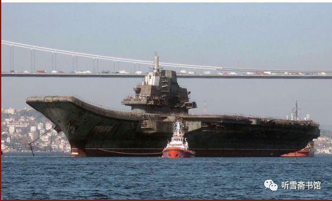

# 序

* 序
  * 历史的记忆和文学的记忆
    * 田珍颖

读罢纪实文学《“瓦良格”号航母来中国》，心潮起伏，热血沸腾。所以，我以八十大岁，勉力扛笔为此书写序。

之前，“瓦良格”来中国的故事，被渲染成：一位港商，买了此舰，捐给国家。这港商也因此戴上了政治的花环；

但，之后，2015年，就有了《“瓦良格”号航母来中国》的书稿的传阅。这本由军旅作家李忠效完成的纪实文学，以无可辩驳的事实，揭开了复杂曲折的真相，否定了“之前”那段编造，让历史回归理性。

读着《“瓦良格”号航母来中国》的书稿，作者那带有颠覆性的写作实践，证实着它的艰难。

长期用各种媒体宣传的那段伪历史，已经霸占了人们的习惯认识，何况还有政治花环的掩蔽。推倒它而揭开真相，谈何容易！李忠效在写作动机刚刚萌动时，就受到了朋友们的各种警告劝阻，均谓之：路途艰险！但这位穿着军装的笔耕者，却一改平时的随和、厚道，坚定地走上了求索“瓦良格”来中国的真相之路。他说：我不能让我国第一艘航母的历史，被人歪曲。

一个军人的担当，让他扛起如椽大笔。

写作的过程，是边破边立、大破大立的过程。当大量的资料、采访录音、文字笔录堆集在案头时，他意识到，必须从中寻找、求索、鉴别、判断，从而得出正确的结论——这才会使真相展露，假相破灭。

他同时研究那段伪历史的文字，看它是怎样黑白颠倒的。

在这样多次的正反的推敲中，他发现了一个玄机——时间。伪历史的制造者，躲避着时间，模糊着时间，从中将事件涂抹得面目全非；而真相恰是在时间连接的链条里，严谨地排列着过程。

西方人有句谚语，说：时间能使隐藏的事件显露，也能使灿烂夺目的东西黯然失色。李忠效决定用“时间”打开历史的大门。

但，这又是一件谈何容易的事。因为时间久远，当事人或少有准确的时间的记忆，或几个人对同一事件记忆的时间不一致。“时间”，绝无捷径可提供，但它是一条可以信赖的通途。无论在立论还是在驳论中，“时间”将以它坚定的本质，为历史的真相作证。

于是，在这本书中，我们看到了“时间”的力量：

时间力挺了事件的准确性，让历史的真实性，成为全书的含金量——

比如，海军副司令员贺鹏飞在得知中央高层不同意买航母时，他提出找一个港商出面“曲线”购买“瓦良格”的设想。这件事是购买“瓦良格”的一个关键的起点。作者是在采访中船重工集团公司总工胡基政时得知这一宝贵资料，但胡基政只记得说话的场合是一艘潜艇的交接仪式之后，却记不得具体时间。于是，作者先后从海军装备部和海军司令部的有关部门查找出该仪式的时间，互相印证后，因与胡基政所说的年份有出入，他又寻找已退休的当年经历此事的老同志验证。最后循迹找到当年亲耳听贺鹏飞讲此话的中船重工集团公司总经理黄平涛核实，黄平涛以他的记忆复述了贺鹏飞谈话的全过程，最后确定了这个重要时刻的准确时间：1998年5月8日。这时，离最初获得这个信息的时间，已过去两年多；当初提供此信息的胡基政同志，已病逝。

当这个“时间”正式出现在书稿上时，事件的准确性被高高托举着；同时一个报告文学作家负责任的写作态度，也显示无疑。

在这本书里，“时间”还经常作为不二的论据，显示了它的正义和真实－－

比如：被高调渲染的港商低价卖了自家的豪宅，购买了“瓦良格”。这是很能煽情的一段伪历史。

“时间”的出场，果断地审判了这个谎言。

从港媒及网络上“时间”在查证中排列：

1998年，该港商斥2.2亿港币之资买下全港闻名的“港版凡尔赛宫”别墅；1999年5月29日港报报道称，该港商交完购房款；1999年底，该港商标价2.6亿港币出售该豪宅。请注意下面这个时间：1999年10月24日，华夏证券公司为主体的一方，早已交清购船款，并拿到包括船主证、造船证在内的全部“瓦良格”法律文件。从这一天开始，“瓦良格”已属于中国。

此刻，“时间”问：该哑口无言的是谁？

在这本书里，“时间”还经常会助力叙述，将一个复杂的事件，层次分明地梳理清楚，简约了许多文字的负载。

比如，国企华夏证券公司董事长兼总裁邵淳，在借款给号称“购买瓦良格”的某港商后，发现其挪购船款于他用，邵淳愤怒、警觉，决定采取措施，保证这笔巨额公款的安全。这件事，经历了一个复杂的过程。涉及五、六个大小单位，十几个有关之人。

作者在多次采访和反复查证中，发现所有经过的阶段，皆有“时间”提携：

1999年2月，邵淳发现该港商挪用了购舰款；

当年4月29日，邵淳一方主动出击，兵临华夏证券与该港商合资的澳门创律投资有限公司。利用澳门的商法与合同法，迫使该港商让出80%的股权，使国企华夏证券一方掌握了购船的控制权；

当年8月3日，澳门创律公司领导层改组，该港商只得到普通经理之职；

当年10月9日，创律公司大股东召集会议，免除了该港商在公司的一切职务；

从此以后，华夏证券一方保护了国家巨额资产的安全，排除干扰，一路挺进，几次派员，直赴乌克兰，扎扎实实地将“瓦良格”拿到手。

……

就这样，在“时间”的引领下，作者走南涉北，千里行程，得到了上百份可为证据的文件，甚至包括当时几方来往的银行汇票复印件。

作者说，每一个“时间”，都引领着一个故事；每一个故事，都积累着沉甸甸的各种资料；每一份资料，都记录着事件的真相。而这些真相的链接，才是“瓦良格”来中国的真实历史，才是我国第一艘航母——“辽宁舰”的真正历史。

这样，我们会看到，在这部书中，“时间”绝不仅仅是结构的形式，它无可辩驳地成为这段历史的实质，标示着这段历史的真相，留下了不可磨灭的历史的记忆。 

写《“瓦良格”号航母来中国》的动机起于何时？

2013年初，军旅作家李忠效奉命采写我国第一艘航空母舰——“辽宁舰”的报告文学。在他最初的构想中，“瓦良格”只是书稿里的一章。

不想，采访进入到2013年4月（这是一个确凿的时间！），他的采访名单中出现了一个名叫唐士源的人－－大连造船厂原军工副厂长。这个当年曾在驱逐舰上服役多年的东北汉子，从一个普通造船工人，一直干到副厂长，亲手造出很多驱逐舰等大型舰艇，他最大的愿望就是为国家建造航母。2000年4月，曾亲赴乌克兰，为“瓦良格”的归航签署了各种法律文件；在“瓦良格”过土耳其海峡受阻后，2001年9月，他又带领一个小分队，赶往土耳其，为“瓦良格”安装各种通讯导航设备，直至护送“瓦良格”进入爱琴海；而当“瓦良格”改装为“辽宁舰”时，唐士源是最具资格的见证人。唐士源的种种经历都是作家李忠效的写作资源，而最令作家意外的是，唐士源的口述历史，竟然让作家打开视野，开始面对一个对“瓦良格”、对“辽宁舰”都可称为强大无敌的“国家队”。作家原有的“港商买舰”的固有认知被动摇了，他以一个报告文学作家特有的敏感，捕捉到“瓦良格”背后影影绰绰的隐藏，于是，他决心再辟途径，寻找“瓦良格”来中国的真相。

果然，他揭开了一个长期被伪历史遮蔽的秘密；他看到了一段充满英雄主义的真历史；他知道要写这段真历史的艰难，但是他毅然地在电脑上敲出了《“瓦良格”号航母来中国》的题目，将原定的只有一章的“瓦良格”，写成了一本书。

这是一本纪实文学，它要遵循“纪实”的真实性，又要展现文学的形象性，于是面对历史的真实，他将这本书的文学描绘定位于：塑造英雄的群像。

这是一支有坚定信仰和超强执行力的队伍。他们的英雄主义充满了时代的精神。国家意识、国家意志，使这支英雄的队伍，完成了“瓦良格来中国”的这个国家行动。

于是，作家沿着“国家”这个确定的定位，把这本书的起笔，落在刘华清老人的身上。从水兵成长起来的海军作家李忠效，对曾任海军司令员的刘华清将军，充满了敬意。写航母，怎能不写这位已故将军的航母梦？于是，刘华清生前对国家应当建造航母的两次论证，把“瓦良格”、“辽宁舰”的出现，推到了一个战略的位置上；而刘华清几次派人、派团，前往乌克兰，考察“瓦良格”，则是这场航母演变的序幕。

时任海军副司令员的贺鹏飞，是“瓦良格”来中国的直接推手，他派人考察“瓦良格”；当得知中央高层不同意购舰时，他又设想了“曲线购舰”的方案。在此之前，他曾三次亲赴乌克兰，认真考察“瓦良格”。他对“瓦良格”非常了解，他认为，“瓦良格”上的四台主机，每台就值2000万美元。因此在邵淳对港商借款买船之事百般思量时，他毅然会见邵淳，说明“瓦良格”的重要性，以使这个购买航母的宝贵机会，不致丧失。

刘华清、贺鹏飞，虽着笔不多，但作者将购买“瓦良格”的国家意识、国家意志，重重地打烙在这个事件的开头处。并以此定位，写出这支英雄队伍中许多杰出的人物。

华夏证券公司董事长兼总裁邵淳，是作者描绘的重要人物。他是促使“瓦良格”来中国的真正的践行者。当他怀着一个中国公民的航母梦，当他被贺鹏飞的报国之心感动时，当他决定借给港商上亿元的巨款时，他知道自己双肩担着道义：一边是国家的重大利益，一边是他会付出的沉重代价。果然，他的壮烈情怀中，从此注入“悲壮”二字，在“以儆效尤”的严惩令下，他被审查，被停职。他负着冤案，看光阴一去十八年！但作者描绘邵总之笔，并不仅限在沉重之中，反而把大无畏的时代精神，作为这位悲情功臣的主调。在邵淳发现港商骗款而果断地阻遏，那智慧和果敢中，充满了一位国企老总的霸气。

作者始终将邵淳挺立的身影显示给我们。尤其是在“瓦良格”驶近大连港时，邵淳千里驱车前往，适逢大雾锁海，他登上附近的山头，遥望海上的庞然大舰，此时的邵淳，多么高大，因为他身后站立着多少华夏人！多少和他一起为“瓦良格”负重的战友！多少怀着航母梦的中国人！

这种精神的光芒，在完成本书的初稿后，于2017年有了一个升华的绽放。使原来十七万字的初稿，章节大增，直至我们现在看到的近三十万字的成书，它成为一本蔚然大书。

这个大量的增幅，来自作者有担当的写作态度。

2015年，当初稿开始传阅征求意见时，闻讯而来的有关当年“瓦良格”项目的当事人，连环般地奔涌而出。于是，李忠效倾力展开了采访，他自购了扫描仪，背着电脑，带着录音笔，寻踪着每一个与“瓦良格”有关的人。这其中最让他永留伤感的，是中船重工集团公司原总工胡基政。作者第三次采访他时，这位年过七十岁的老人，已重病缠身，刚刚做过一次大手术，身体瘦弱。他用虚弱的声音叙说着运送“瓦良格”过海峡的艰难日子。当年，他作为前方领导小组的成员之一，和各部委派来的同志，天天开会研究对策，步步推进，终使“瓦良格”来到中国。

当作者表示，因为许多当事人都年事已高，自己是在“抢救”这段历史。胡基政拍拍自己胸脯说：我就在被抢救之列呀！2015年8月，这本书尚未收笔时，胡老溘然长逝。

每当想到此，李忠效都慨然长叹：胡老留下了历史，留下了精神，但他无力挽留自己的生命！从此，那种原本从动笔时就压在肩上的使命感，骤然加重了。于是，采访和写作，都加速进行，常常在转换下一个采访对象时，他在路途上完成采访提纲。当采访本的数量达到20册时，许多人物开始跃然纸上。他们是当之无愧的“国家队”，一水儿的来自国家各部委及有关单位。

时任中船重工总经理黄平涛是“瓦良格”归航工程的第一个承担者。当中央决定将“瓦良格”从黑海造船厂拖回来时，黄平涛，这位中船重工的领导，立刻意识到，这是大任所降，他将带着刘华清、贺鹏飞这一代代航母追梦者的意志，去迎接“瓦良格”；

国防科工委办公厅主任马鸿琳是这个浩大的归航工程前方领导小组牵头人，在各个与航母归航有关的现场，在需要领导拍板的重要时刻，马鸿琳都会在第一时间表示：“我签字，我负责。”这六个字里，饱含着个人担当和国家意志的不可动摇；

交通部救捞局局长宋家慧在这次航母归航的过程中，留下堪称惊险的一个镜头－－深夜，船队通过马尔马拉海的时候，他发现荷兰拖船航速缓慢，在伸手不见五指的黑暗中，他在距离拖船两米高的“瓦良格”上，纵身跳到荷兰拖船的前甲板，闯入驾驶台，大声怒斥外国船员的有意拖延，命令他们加速，使“瓦良格”能够在翌日中午12点之前，驶抵达达尼尔海峡入口处，预留5小时时间，安全通过达达尼尔海峡。

……

这样的人物，在书中一行行地排列着，我们无法记住他们每个人的姓名，却永远难忘这支“国家队”，为国贡献的勇敢和慷慨之心。

在读《“瓦良格”号航母来中国》一书时，常常会被感动得流泪。不是为了什么惊险的情节，而是为的这支英雄队伍的精神。

在当下这个以“去英雄化”为时尚的文艺现实中，让英雄主义扬帆航行，是多么难能可贵的创作实践。

写到此，我该伫笔。因为我发现，满篇序文，缺少评论元素的学术含量。但我并不想修改和补充，因为我写的都是我读这本书的真实感受。绝不矫情。我愿以此与读到本书的朋友互为交流，以保留一段历史的记忆和文学的记忆。

> 2018年12月  北京紫芳园
