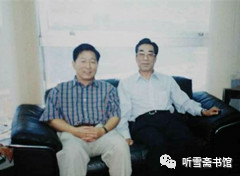
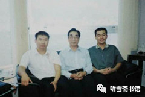

# 第四章 步步惊心

## 一

本来双方已经谈好，华夏证券公司出资8000万元人民币，由泰信达公司持有澳门创律公司49%的股权。可是过了几天，徐增平又提出：泰信达公司以8000万人民币持有澳门创律公司（“瓦良格”号航母）49%的股份，太多。还是进行整个项目合作，泰信达公司占49%，香港创律公司占51%。

徐增平利用邵淳对这个项目的“情有独钟”的弱点，开始“得寸进尺”了。

徐增平说：拖船都联系好了，过土耳其海峡手续也办完了，只要一交钱，航母就可以拖回来。再说我忙了半天，也得赚点钱吧？

在商言商，徐增平要通过这个项目赚点钱，是可以理解的。再说了，华夏证券公司和泰信达谁也不可能跑到乌克兰去办理此事，那就让徐增平去跑吧！邵淳认为，既然是“国家的事”，原则上同意继续给予支持。

1998年9月12日，在李×的主持下，泰信达公司与徐增平进行了正式谈判。徐增平一开始将澳门创律公司的总资产估值为1.2亿美元。李×和吴巍没有同意。澳门创律公司的全部资产就是一条报废的航母，买船的钱是有数的，2000万美元，一条2000万美元买来的破船，一下涨价到1.2亿元，是任何人都不能接受的。就是再加上徐增平前期在乌克兰“疏通关系”花的钱和将要产生的拖带费、停泊费、过海峡费、物资供应费等等费用，也不可能溢价6倍啊！

经过几个回合的谈判，最后双方将澳门创律公司的总资产估值为6000万美元，并在由陆昆来起草的股权转让协议上签字。协议规定：以航母到达澳门或中国海域200海里所需费用6000万美元计算，徐增平转让其持有澳门创律公司98%股份（另外2%股份为庄立祥持有）中的50%（即澳门创律公司49%的股份）给泰信达公司持有，泰信达公司承担费用支出2940万美元；泰信达公司先支付6000万元人民币给徐增平用于航母项目的费用支出，余额在船到达澳门后60天内付清，船到达澳门前所需的剩余费用由徐增平负责筹措。

我在写作本书时，找到一份由徐增平签字的文件，从中可以看出徐增平的手段。

航空母舰“瓦良格”号总成本分析

（以该航空母舰被拖运至目的地为澳门、香港或中国200海里以内海域）

1、购买成本：贰仟万美元（USD20,000,000）

2、投标文件准备及研究费：陆佰万美元（USD6,000,000）

3、各类顾问费：壹仟伍佰万美元（USD 15,000,000）

4、运费、保险费、码头费及有关手续费：陆佰万美元（USD6,000,000）

5、行政、公关、备航及财务费：壹仟叁佰万美元（USD 13,000,000）

共计：陆仟万美元（USD60,000,000）

徐增平（签字）

邵淳认为，徐增平在乌克兰“疏通关系”，可能会花一些钱，但不会像他说的那么多，但是到底花了多少，谁也说不清楚。如果参照美国“尼米兹”级航母33亿美元的造价，6000万美元相当于“尼米兹”的5%，还是划算的。

由此可见，徐增平花2000万美元购买的“瓦良格”号航母（只预付了200万美元订金），还没有离开乌克兰的黑海造船厂，卖出半条航母，就开始赚钱了，另外还赚下了半条航母的物质资产。毫无疑问，徐增平做了一笔注定不会赔本的买卖。

对此，邵淳并不在意。他的目的很简单，就是把事情搞成，尽早把“瓦良格”从乌克兰黑海造船厂拖回来。

吴宇在接受笔者采访时就说：“我在商海里面闯荡这么多年，徐增平算得上是一个对手中的‘高手’。”

1998年9月18日，隆泰源公司向泰信达公司提供6500万元人民币的借款，经李×决定，泰信达公司分别于1998年9月18日和28日，支付给徐增平6000万人民币。加上此前支付的2000万人民币，泰信达已给徐增平汇去8000万人民币了。

据吴巍回忆：“当时大家都觉得‘瓦良格’号航母值6000万美元，所以我也没有和徐增平讨价还价。”

据吴宇回忆：“6000万美元是泰信达认可的，我都不知道怎么回事。一开始我们没想要那个船，我们只是借钱支持他们干这个事儿。”

实际情况是，6000万美元是邵淳认可的，邵淳只是让吴宇负责筹款，并没让他参与具体的运作，运作是由泰信达公司负责。即便如此，我还是要说，邵淳是一步步走进徐增平给他挖的坑里，这个过程可谓“步步惊心”。

## 二

尽管泰信达公司与华夏证券公司（隆泰源公司）是借贷关系，但钱是华夏证券公司出的，邵淳不能放手不管。他心里清楚，一旦徐增平那边出了问题，泰信达是没有能力偿还这笔债务的。因此他特别关心“瓦良格”项目的动态。

自从有了“瓦良格”这个项目，邵淳的生活就完全变了样。

当时他每天的工作特别忙，主要是他发现公司内部存在一些比较严重的问题，如果不及时纠正，将会影响公司的发展。

1993年初，他到华夏证券公司来的时候，公司还处于创业阶段，大家都想把公司搞好，齐心协力干工作，每天虽然很累，但很快乐。到了1996年，公司盈利多了，情况也随之发生了变化。以前总公司的人下去，吃饭都是上大排档，喝啤酒。1996年以后，吃饭全变成鲍鱼、燕窝、鱼翅了，喝洋酒。而且饭后都有安排，除了唱歌跳舞，晚上回到房间，小姐就来了，说是接待人员安排的。邵淳每次遇到这种情况，就立即把小姐赶走。他认为：我不能胡来，我要是一胡来，下面就更乱了。

到了年底，报表一出来，应该有多少利润，邵淳心里是有数的，结果比他预估的要少，要差一倍左右。

这时他也听到一些反映，从1996年开始，各分支机构的老总，包括总公司的一些人，生活越来越奢侈，包、皮带、鞋子、衣服，什么东西都是名牌，汽车最低也是奔驰、宝马，有的还是法拉利。甚至有的领导，染着红头发招摇过市。

1997年，问题越来越严重。华夏证券公司是大公司，发行的股票特别多。当时股民买股票是全额交款，然后再抽签。这是很大一笔钱。抽了签马上要清算，把款打到交易所去。可是有的人说，钱不够，要透支。邵淳奇怪：不对啊！钱怎么会不够？

后来他就注意看报表。到1998年初的时候，他拿华夏证券公司和申银万国证券公司作比较。这两家公司人员差不多，机构数量差不多，开户数差不多，交易量差不多，那股民的保证金也应该差不多。但是华夏证券公司的股民保证金比人家差30多亿！邵淳认为，肯定是下面系统性的瞒报，大范围的瞒报。

邵淳还发现，公司的自营交易越来越不透明。所谓自营交易，就是二级市场为自己做的股票。

邵淳觉得要出事了，一旦出事，不知道要逮多少人。他下决心进行整顿。

1998年7月10日早上9时，华夏证券公司向全国的93家分支机构发出一个总部命令，文件编号为“110”。文件规定各营业部、分公司在48小时内，上报总公司六大方面情况：在各银行、金融机构的账户；自营仓位、A账户；购买的车辆；因公、因私护照；实业投资等。文件规定：如实上报者，一切问题由总公司负责；不报或者谎报者，责任自负；如有隐瞒一经发现，将视为违规行为，若进一步发现有违法行为将移送司法部门。

这是邵淳清理整顿公司的一个大动作，后来被人称为“110风暴”。

通过这次大规模整顿，一下收上来26000个A账户，这都是原来总公司不掌握的。并一下收出来30亿资金，正好和邵淳感觉比申银万国证券公司少的30亿保证金相吻合。

这次整顿，消除了公司隐患，也挽救了一大批干部。如果让他们继续发展下去，不知要捅多大娄子。

当时华夏证券公司在全国各地的员工共计4000多人，总公司就有几百人，每年公司运作的资金达100亿人民币，邵淳不得不把主要精力放在公司内部管理上。

但是即便公司再忙，他也没有减少对“瓦良格”项目的关心。在他看来，公司的事情和国家的事情想比，那都是小事。他几乎变成了“航母发烧友”，每天的工作之余，都在研究航母问题。

在这个过程中，他老是觉得这件事哪里有点不对劲儿，心里不踏实。于是他开始在暗中了解徐增平所说的情况是否属实。

邵淳通过时任总后财务部副部长的同学约到了总参的一位领导，邵淳询问关于国家购买乌克兰报废航母“瓦良格”的事情，这位领导说：徐增平这个人我没有听说过。“国家行为，民间操作”这个政策也没听说过。至少我没参与研究这个政策。不过，现在骗子很多，你要当心，别上当受骗。

这让邵淳心里更不踏实了：船是真的，民间操作是假的，这怎么弄啊？

多年以后，邵淳才得知，1998年3月17日徐增平在乌克兰中标以后，有关部门向上级汇报了有关情况，结果捅了“马蜂窝”，有关部门切断了与徐增平的联系。

## 三

1998年国庆节期间，徐增平为庆祝香港创律公司成立10周年，在香港举行系列庆典活动，其中包括盛大的酒会、演出等。邵淳、李×、吴宇、吴巍应邀到香港参加庆典活动。邵淳也想借此机会考察一下徐增平的公司，再问问他关于“瓦良格”的事情。

徐增平的香港创律公司并不大，庆典活动却十分隆重奢华。参加酒会的重要嘉宾，每人一个500克重的纯金纪念牌，按当时的黄金价格折算，大约价值5万人民币。不算其它花销，仅纯金纪念牌一项，当时就花销二三百万人民币。邵淳没要他的那个金牌。

* 

* 邵淳参加香港创律公司成立10周年庆典

* 左起：邵淳、徐增平、张勇（张勇提供）

邵淳和李×、吴宇、吴巍考察了香港创律公司。香港达程有限公司总经理张勇应邀参加陪同。

徐增平的香港创律公司设在香港世贸中心大厦内，一共租了两层楼面，总共有1000多平方米。

徐增平的办公室非常大，大约200平方米。屋内有多个工艺架，分别摆放着各种紫砂壶和高级烟斗，据说那些产自世界各地的高级烟斗都是用特殊材料制造的，价格不菲。

敞开的办公区有300平方米，只有十几个人办公，很多位置是空的。在香港这个寸土寸金的地方，这样的铺张和奢华是需要有雄厚的资金做后盾的，否则将会入不敷出。邵淳看到如此“气派”的公司，不由自主地蹙了一下眉头。这个细节被张勇捕捉到了。张勇也不理解，徐增平为什么要搞这么大的排场。

看过办公环境，又听徐增平介绍公司经营情况。这时徐增平提出，由于亚洲金融危机的影响，出现筹资困难，希望泰信达公司能从航母的安全出发，提前支付按协议规定船到后60天内应付的款项，他会立刻办理拖船手续，保证航母10月底启航。

据吴巍回忆，由于有了这个变化，大家心里产生了一些怀疑和不安。

邵淳向徐增平提出质疑：怎么证明你这个事是为国家干的？你说是国家行为，民间出面，你有“红头文件”么？

徐增平说：有。

邵淳说：我要看看。

徐增平说：得请示。

邵淳在创律公司待了一个小时，随后来到张勇的达程公司，徐增平则没有跟随。

张勇是山东省蓬莱市（原蓬莱县）人，1938年出生，1955年在北京第26中上学时入党，1962年大学毕业后曾留校工作；1963年起，先后在北京、西安、武汉工作，历任工程师、总经理、公司董事等职。1989年移居香港，任香港达程有限公司董事长兼总经理，并获得香港永久居留权。

1998年8月的一天，张勇接到李×的电话，让他到北京来一趟。他到北京之后，才知道澳门创律公司购买“瓦良格”航母的事情。澳门创律是个空壳公司，主要业务还是在香港。他被李×推荐给泰信达公司董事长吴巍，因为他有香港的身份，便于在香港和澳门开展工作，可以帮助泰信达公司协调与香港创律公司的关系。

张勇的达程公司设在香港会展中心的大楼里，公司员工不多，办公面积不到100平方米，还没有徐增平的总裁办公室大。张勇的办公室就更“寒酸”了，不足20平方米，除了办公用品，没有其他陈设，与徐增平的公司相比，有天壤之别。但邵淳恰恰看中了张勇公司的朴实无华。他在张勇的办公室拍照留念，并和张勇一起聊起下一步的工作。

* 

* 邵淳（左）与张勇在张勇办公室合影（张勇提供）

邵淳对张勇说：“你这里可以作为华夏的一个窗口公司。我们没有合适的人选，派不出人到港澳来，你的身份、你的经营理念、你的处事方式，很适合与华夏合作。把你的资源贡献出来吧！咱们一起干，房租费、人工费、水电费，全部由华夏提供。我宁肯把华夏的钱丢在你这里，也不丢在徐增平那里。他太铺张了，把钱放在他那里我不放心。”

泰信达公司在钓鱼台大酒店租了几个房间，作为“瓦良格”项目的办公室，有关人员开始集中办公。张勇也在那里住过一阵子。

那段时间，邵淳经常在晚上到钓鱼台大酒店和张勇等人聊天儿。邵淳对张勇说：“欢迎你到这儿来。‘瓦良格’项目是大事，目前比较隐秘，对外、对家人都不要说。大家以后在工作中慢慢互相了解，增加默契，目的是为了一个目标――把‘瓦良格’项目搞好。”

通过闲聊，邵淳与张勇之间逐步加深了了解，密切了关系，几乎无话不谈。那时邵淳就对张勇说了一句耐人寻味的话：“徐增平为了搞钱，大话连天。”

“事实证明，邵总看人还是很准的。”张勇在接受笔者采访时说，“邵总之所以被徐增平牵着走，主要是他对航母这个项目感兴趣。他太想把‘瓦良格’买回来了！徐增平把‘瓦良格’这个诱饵甩给他，算是找对了对象。邵淳对‘瓦良格’的热情，是一种爱国情怀的具体体现。”

从1998年10月份开始，张勇代表泰信达和华夏证券公司在香港负责“瓦良格”项目的对外联络和办理有关的法律文件。

* 

* 1998年10月，在张勇办公室合影

* 左起：吴宇、张勇、吴巍（张勇提供）

徐增平的香港创律公司，看上去很气派，似乎很有实力，但邵淳看了徐增平的公司，对他更不放心了，购买“瓦良格”是一个投资巨大的涉外项目，很多事情不好把控。

在邵淳离开香港之前，徐增平回话：经请示，文件属于国家机密，不能出示。

邵淳有些不快：文件都不给我看，我怎么出钱啊？

徐增平说：领导面谈行不行？

邵淳说：行。

他以前在中国工商银行计划部当副主任，经手过一些没有正式文件、领导交办的事情，所以对这种事情见怪不怪，他问徐增平：见谁？

徐增平说：海军副司令贺鹏飞。

邵淳说：可以。

徐增平说：好，那我们联系贺鹏飞将军见你。

邵淳此时已经打定主意，如果没有红头文件或有关领导出面证实此事，他一分钱也不会出了，已借出的钱也要收回。如果徐增平所说为假，要坚决追究他的责任。

## 四

据《山东人》一文介绍，乌克兰对购买“瓦良格”号提出的四个条件之一就是“要提供由一流银行开出的资信证明，证明该公司在银行有5000万美金以上的存款”。1998年“农历除夕，创律集团筹集的资金全部到位，香港汇丰银行开出了5000万美元的存款证明”。

徐增平拍得的“瓦良格”号航母，中标价为2000万美元。按说，徐增平有5000万美元的存款，支付2000万美元应该轻而易举，而他却在支付了200万美元的定金之后，陷入了艰难的筹集资金的困局之中。那5000万美元的存款证明，不知道徐增平是怎么弄出来的。实际情况是，购买“瓦良格”的资金大部分来自华夏证券公司的子公司，而徐增平对外从来不提华夏证券公司，也不提邵淳的名字。

最近网上出现的一篇内容与《南华早报》的《“不幸功臣”》相似的文章《徐增平再揭瓦良格航母的秘密》（以下简称《航母的秘密》）披露，徐增平买航母的钱是国有企业中国航天国际控股有限公司（航天控股）提供的。

明明是华夏证券公司出资，怎么又扯到航天控股公司去了？这篇文章是有人授意记者这样写的？还是记者自己“挖”出来的材料？笔者不得而知。

《航母的秘密》一文披露，2004年6月，创律地产公司还和航天控股公司打了一场官司。原因是香港创律地产公司以坪洲一块41800平方米的土地作为抵押，航天控股公司“于1997年以15%年利率借给徐增平香港公司创律地产一笔3.3亿港元的两年期贷款”。“2004年6月，创律地产控告航天控股，指称航天控股仅曾向它借款2.51亿港元。双方在2007年解决了诉讼。”

按文中说，航天控股公司原答应创律地产公司借贷3.3亿港元，最后只借给2.51亿港元，少借7900万港币，就被对方告上了法庭。报道没说明这其中的利害关系，给人的感觉是：我把地押给你了，你没按答应的数字借款，是你违约，所以我要告你。

撇开这桩官司不说，单说航天控股公司已经借出的2.51亿港元，如果用来支付买航母的余款，是足够了。

据说当时港币对美元的汇率也是8.5:1，2.51亿港元可兑换3000万美元。如果真如报道所说，徐增平或者有5000万美元存款，或者有2.51亿港元贷款，都不应在资金问题上捉襟见肘，更不需要东借西借了。

尽管徐增平公开场合从来不提华夏证券和邵淳，不提隆泰源公司和吴宇，不提泰信达公司和吴巍，也不提香港达程公司和张勇。我却不能不说，如果绕过华夏证券和邵淳，绕过隆泰源公司和吴宇，绕过泰信达公司和吴巍，绕过香港达程公司和张勇，关于“瓦良格”的故事就讲不下去了。就像我不能绕过香港创律公司和徐增平一样。

