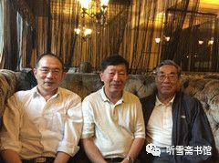

# 第六章 出击避险

## 一

“瓦良格”迟迟没有动静，吴巍心里越来越不踏实。吴巍建议李×立即想办法完善收购澳门创律公司股份的法律手续，李×却说，法律手续不重要，我有办法控制徐增平。吴巍心里很着急，暗中将情况向邵淳和吴宇做了通报。他们三人经过商量，一致认为，为了控制资金风险，一定要先完善收购澳门创律公司股份的法律手续，再想办法从法律上控制徐增平。

吴巍也曾多次建议李×立即召开董事会，对前期所签订的股权转让协议的不完善处进行补充。并迅速采取措施，完善收购澳门创律公司股份的法律手续。李×让陆昆来负责办理，但一直未见结果。

在这种情况下，吴巍作为公司的法定代表人，感觉到了问题的严重性，便不再一味忍让，在一些问题的处理上与李×和陆昆来发生了分歧和争执。李×一看吴巍开始“不听话”了，就多次告诫吴巍说：航母项目是我介绍的，资金是我的朋友支持的，泰信达公司有今天这么好的局面，完全是我的功劳，你按照我说的做，出了事我负责。

然而李×的所作所为，却让吴巍对他的言行产生了怀疑。他经常言行不一，日常花销过大，要求以个人名义购买别墅，还违反财务规定，打着“项目需要”和“为领导办事”等旗号，提走巨款存入个人账户，等等。

为了稳定局面，推进工作进展，吴巍没有急于行动，只是暗中向吴宇通报了一些情况，让吴宇想办法对李×施加压力。

在吴巍的建议下，邵淳和吴宇都认为有必要召开一次澳门创律公司董事会，讨论一些重大问题，因此李×让陆昆来通知徐增平来京开会。1999年2月7日，澳门创律公司董事会在北京钓鱼台大酒店召开，徐增平、李×、张勇、吴巍、庄立祥等董事出席会议，陆昆来、吴宇等列席会议。

董事会讨论通过了几项决议：

* 一、徐增平在1999年2月9日前向泰信达公司和澳门创律公司董事会提供关于“瓦良格”项目2.3亿人民币（其中包括留在泰信达公司做北京办公费用的500万人民币）资金运作及支付情况的详细资料，包括各项支出的银行对账单，收、付款凭证、合同及剩余款项。
* 二、有必要对澳门创律公司的正规化运作做出实质性的安排，必须尽快签署并确认一系列符合香港、澳门地区法律的公司文件，组建公司机构，确定公司章程，明确公司的法律地位，为“瓦良格”号航母抵达做好各项准备工作。
* 三、对存放在香港创律公司账上的购船资金尽快转移到澳门创律公司的账号并进行双控管理，由双方股东指定专人共同监控所有资金的开支，每月须定期向董事会汇报资金使用计划，报送财务报表。10万美元以上开支，须报经董事会批准。
* 四、尽快解决资金缺口。
* 五、责成徐增平立即赴乌克兰并签署有关协议。
* 六、今后澳门创律公司一切与“瓦良格”号航母有关事宜，均应规范操作，提高透明度以降低风险。
* 七、对前期股权转让协议做必要的修改和补充，并立即签订股权转让补充协议予以规范。

应该说，以吴巍为主导召开的这次董事会，达到了预期的效果，围绕“瓦良格”项目存在的问题，做了全面的梳理，并制定了相关的措施，如果能以此次会议精神向前推进，这个项目就不会再节外生枝了。

可是，对于那些完全不想按规矩出牌的人来说，仅仅依靠一纸董事会决议，是很难达到预期目标的。

邵淳没有参加2月7日的董事会。会后，吴巍和吴宇向他汇报了会议的情况。他说：“如果能够按照决议执行就好了。我觉得不能太乐观。”他没说“不能太乐观”的原因，但是吴巍和吴宇心领神会，通过半年多来的接触，他们已经比较了解徐增平的为人了。

董事会决议还要求，徐增平要在1999年2月9日以前提供有关“瓦良格”项目的财务资料，徐增平以各种理由进行拖延，没能按时提供。

因为转给徐增平的2.25亿人民币都是吴巍经手的，所以邵淳就让吴巍去催徐增平，吴巍给徐增平打电话，徐增平继续支支吾吾。他的这种行为，让人更加怀疑他在“瓦良格”项目中搞了什么名堂。

据邵淳回忆，1999年的春节，北京特别冷，他心里也特别冷。因为“瓦良格”的事情，邵淳的这个节也没过好。春节刚过，节日假期还没结束，邵淳就把吴巍和吴宇叫到了北京钓鱼台大酒店“瓦良格”项目办公室，一起研究“瓦良格”的事情。

吴巍首先提出：可能要出问题，要出大问题。

邵淳也意识到了这一点，所以他才大过节的，就把吴巍和吴宇叫出来开会。

邵淳在接受笔者采访时说：“对于搞金融的人来说，最忌讳的事情就是对资金不能把控。2.3个亿，现在被一个不讲诚信的人拿去了，操纵权在他手里，他又不如实给你提供情况，只能被他牵着鼻子走，不知还要投几个亿进去，这个风险太大了！”

邵淳接着说：“这件事是秘密进行的，在公司里面是不公开的，没有经过公司领导集体讨论，完全是个人决定。当初要是知道这件事会拖这么长时间，我就会慎重点儿了。如果钱没了，船也没了，可就没法交代了。”

更让邵淳感到窝囊的是，徐增平利用了他们的爱国心，并把这种神圣的爱国心给亵渎了。

“我记得那天从钓鱼台大酒店出来，寒风刺骨，心情也非常沉重。”邵淳回忆说。

节后一上班，邵淳就给张勇打电话说：你去催徐增平，看看他给乌克兰汇了多少钱。我要看徐增平给乌克兰汇款的底单。我怀疑他把买航母的钱挪用了！

张勇去找徐增平。张勇说：徐总，买航母的钱是华夏出的，你不给人家看看账目不好吧？你也不要给我，你直接发到北京去。

又过了几天，徐增平终于派人把一大包财务资料送到北京。邵淳就让吴巍负责审查。吴巍花了几天时间，对徐增平提供的资料进行认真梳理，发现其中有一大批票据是伪造的。财务报表、往来账目、银行对账单等，一般人看不懂，吴巍是中央金融学院的优等生，毕业后一直从事金融工作，阅读那些“天书”般的资料简直小菜一碟。经吴巍核实，泰信达汇给徐增平的2800万美元，徐增平只付给乌克兰黑海造船厂1000万美元，另外1800万美元去向不明。

邵淳听到这个消息，大怒：太过分了！这个人的良心坏了！没有底线了！

在此之前，邵淳认为徐增平是在为国家买航母，又有庄立祥监督，他不敢胡来，因此没有对他进行财务监督。没想到他竟然大笔挪用买航母的钱！

邵淳打电话问徐增平：钱哪去了？

徐增平说：那些钱虽然没有回到黑海造船厂，但是都用在这个船上了。

邵淳当然不会相信他的这番话，可也拿他没有办法。

航母迟迟拖不回来，邵淳的心理压力最大。据吴宇回忆，邵淳曾私下对吴宇说：听说徐增平在外面欠了很多债，如果他把航母抵押出去，我们就一分钱也要不回来了，那我就死定了！

当时邵淳的思想斗争很激烈，他想给贺鹏飞打电话问问，徐增平买航母这个项目到底是怎么回事？犹豫了很久，最后还是没有打这个电话。

2015年5月17日，邵淳在接受笔者采访时说：后来我发现，徐增平根本没有能力把航母弄回来，就是想利用这个项目到处骗钱！

张勇在一旁解释说：他欠了别人很多钱，是想利用航母这个大平台来忽悠一些人，再借钱，拆东墙补西墙。他喜欢讲派场，也是想让人觉得他很有钱，不要担心还不了钱。

* 
  * 2015年5月17日，作者采访邵淳、张勇时合影
    * 左起：李忠效、邵淳、张勇（王守范摄影）

## 二

“瓦良格”号航母迟迟不能启航，邵淳和吴巍、吴宇等人在积极研究对策，李×却打起了自己的算盘。

一天，李×突然神秘地对吴巍说：吴巍，“瓦良格”的事可能要砸，你赶紧跑！

吴巍感到很奇怪：“瓦良格”搞砸了，我为什么要跑？

李×说：你把华夏公司的钱弄没了，事又没办成，如果告你一个经济诈骗，可就麻烦了。

吴巍当时年轻，只有29岁，但他不是等闲之辈，不是被人一吓唬就晕头转向的毛头小伙。尽管“下海”时间不长，却也是个“老江湖”了。

他曾就职于北京华阳金融租赁公司，是公司最优秀的员工，26岁就被提升为处长。他的性格天生不安分，1997年，他辞职下海，成立了北京泰信达科技发展有限公司。因为他在社会上的朋友多，不久他就通过朋友结识了李×，李×又介绍陆昆来“入伙”，于是就有了“瓦良格”这个项目。

现在，项目搞起来了，公司有钱了，李×在这个时候劝吴巍走。

吴巍心想：公司是我开的，当初是我收留了你们，现在却要反客为主，要把我挤走！

年轻气盛的吴巍决定主动出击，揭露李×的真面目。

一天晚上，吴巍找到吴宇，对他说：吴总，跟你说个事。

吴宇看到吴巍神情严肃，预感到此事严重，就问：什么事啊？

吴巍说：老李挪用买航母的钱。

吴宇“哦”了一声，并没感到意外。他知道“老李”是指泰信达公司的“太上皇”李×。

李×是甘肃人，50来岁，没多少文化，“江湖”上关于他的传言很多。据说他是从五台山下来的“散仙”，懂“法术”，会算命，会看风水，在北京高层有很多关系，也是很多房地产公司老板的座上宾。

在“瓦良格”项目之前，泰信达没有多少业务，吴巍和李×相安无事。泰信达接手“瓦良格”项目之后，公司开始有钱了，两人之间的关系开始发生微妙的变化，两人都想抓住公司的话语权，于是矛盾出现了。李×和吴巍都在吴宇面前反映过对方的问题，李×说吴巍办事能力不行，吴巍说李×整天“装神弄鬼”。吴宇不想介入他们的矛盾，一般不表态。不过他开始留心泰信达公司的事情了，并发现了不少问题。

后来吴宇渐渐觉得泰信达公司的情况有点要失控，他正在考虑怎么处置这些事情，吴巍主动找上门来“举报”李×了。

吴巍拿出一沓票据说：这是李×挪用公款的证据……

吴宇说：既然这样，咱俩一块儿去找邵总汇报一下。

二人来到邵淳家附近的燕山大酒店，把邵淳约出来，向他汇报了李×的问题。本来买航母的钱是隆泰源公司出的，吴宇是隆泰源公司的法人，他完全可以自行处理此事，但他考虑李×和邵淳关系很好，这个项目又是邵淳亲自抓的，不能撇开老板自己处置。

邵淳听了吴宇和吴巍的汇报，开始还有点不太相信，吴巍把证据拿出来了，是李×私人存款的证据。邵淳看了，一脸茫然。

邵淳用征询的口吻问吴宇道：那怎么办啊？

吴宇说：这个事儿，我来处置吧！

邵淳说：买航母的钱，不能挪用啊！不能公款私用啊！

吴宇说：那成，我知道了。说完，就带着吴巍走了。

吴宇当时的心理压力比较大，他是隆泰源公司的法人，是第一责任人，如果这个项目失控，他要承担主要责任。

## 三

吴巍向邵淳揭发李×的目的是想借助邵淳的力量，把李×从“瓦良格”项目上赶走。但是邵淳有自己的想法，他要从大局出发，权衡利弊。邵淳认为，李×有李×的问题，但也有他的优势，那就是徐增平怕他，他可以降住徐增平。李×经常讲，他是有“背景”的人，他有能力控制徐增平。华夏证券公司的2.3亿人民币被徐增平拿走了，华夏证券公司手里什么东西也没有，连澳门创律公司的49%的股权也没有落实，如果把李×赶走，当年才29岁的吴巍能降住徐增平么？

另外李×也曾在邵淳、吴宇、张勇面前说了不少吴巍的坏话，为挤走吴巍做舆论准备。在如此复杂的情况下，邵淳、吴宇、张勇对吴巍的话也是半信半疑，但有一点他们是一致的，那就是泰信达公司应派人立即在香港成立公司，为收购澳门创律公司股份做准备。考虑到张勇在香港、澳门地区社会关系广，特别是与澳门赌王何鸿燊的关系密切，对航母到澳门后的商业运作有利，于是决定由泰信达公司派人收购原张勇控制的香港达成公司，并以达成公司代表泰信达公司收购澳门创律公司49%的股份。

1999年3月中旬的一天，在邵淳、吴宇等人的敦促下，泰信达公司召开了收购达程公司及确定股份划分的会议。

由于达程公司股份的划分是泰信达公司内部的事，邵淳和吴宇等人也不便出面进行协调。吴巍已经看出，事情拖得太久，在法律手续不完善的情况下，可能造成项目无法进展、资金失控的巨大风险。为稳定局面，尽快以达程公司名义完成收购澳门创律公司股份的法律手续，吴巍只好被迫在会上宣布退出航母项目。

会后，李×又劝吴巍不要退出航母项目，他对吴巍说：如果跟我一起干，保证能挣大钱。离开我是不会有前途的。

吴巍心里很清楚，李×是想让泰信达公司继续与他合作，以达到让泰信达公司继续承担对隆泰源公司的所有债务，而以李×控制的达程公司占有澳门创律公司49%股份的目的。

吴巍坚决表示结束合作。

吴巍和吴宇经过友好协商，决定将泰信达公司与“瓦良格”项目相关的债务，全部转到香港达程公司。吴宇说要给吴巍留一大笔现金，吴巍没要。在股权没有得到解决的情况下，吴巍担心这笔钱以后会给他带来麻烦。他当时就预感到，“瓦良格”项目后面的麻烦不会少。但是他表示，他会积极配合吴宇完善法律手续。

1999年3月21日，徐增平来到北京，一共签了三份文件，第一份是北京泰信达公司与澳门创律公司的补充协议，说明将泰信达名下的49%股权转到香港达程公司；第二份是北京泰信达公司、香港达程公司、澳门创律公司三方签订的协议；第三份是澳门创律公司收到北京泰信达公司2.3亿元人民币汇款的证明。

为了工作需要，李×、吴巍和张勇在吴宇的监督下，签署了达程公司的股权转让协议，由李×持有达程公司90%的股份，吴巍个人持有达程公司10%的股份。吴巍声明，持有股份可以，但不要任何利益，挣多少钱与本人无关。

在隆泰源公司要求控制资金风险的情况下，李×、吴巍同隆泰源公司签订了承诺书。这个承诺书实际上是放弃了达程公司的决策权。

至此，在李×控制下的泰信达公司结束了参与航母项目的前期运作，吴巍与李×、陆昆来在泰信达公司的合作也同时结束。

吴巍签完这几份文件，感到心里轻松了很多。

## 四

吴宇心里清楚，在“瓦良格”项目上，最难控制的还不是李×，而是徐增平；这就要通过李×，遏制徐增平，免得徐增平那边再出问题。他下一步要做的事情，就是赶紧把澳门创律公司49%的股份拿过来。按照澳门的法律，仅有协议书是不行的，还必须到澳门的律师楼去，在律师的见证下办理股权变更手续。这个事得由李×去催徐增平赶紧办，不然一旦出事，钱付出去了，华夏证券公司手中什么东西也没有，那他的责任就大了。

一天，吴宇去见邵淳，邵淳问他：“那个事，怎么样了？”

吴宇说：“我想引而不发，借力打力。”

邵淳问：“怎么个打法？”

吴宇说：“我们现在很被动，股权不在我们手里，钱撒出去了，项目不知进展如何，我还不能公开出面，所以只能让老李去压徐增平，目的是把49%股份过户到达程公司，光签张纸没有用啊！得到律师楼去办理相关法律文件。”

邵淳无奈地说：就按你的想法去干吧！

1999年3月底，吴宇、吴巍、李×和隆泰源公司的律师赵洋一起去香港，准备先办理收购达程公司的法律手续，再同徐增平商谈办理澳门创律公司的股权转让手续。到了深圳，吴宇见到徐增平，才得知赵洋律师的港澳通行证没有办下来。吴宇很生气：“我的律师不去，我去香港干什么啊？”吴宇和徐增平之间产生了误会，吴宇以为是徐增平故意不给办的。

因为不能按计划出境，吴宇等一行4人只好在深圳的酒店住了下来。这时吴巍从吴宇处了解到，办证的事情是吴宇交代李×去办的，吴巍觉得这里面有问题，就建议吴宇去找徐增平谈谈。这一谈，还真发现了很多问题，把吴宇吓了一跳。什么事呢？

李×曾对徐增平说：邵淳进过秦城监狱，是我找了中央最高领导，把他救出来的，邵淳听我的，你谁的话也别听，别听吴巍的，别听吴宇的。李×还说，吴巍退出时提了很高的条件，要2000万港币的利润，让徐增平将钱汇入他指定的账户，等等。

赵洋律师的港澳通行证不是徐增平不给办，是李×没通知徐增平。

吴宇恍然大悟：原来是李×不希望吴宇带律师去香港。

吴宇对吴巍说：李×希望我们去不成香港，怕我们与徐增平接触后，暴露了他的所作所为。吴宇感到好笑，这种小把戏也太小儿科了！

在如此紧要的时刻，李×完全置航母项目风险于不顾，仍在打自己的小算盘，人为制造麻烦，为自己捞利益。

李×的劣行暴露后，吴宇彻底改变了对李×的态度。第二天，吴宇飞回北京，将李×的情况向邵淳做了汇报。邵淳说：我什么时候进过秦城监狱啊？李×这人说话也太不靠谱了！

邵淳认为，徐增平的话虽然不能全信，但也不能不信。徐增平复述的那些话确实像李×说的。

邵淳和吴宇商量决定，对达程公司的股份进行调整，暂以吴宇的名义代表隆泰源公司占有达程公司60%的股份，李×占有20%股份（是信托股份，目的是为了不让他逃脱责任），吴巍占有20%股份（也是信托股份，为了配合工作需要），实际股份都在吴宇代表的隆泰源公司控制下。

不久，香港达程有限公司正式成为华夏证券公司全资子公司。吴宇任董事长，张勇任总经理。办公地点和公司人员不变。吴宇是海南隆泰源实业投资有限公司的法人代表，大部分时间在北京办公，公司主要业务均由张勇坐镇香港进行处理。

自从1998年8月张勇参与“瓦良格”项目之后，便逐步减少了达程有限公司的其他业务。原公司的全体员工在张勇的率领下，全力以赴地打理与“瓦良格”项目相关的业务。

## 五

自从发现泰信达公司出现分裂之后，邵淳就开始调整“瓦良格”项目的运作思路了。他觉得泰信达这样的民营公司容易出事，于是他准备“另起炉灶”－－选一家可靠的公司来运作“瓦良格”项目。邵淳为选择“可靠的公司”设定了三条标准：一是能对“瓦良格”项目进行操作的，二是公司领导人是正派的，三是应该是有军方背景的。

最初华夏证券公司与徐增平的分工是，华夏证券公司负责提供资金支持，徐增平负责把“瓦良格”拖回来。现在把徐增平踢开了，邵淳不得不考虑怎么把“瓦良格”拖回来的问题。如果事先不把关系理顺，将来“瓦良格”回来了，入关都困难。澳门港口水深只有6米，“瓦良格”吃水超过10米，根本进不去。要进入大陆港口，必须要把入关手续办好。华夏证券公司是不方便出面办理此事的。因此邵淳觉得，找一家有军方背景的公司来操作，将来可以让他们去与海军等单位沟通，更顺理成章。

邵淳通过关系找到了一家符合要求的公司－－（北京）东方汇中投资控股有限公司。

该公司董事长叫高增厦，是河北省深州市辰时镇人，1937年出生，1951年入伍。高增厦在任解放军总后勤部生产管理部副部长时，曾被授予少将军衔。退休后创办（北京）东方汇中公司。东方汇中公司挂靠在国防交通协会下面，属于民营性质。邵淳对退役将军有一种天然的信任感，高增厦对航母有一种天然的亲近感，两人一拍即合。另外，东方汇中公司也需要华夏证券公司帮助他们解决一些投资项目的资金问题。

东方汇中公司是个按照现代企业管理制度创办的公司，凡是公司大事，都要经过董事会集体谈论决定。1999年3月25日，东方汇中公司召开董事会议，专题讨论“瓦良格”项目事。参加会议的董事有：高增厦、王广平、戴岳、王承瑞、王志力、曾东江。

董事长高增厦首先介绍了“瓦良格”项目的基本情况。他说，该项目是由华夏证券公司总裁邵淳介绍的。华夏证券公司是国有证券大公司，在国内证券行业排行前几名，信誉非常好。“瓦良格”项目前期是由华夏证券公司运作的，据邵淳讲，他们运作得也非常顺利，仅是由于国家政策的原因，“金融机构不能从事主营以外的业务”，所以华夏证券公司邵淳总裁找到我，希望我们公司来接受“瓦良格”项目，而且承诺了优惠的转让条件：

项目的后续资金仍由华夏证券公司全部负责。为增强该项目的还款能力，华夏证券公司另外支付3000万－4000万资金支持公司已开发的项目。此外还有其他资金和项目扶持。

东方汇中公司的义务只是“瓦良格”号航母到达澳门后的后期运作，将华夏证券公司前期已投入项目的资金作为负债接过来，同时用公司重庆制药一厂和重庆五桂公司资产做抵押。

与会董事就“瓦良格”项目充分发表了意见。

王志力表示反对接受此项目，认为“没有天上掉下来的馅饼”，华夏证券公司这个项目一定有问题，不然不可能开出这么好的条件，一定要警惕。

王广平、戴岳表示支持接受该项目，理由是别人出钱，我们做事，所承担的义务不多，而且根据公司自身情况，完成义务有把握，操作好了可以给公司带来巨大利润。

最后进行表决：高增厦、王广平、戴岳支持接受此项目；王志力反对；曾东江、王承瑞弃权。按照少数服从多数的原则，决定参与“瓦良格”项目，但要按法律办事，要注意保密，按纯商业化境外运作，不搞国家行为，更不能有军队色彩，要规避风险。此项目以戴岳为主运作。

1999年3月26日，华夏证券公司子公司海南隆泰源实业投资有限公司法定代表人吴宇和东方汇中投资控股有限公司法定代表人高增厦在《股权转让及借款协议》上签字。

1999年4月6日，双方又在《股权转让及借款协议》的基础上，重新签订了《股权转让协议》和《贷款协议》。协议的条款很多，文字很长，用简短的文字概括两份协议的主要内容就是：东方汇中公司把华夏证券公司（海南隆泰源实业投资有限公司）所持有的澳门创律公司的股权（实际上就是“瓦良格”的股权）买过来。东方汇中不是没有钱么？那么好，华夏证券公司贷款给你。东方汇中公司用什么做抵押呢？用在建的两个项目（重庆制药一厂和重庆五桂公路资产）做抵押。协议规定，为增强该项目的还款能力，华夏证券公司另外支付3000万－4000万资金支持公司已开发的项目。“瓦良格”项目的后续资金全部由华夏证券公司负责。

这确实是个对东方汇中公司十分利好的项目，难怪东方汇中公司董事王志力充满怀疑态度，认为“没有天上掉下来的馅饼”。

其实这也是邵淳不得已而为之。徐增平出局了，他和吴宇又不能露面，活儿还得有人干，光让人干活不给好处怎么行？他与东方汇中公司合作的目的很简单，只要能把这件事做成，把“瓦良格”拖回来，把华夏证券公司前期投入的钱拿回来就成。

在这个问题上，内外都有不同的想法。

先说外部的想法。

外部即东方汇中公司。东方汇中的很多人认为，邵淳之所以这样做，是为了甩包袱，如果仅仅是想委托别人把这件事做好，可以不必采用又转让股权又贷款的方式，签订一个委托代理协议即可。他把股权转让给别人，出了事就得别人来负责了。笔者在采访邵淳时，曾就此问题请教于他，他笑道：东方汇中的这个说法是他当初没有料到的。

再说内部的想法。

内部是指吴宇。吴宇和邵淳的想法有些不同。吴宇的想法是：这个股权谁也不给，隆泰源自己留着，给了别人将来出事说不清楚。

吴宇认为，军方背景也好，退役将军也罢，到了商场上，大家在商言商，都是以经济利益最大化为目的。已有徐增平、李×等人的“前车之鉴”，邵淳不吸取经验教训，还继续按照原来的模式运行，风险太大。

为此，吴宇曾与邵淳谈过一次话。

他直言不讳地对邵淳说：“邵总，你是不相信我啊，还是怕我拿不回来这些东西？”

邵淳说：“为了保护你。”

吴宇说：“你觉得这样做安全么？”

邵淳无奈地说：“已经这样啦！”

吴宇说：“走了个泰信达，来了个东方汇中，还是那样干，不利于华夏隆泰源。”

邵淳问：“你想怎么干？”

吴宇说：“邵总，太宏观了不行，具体细节必须要了解，我们不能失去主动权。这样吧，东方汇中谈判，我参加，这次我要把一次关。”

接着，他把他的一系列想法向邵淳做了汇报，邵淳听完，有些担心地说：“小吴，你这个想法行不行啊？你就一个人，不行怎么办？如果不行，挡风的墙都没有了。”

吴宇说：“老板，这堵墙有没有它，也没什么区别啊！商场上不就是这么回事嘛！大都是些见财起意的人，或者唯利是图的人。见财起意，咱要防备他，唯利是图，咱要利用他。让他挣钱，给咱办事。只要把资产拿回来，咱就什么都不怕，船在那摆着，拖不拖，运不运，用不用，都没关系，放着呗！比你什么都没有强，从最坏的结果看，咱们花了钱，起码兑回来一个东西。”

邵淳觉得吴宇说得有道理，就同意了他的想法。从此，吴宇从“后台”跳到了“前台”。

“我不跳到前台不行。”吴宇在2015年10月接受笔者采访时说，“因为我感觉前面那么做不对啊！我不能出头，也不参加会，什么情况不了解，还得付钱，付了钱以后还控制不住，风险多大！”

其实邵淳和吴宇都有避险意识，只是站的角度不同，思路不一样。邵淳的避险方式是“隐蔽”，吴宇的避险方式是“出击”。

尽管吴宇心里很不乐意，他还是按照邵淳的意思把有关协议签了。

双方签订协议之后没几天，高增厦打电话约邵淳见面，说有重要的事情商量。邵淳听对方的语气很急，就马上驱车去了高增厦的办公室。

见面以后，高增厦开门见山地告诉邵淳：我了解了一下，航母这个事，高层不同意，而且是坚决不同意。上面定了一条政治纪律，任何人不准提航母。

邵淳说：老高啊！这个事儿咱们刚刚签协议，你介入的还不深，要不然你就退出去，别惹麻烦。因为你是军人。我再想办法。

高增厦沉思了一会儿说：不用。咱都走到这一步了，退是退不了了，不能退！咱还是想办法把它弄回来。弄回来了即使他们不用，咱摆在那也好，至少这个战略资源在中国手里头，免得叫别人拿走吧！实在不行，咱们拆船，也能把本儿拆回来吧？

邵淳说：那倒是。

高增厦说：老邵，你放心，这个事我签了协议，我就会做到底！

邵淳说：如果是这种情况，下一步就得步步小心，不能出任何的纰漏。

邵淳和高增厦商量，成立一个“瓦良格”项目联合领导小组，邵淳和高增厦为并列组长，东方汇中公司副董事长王广平以及戴岳和吴宇为领导小组成员。有什么事情，大家一块儿商量。小组成员的具体分工是：王广平负责协助邵淳和高增厦工作；戴岳负责与乌克兰黑海造船厂谈判；吴宇负责融资。为了避免出现徐增平挪用资金的情况，项目实行“双签制”，即两人签字，才能支付。

邵淳对高增厦说：关于这个船的情况，以前都是听徐增平说的，到底什么样啊？我们谁都没去看过。下一步，要尽快把股权的情况落实下来，然后派人去乌克兰看看，请懂船的专家去看看。

高增厦说：好。这些事情我们负责。

* 
  * 东方汇中公司董事长高增厦

## 六

1999年４月，东方汇中投资控股有限公司正式从泰信达公司手中接管“瓦良格”项目，东方汇中公司派出总经理戴岳负责这项业务。

戴岳出身于部队干部家庭，父亲是老红军。戴岳1952年出生，1969年入伍，先后在空军高炮部队、后勤指挥学院工作，团职军官。1995年退出现役，受聘担任东方汇中投资控股有限公司总经理。

1999年，戴岳47岁，正是年富力强的年纪，他在以邵淳、高增厦为首的联合领导小组的统帅下，积极开展工作，为加速推进“瓦良格”项目做了许多具体的卓有成效的工作。

东方汇中接管“瓦良格”项目以后，必然要与徐增平产生交集，或者说产生“交锋”。

关于高增厦与徐增平的第一次交锋，目前有两种说法，一个是邵淳版，一个是吴宇版。

邵淳版说，东方汇中公司接手“瓦良格”项目以后，高增厦带领公司的副总王广平等人，专程到深圳与徐增平见面，说是他们将代表华夏证券公司运作“瓦良格”项目，请徐增平把项目文件移交给东方汇中。徐增平当时表示同意移交文件，但后来摸清了高增厦和东方汇中公司的底细之后，便不予配合了。

吴宇版说，吴宇跳到前台第一次“亮相”，是安排东方汇中公司董事长高增厦和澳门创律公司董事长徐增平见面，一起吃了一顿饭，主要是谈49%股权办理过户手续的事情，结果不欢而散。

徐增平是个“手眼通天”的人物，在大陆政界和军界有很多朋友，级别比高增厦还高，他认为吴宇是想拿高增厦来压他，所以他对高增厦表示不屑；高增厦自然也不会把一个小小的港商放在眼里。双方的“交锋”，变成了“交火”。

吴宇深感徐增平不好对付，东方汇中这些人也未必是徐增平的对手，他决定自己策划针对徐增平的“作战方案”。

邵淳则继续按照他设定的“路线图”向前推进。有一天，邵淳对张勇说：老张，现在咱们要跟东方汇中合作了。

张勇说：那是你们的事情，我只代表华夏公司在香港、澳门办事。

邵淳说：不行，东方汇中你一定要参与，这次要吸取之前的教训，我们不光用它的牌子，我们还要控制大局。你不跟过去，我们无法控制东方汇中。

张勇说：这个你放心，华夏公司的利益，我会尽力维护。

邵淳说：你在香港要仔细给我听消息，了解徐增平，控制徐增平。

根据邵淳的设想，由东方汇中公司负责运作“瓦良格”项目，香港达程投资有限公司在香港任务不变。

