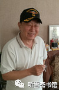
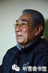
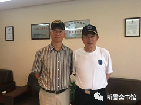
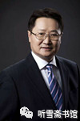

# 第十三章 不幸功臣

## 一

香港报纸把徐增平说成是“中国成功收购航母的‘不幸功臣’”，实在是夸大了徐增平的“不幸”，其实，徐增平在“瓦良格”项目上得到的，远比他失去的多。这些年来，徐增平得到的金钱起码有几个亿人民币（参见本书附录二：《纠正媒体在“瓦良格”报道中的错误》之六《关于徐增平因为买“瓦良格”倾家荡产问题》）；得到的荣誉也不算少，连续两届全国政协委员，只是含金量不够高。外面那层薄薄的包金，稍见风雨就会脱落。

和徐增平的“不幸”比起来，邵淳、吴宇、吴巍、张勇等人才是真正“不幸功臣”。

先说邵淳。

常言道：人无完人，金无足赤。这话用在邵淳的身上，也是合适的。

邵淳是个什么样的人呢？我和邵淳没有深交，仅凭几次采访很难对一个人进行全面的评价。要想真正了解一个人，需要大量的旁证。《瓦良格迷局》这本书对邵淳贬多褒少，可以作为参考。为什么呢？往往贬一个人的时候，更能从另一个方面看到这个人的真实面貌。

《瓦良格迷局》是一本什么样的书呢？

2013年9月9日，我为了写“辽宁舰”，到中船重工原总工兼军工局局长胡基政家中采访。胡基政是中国政府部门与“瓦良格”号航母关系最密切的人员之一（这一点我将在本书下部重点介绍）。我看到他书房的桌上有一本《瓦良格迷局》，很感兴趣，就说：回头我也去买一本。

他说：我看完了，你拿走吧！

我拿起来翻了翻，问道：写得怎么样？

胡基政笑笑，没有置评。我想他可能一时不知该怎么说。稍停片刻，他说：写“瓦良格”的内容很少，大部分内容是写华夏证券内部的是是非非。我就看看跟“瓦良格”有关的内容，好像作者不是太了解情况。

随后，胡基政用手点着《瓦良格迷局》说：这本书里说了很多事，都是胡扯！

《瓦良格迷局》有很大的篇幅是写邵淳的，我就该书内容的真实性向邵淳求证时，邵淳告诉我，该书作者并未采访过他，正式出版之前也没给他看过书稿。很难想象，这样的书是怎么炮制出来的。起码说明，那些与邵淳有关“逼真”的描写是“不靠谱”的。

《瓦良格迷局》一书中有一节写《邵淳登舰事件》，大概意思是说：2004年的春天，邵淳因为心系大连港湾里的“瓦良格”号航母，一日突发兴致，与几个人一道直奔大连港，迅速靠近锈迹斑斑的“瓦良格”。但是航母停靠的码头有船厂多名守卫警戒，禁止对外人开放，只可远观不可近看。邵淳心底忽然涌起一种冲动，要到舰上亲眼看看。在船厂守卫的严格询问下，邵淳急中生智，说一行数人是华夏证券航母处理小组成员，需要登舰核实几处情况。守卫要求他们办理复杂的登记手续，就特许他们登上了“瓦良格”号。几天之后，某上级领导给周济谱打电话说，已经查实，邵淳带人登上了“瓦良格”号航母，打的旗号是华夏证券航母处理小组。领导批示，一个还在被审查的人竟敢如此嚣张，责成邵淳做出深刻检查，以观后效……

我问邵淳是否属实，邵淳的评语是：“胡说八道！”

邵淳自2002年2月下旬应中船重工集团公司军工局副局长牟安成之邀到大连迎接“瓦良格”号航母归来，并于3月3日乘船到海上观看“瓦良格”，之后再未与“瓦良格”有过近距离接触。也不知周济普是怎么编出《邵淳登舰事件》来的。

不过《瓦良格迷局》也不是一无是处，其后记中有一句话我很欣赏：“邵淳犯了一个伟大的错误。”

后记解释道：“说错误，是因为违规经营，以致失去控制；说伟大，是因为邵淳、徐增平就此歪打正着地把自己写进了历史。”

《瓦良格迷局》中的邵淳，不是被褒奖的对象。

从《瓦良格迷局》所写的邵淳来看，邵淳属于“业务能力强、个人野心大、独断专行、大胆妄为”这样一类人。也许这类人注定要干大事，这类人注定要受磨难，这类人注定要遭遇“不幸”。

* 
  * 2013年邵淳参加某论坛（选自网络）

1999年12月，“联合调查组”进驻华夏证券公司以后，内查外调6个月，也没有查出邵淳有贪污、受贿等经济问题，对于“违规进行大规模实业投资”无法作出结论，调查组就撤走了，没有给邵淳作任何处理意见，邵淳就被“挂”了起来。没有人给他恢复工作，没有人给他恢复组织生活，甚至没有人给他恢复工资待遇，他每月只有不到3000元的工资。

邵淳在被“晾”了一段时间之后，觉得这样下去也不是个事，就催问上级纪委，希望尽快下个结论。纪委回话：别着急，等等再说。这一等就是几年。

在此期间，不断有各种信息传到他的耳朵里：“联合调查组”的调查报告曾以邵淳“违规操作，为国家造成重大损失”为名，提出给予邵淳“双开”（开除党籍、开除公职）的建议。但是，中纪委有关部门对这个决定提出了不同意见：现在这个船在乌克兰，暂时回不来，不等于以后回不来啊！如果现在把处分决定发出去了，说邵淳“为国家造成重大损失”，明天船回来了怎么办哪？所以这个“双开”的文件就没发。

2008年，北京市纪委领导找邵淳谈话，想要解决他的问题，但是由于邵淳过于“较真”，他的事情又被挂了起来。

张勇给我提供了一份邵淳写于2000年4月16日的材料，在材料结尾这样写道：

“苟为利害生死以，岂因祸福趋避之。”只要对国家有利，我愿个人付出一些代价。在“瓦良格”号项目的全过程中，我这一态度贯彻了始终。是非功过，我相信组织和历史会给我做出公正的评价。

由此可见邵淳在“瓦良格”项目上的心迹和胸怀。

我在网上看到有网友留言：“向邵大侠致敬！”

如此看来，称邵淳为中国“航母大侠”一点也不过分。

* 
  * 邵淳近照（2017年6月 李忠效摄影）

就在本书定稿之时，2018年1月12日，北京市纪委约见邵淳，正式通知他，关于“瓦良格”项目一事，已经结案。鉴于他为国家做了很大贡献，组织决定，将按照公司董事长的级别，补发这19年来欠发的工资和奖金，将由相关部门给他颁发一个对中国航母做出突出贡献的证书。

这一次，邵淳没有像2008年那次谈话那样“较真”，毕竟，他已经74岁了，能在有生之年得到这样的一个结果，也罢。

## 二

和邵淳一起在“瓦良格”项目上受审查的吴宇，甚至比邵淳还“惨”。

调查组把被“双规”的吴宇安置在北京渔阳大酒店的一个套间里，开始时他住里间，警卫人员住外间，12个人三班倒。我之所以将“看守人员”称为“警卫人员”，是吴宇自己认为，他在这里实际上是“保护性居住”。办案人员只在一开始来向他问过有关情况，后来就没影儿了。

吴宇被“双规”的头一个星期，调查组的人每天找他谈话，了解情况。翻来覆去就那几个问题：买航母的钱是从哪里来的？是不是动用了“保证金”？你个人从中得了多少好处？邵淳从中得了多少好处？等等。

吴宇告诉他们，买航母的钱主要这么几个来路：一笔是隆泰源公司经营房地产和股票的盈利，一笔是中石化公司的借款，一笔是从丰台区农信社借的国债，通过“回购”运作变现。与总公司的“保证金”没有一点关系。这些钱唯一和总公司有关系的就是总公司为隆泰源公司融资做了担保。

大部分办案人员的态度都非常和蔼，只有一个姓徐的处长，态度很恶劣，好像在故意挑他发火。

徐处长说，证券公司投资“瓦良格”项目是违规操作，致使国有资产流失。

吴宇说：隆泰源是实业投资公司，投资买航母，是正常的业务范围，我怎么违规了？也没有人规定实业投资不能买航母啊！我是华夏证券公司的人，可我同时还兼着海南隆泰源实业投资公司的法人，这个项目的投资主体是海南隆泰源实业投资公司，不是华夏证券公司，我违什么规啊？你最好搞清楚情况再来办案！

徐处长说：你这态度，你在这待着吧！

吴宇年轻气盛，接着顶了一句：我待一年也不怕！

徐处长带着人走了，从此他再没有出现过。吴宇一共被“保护居住”了136天，后130天就没有办案人员来找过他。除了要求他不能回家，不能上班，不能自己到处乱走以外，其他的，就跟住疗养院一样，该吃就吃，想喝就喝，看书、下棋、游泳、卡拉ok，随便。136天，他一共看了几十本书。

调查组在吴宇身上没有查出实质性的东西，最后只得还他自由。

2000年4月30日上午，调查组的古树林处长带了几个人来到渔阳饭店，古树林见到吴宇，对他说：你胖了！

吴宇说：休养了136天，能不胖么？

古树林说：你写个东西。

吴宇问：写什么东西？

古树林说：你对这个事儿的认识。

吴宇问：这跟调查这个事儿有什么关系么？

古树林说：你写吧，你写完我告诉你个好事儿！

其实不用他说，吴宇已经知道这个“好事儿”是什么了。“双规”后期，吴宇基本属于半自由状态，可以随便打电话，随便见人，他已对事态有了大概的了解。那时“联合调查组”已经悄悄撤出华夏证券公司，连邵淳都没人找了，还关着他干什么？让他写个东西，无非是让他承认错误，怕他将来“翻案”。

吴宇对古树林说：怎么写？我没写过这东西，有没有别人写的让我参考一下？

古树林说：我说，你写。

一旁早有人给吴宇准备好了纸和笔，吴宇坐下来开始写。

古树林口述道：检查。通过这段时间组织的教育，加上自己的学习，认识到，在“瓦”号这个项目上有以下几点错误：一、程序错误。“瓦”号项目没有经过董事会讨论和批准。二、党性不强。发现问题没有向组织汇报。三、……

吴宇一听，也没什么实质性的东西，也别较真儿了，就按照古树林的意思写了一份所谓的“检查”，签上自己名字，交差。

古树林收起这份“检查”，对吴宇说：哎，告诉你，组织审查了，尚未发现你个人有经济问题，审查结束。跟公司也说了，5月8日上班。待会儿单位的车就来，你有什么要带走的东西，收拾一下。中午一起吃个饭吧！

吴宇说：饭就不吃了。可以随便打电话吧？

古树林说：可以，可以。从现在开始，一切活动不受限制。

旁边过来一个人，就是当初没收他手机的那个人，递给他一个手机，对他说：这是你手机。那个手机找不到了。

吴宇的两个手机，一个新的，一个旧的。还回来的是旧手机，新手机“失踪”。

古树林说：你们公司一会儿来车，再见！

吴宇认为，古树林在办案期间，态度比较温和，也比较客观，彼此没有成见，后来吴宇还请他吃过一次饭。

5月8日，吴宇回到公司上班。这时他发现华夏证券公司已经物是人非。

当时公司是赵大建“执政”，邵淳仍然“靠边站”。赵大建见了吴宇，幸灾乐祸地说：我在国泰证券公司的时候，徐增平曾经找过我，被我拒绝了，我认为这事不应该干。买它干什么？有什么用？幸亏我没干，要不然被“双规”的就是我了。一坑国家，二害部队，三对不起公司。

吴宇一看这个领导就这种水平，心里拔凉拔凉的，自己已然成了公司的罪人，这个班还怎么上？他提出辞职，公司不批，他也不去公司上班，在社会上“漂”了两年，帮助朋友搞了一个“中华慈善公益信托”。

另外他还收购了一家上市公司，进行包装后重新上市，他从中大赚了一把。

这期间，吴宇个人干得红红火火，华夏证券公司却在赵大建的手中日渐凋敝，每况愈下。

2001年5月，中经信投资有限公司董事长周济谱调到华夏证券公司任董事长，华夏证券公司在周济谱的手中不但形势没有好转，反而更糟。

2002年3月，“瓦良格”历经磨难靠上大连港的码头，周济谱觉得机会来了，于是上报了一个天文数字的账单。别人不了解情况，北京市“瓦良格”处置领导小组只好把邵淳和吴宇请了回去。这项工作哩哩啦啦持续了很长时间，因为航母拖回来以后，国家当时还没有要收购的意思，航母一直停靠在大连港的码头上。只有中船重工集团公司在那里忙碌，力图将其恢复续建起来。

吴宇个人的命运，也随着航母的命运在起伏。他因受“航母事件”的牵连而离队，又因“瓦良格”号的归航而归队。祸兮福兮皆因航母。

全国13亿人口，能把个人命运与航母命运拴在一起的人只有那么几个，吴宇以此为荣。

邵淳在看过本书初稿后，认为写吴宇的笔墨少了些。邵淳说，吴宇在“瓦良格”项目上的贡献还是很大的，买航母，首先要解决资金问题，澳门创律公司投在“瓦良格”项目上的钱（包括被徐增平挪用的钱），除了徐增平前期投入的200多万美元，其余的钱都是隆泰源公司出的，当然也不都是隆泰源公司的自有资金，有一部分是吴宇融资来的。邵淳希望我多写写吴宇，但是写报告文学需要故事，需要细节，往往贡献大的人缺少故事，作家也不能“妙笔生花”胡写一气。

希望读者能记住邵淳对吴宇的评价：吴宇在“瓦良格”项目上的贡献很大。

## 三

应当承认，吴巍也是“中国成功收购航母的‘不幸功臣’”之一。

邵淳和吴宇在谈到吴巍时，特别强调了两点：第一，“瓦良格”这个项目是从他的泰信达公司引过来的，他在前期做了很多工作；第二，吴巍在后期虽然不参与“瓦良格”项目具体操作了，但很配合华夏证券公司的工作，协助吴宇同徐增平进行股份谈判，为华夏证券公司获得了澳门创律公司80%的股权，可谓劳苦功高。邵淳本来只寄希望于获得60%的股权，吴巍超额完成任务，为后来国家收购“瓦良格”创造了重要条件。

他是“瓦良格”项目这个链条上的重要一环。在“瓦良格”的项目上，也体现了他的爱国情怀。

在邵淳被批“胆大妄为”之后，吴巍也曾受到牵连，妻子被吓得经常做噩梦，他本人被“边控”4年，不能出国谈生意，也不能去探望在澳大利亚定居的妻子和孩子。

这4年间，他放弃了很多东西，一心闭门读书。他研读很多数学和物理方面的书籍，目前他已将公司业务交给别人去做，自己塌下心来搞科学研究。

## 四

毋庸置疑，张勇也是“中国成功收购航母的‘不幸功臣’”之一。如果说邵淳是指挥员，那么张勇就是战斗员；邵淳是抓宏观，张勇是抓微观；邵淳是决定层，张勇是执行层。

在执行层面上，吴宇属于重要人物，因他受身份限制，忽隐忽现，“神龙见首不见尾”，而张勇是唯一从头到尾参与“瓦良格”项目“民间阶段”的负责人，也是唯一在境外操作“瓦良格”项目的负责人。他先后任职于七家为“瓦良格”项目工作的公司，分别是：

* 北京泰信达科技发展有限公司董事；
* 海南隆泰源实业投资有限公司董事；
* 香港达程有限公司董事长、总经理；
* 香港达程投资有限公司董事、总经理；
* （北京）东方汇中投资控股有限公司董事、副总经理（股东）；
* 香港汇中投资发展有限公司董事、副总经理；
* 澳门创律旅游（娱乐）有限公司董事、副总经理；

上述公司是分阶段与“瓦良格”项目同行的，而张勇则是在不同阶段都与之同行的参与者，直到把这个项目交给国家。为此，他也做出了巨大的牺牲。

张勇所任职的达程公司于1998年下半年停止了一切业务，全力投入“瓦良格”项目。在“瓦良格”项目移交国家后，又为其做了许多工作。

2000年底，曾经为“瓦良格”项目做出重要贡献的香港达程公司宣布关闭，员工解散。

1938年出生的张勇，2000年结束“瓦良格”项目后，他已经62岁。在香港，他既没有退休金，也没有社保、医保等福利。如今他已经80岁，生活、看病的实际困难很多，由于邵淳的问题还没有结案，邵淳当初承诺给他的股份也无法兑现。

张勇曾问邵淳：你原来的承诺还算不算数？

邵淳说：算数。但是得我的问题解决以后，你的问题才会有人解决。

但是，据我所知，前景并不乐观，因为华夏证券公司不在了，皮之不存，毛将焉附？

* 
  * 张勇近照（2017年 李忠效摄影）

邵淳对张勇的人品评价很高，他说：张总要和老徐一样，早就发大财了！

张勇自己也说：从我手里过的钱上亿元，都是我签字，在那捞钱很容易。要是有私心，随便捞。那时就没想这个事儿！到最后还有4万多没有报销的票据。过了很长时间，我找到戴岳，对他说：“这是未尽的事宜啊！”戴岳在他的公司给我报了。

## 五

东方汇中公司团队中的高增厦、王广平、戴岳、王毅民、刘继等人，在“瓦良格”项目上也都不同程度地做出了贡献，同时也都做出了牺牲，特别是戴岳、王毅民和刘继。

戴岳是这个项目中争议比较大的人物之一。但邵淳认为，戴岳的贡献是非常大的。先说贡献，再说争议。

戴岳于1999年3月16日正式参与“瓦良格”项目，到2000年3月16日被北京市公安局经侦支队抓捕，时间整整一年。

他曾经三次赴乌克兰黑海造船厂，和张勇一起厘清了前期徐增平遗留的问题，结清了滞纳金、靠港费等808万美元欠款，于1999年10月24日和张勇一起与黑海造船厂签订正式购买“瓦良格”合同，获得了船主证、造船证等十多份法律文件。这是没有争议的贡献。

再说争议，就是那个“台湾公司事件”。

戴岳自参与“瓦良格”项目后，该项目的两次大的转折，都与他有关，一次是正式签约，获得船主证和造船证，一次是把项目正式交给国家（他是被动的）。故此，邵淳认为戴岳对“瓦良格”项目贡献很大。

* 
  * 2017年6月21日，作者采访戴岳时合影（曹林摄影）

在邵淳写给中央领导的报告中，本来没有提王毅民，但是在公安局抓捕戴岳时，因为王毅民和戴岳在一个车上，就被一起抓走了。虽然办案人员对他很客气，但他和戴岳一样，被关了10天。让他本人和家人都受到不小的惊吓。

和王毅民相比，刘继还要“不幸”一些。

2000年4月12日，刘继被放出来以后，23日，他准备去美国探亲，他的老婆孩子都在纽约。在首都机场，刘继被拦下来，并被没收了护照。这时他才知道。他属于被限制出境人员。那一段时间，他很苦闷，不知何时才会被解禁，何时才能与家人团聚。“被限制出境”，就像有一个无形的“紧箍咒”罩在头上，让人很不舒服。

到了七八月份，刘继听说，“瓦良格”已经离开了乌克兰黑海造船厂，过不了海峡，正在黑海上漂泊，前景不明。刘继心里有些紧张：如果船回不来，国有资产遭受损失，像我这种从海外回来的人，说不定会被当作替罪羊处理。怎么办？情急之下，他给国务院领导写了一封信，简单陈述了自己在这个项目中的所作所为。他说：我在东方汇中公司，只是帮助起草和审阅法律文件，项目合不合法，资金怎么使用，都与律师无关。我唯一的工作是在法律上帮助国家挽救了这条船，完成了交付。

领导人批示：请××、××阅。理应实事求是处理。

×××批示：一、指定专人谈话；二、国家利益为重；三、给予安慰。

2000年9月3日，公安部二局一名刘姓处长给刘继打电话，约他到公安部去一趟。那位处长一见面，就非常客气地对他说：你写给领导的信，领导已经批示。你很有水平啊！影响你回家了，影响你业务了。刘处长反复向他道歉，并告诉他，可以到首都机场公安分局取回护照。

* 
  * 刘继律师近照

虽然问题终于解决了，刘继却余惊未消，回到家里，一口气喝了一瓶“二锅头”，给自己压惊。

不可否认，在“瓦良格”项目上，很多人是很冤的。

我们老家有一句老百姓常说的大实话：从古至今，哪个庙里没有冤死的鬼啊！

今日亦然。
