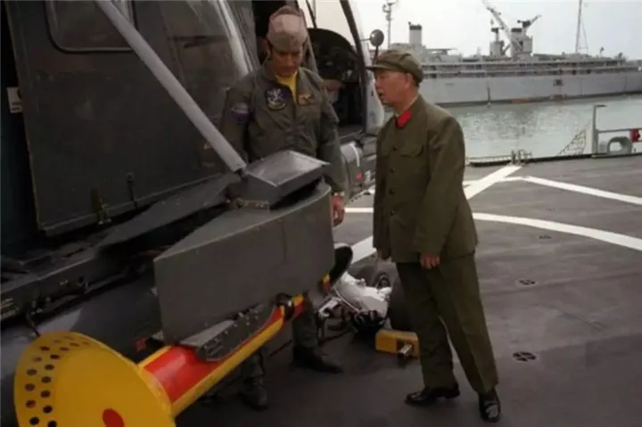

# 瓦良格号对中国航母的作用有多大？

问：瓦良格号对中国航母的作用有多大？

答：非常大

这艘半成品航母，为我们提供的技术是纯粹的「一手货」，

我们能在角落中窥见到众多价值连城的「细节」。

并且，瓦良格号存放着接近 40 吨工程图纸。

对于我国的航母事业来说，这些拥有不可估量的价值。

也正因此，哪怕被土耳其「敲竹杠」，

我们也要把「瓦良格」号买下，并运回中国。

## 航母

2000 年 6 月 14 日，一艘「破船」被拖出了乌克兰黑海造船厂。

这条船外表锈迹斑斑，内里没有任何动力系统、前进全靠别的小船拖行。

它就是「瓦良格号」。

一艘曾经让苏联引以为傲的新型航空母舰。

但可惜的是，这艘航母的完成度只有 68%，还没来得及造完，苏联就解体了。

随后，「瓦良格号」就被发配到了乌克兰的黑海造船厂。

这里是当时世界上最大的军用造船厂。

但是，乌克兰穷得一批。

既没有钱去建完这艘航母，又没有钱去拆了它，只能扔在那里被风吹雨打。

到了 1991 年，乌克兰越混越差，便开始「变卖家产」。

这风声一出，美国、韩国、印度、越南这些国家顿时兴奋起来。

当然，也包括我们中国。

不过与众不同的是，我们想买航母的人，是个香港富商，名叫徐增平。

而他买航母，是为了建造一个海上赌场。

徐增平为拿下这个项目，还专门成立了「澳门创律公司」，多次前往乌克兰考察。

在一轮轮谈判后，澳门创律终于以 2000 万美元的价格拍下「瓦良格号」。

从 1991 年到 2000 年，长达十年的谈判过程可谓一波三折，甚至有人为此付出了毕生代价。

总之，「瓦良格号」从此有了中国户口。

6 月 14 日这天，苏联的众多航母工程师聚集在一起，含泪送别「瓦良格号」。

身患重病的船厂厂长马卡罗夫，在位于海边的造船厂疗养院，目送了这艘航母的「最后一程」。

上午时分，「瓦良格号」离开尼古拉耶夫港，进入黑海。

* 出港的瓦良格号
  * 

由于被拆除全部武器和动力系统，「瓦良格号」只能被其他轮船拖着走。

负责这次运输的，是荷兰国际运输合约公司（简称 ITC）旗下的 SUHAILI 号拖轮。

按 ITC 的计划，「瓦良格号」从黑海造船厂出发，途径土耳其海峡，60 天左右就可以抵达中国。

初中地理课讲过，土耳其海峡是黑海向外的唯一通道，由博斯普鲁斯海峡、马尔马拉海峡、达达尼尔海峡组成。

毫不夸张地说，这是世界上最繁忙的航路之一，也是「瓦良格号」回中国的必经之路。

* 土耳其海峡地形图：博斯普鲁斯海峡、马尔马拉海峡、达达尼尔海峡
  * 

2000年6月17日，「瓦良格号」启程三天后，变故出现了。

土耳其政府表示：拒绝放行！

## 变故

中国有句老话，欲加之罪，何患无辞。

土耳其政府为了不让「瓦良格号」进入博斯普鲁斯海峡，前往中国，可谓费尽心机。

他们阻拦的理由是，根据 1936 年《蒙特利尔海峡公约》，土耳其对这段海峡享有主权，商船可以自由通行，但涉及大型军舰，必须向土耳其方面申请。

那么问题来了。

准确来说，「瓦良格号」的建造只完成了 68%，并且在出发前，所有军舰该具备的武器、动力系统，已经全部被乌克兰政府拆除。

说白了，「瓦良格号」就是一堆废铁，不足以被称为「军舰」。

但澳门创律还是按规矩，老老实实地向土耳其政府提供了各种证明。

例如，航空母舰船主证、建造证、原产地证明、无拖欠证明、无抵押证明、船厂检测报告……

这些证明全是乌克兰政府批准过的，没有任何法律问题。

但偏偏，土耳其政府不认。

这样一来一回的拉扯，耽误了整整五个月的航程。

而「瓦良格号」，就这么飘在黑海之上，每天都被风吹日晒，静静地等待着放行。

澳门创律眼看沟通无果，只好向我国驻土耳其大使馆求助。

这时，姚匡乙正担任驻土大使。

* 姚匡乙大使
  * 

其实从「瓦良格号」进入黑海后，姚匡乙就收到了消息。

但令他没想到的是，这件本来很简单的事情，竟然拖拉了一百多天。

由于这件事涉及三个国家，被拦截的还是个引人注目的「航母」，姚匡乙赶紧向国内汇报。

没多久，他就按照指示，全面介入「瓦良格号」通过海峡一事。

国家既然出面了，事情总该好办了吧？

2001 年 1 月 30 日，姚匡乙以官方的名义，会见了土耳其负责海事的国务部长米尔扎欧鲁。

之所以找这个人，是因为他是拦截「瓦良格号」的决策者。

也就是说，「瓦良格号」能不能通过土耳其海峡，全由他说了算。

姚匡乙也知道这位是个硬角色，准备了各种应对预案，尤其是针对「军舰」的反驳。

然而，米尔扎欧鲁自知以「军舰」为拦截理由，有些站不住脚，所以，在会谈一开始，他就巧妙地避开了这一问题，甩出了另一个关键词：安全。

他解释道，「瓦良格号」个头这么大，长度足足 306 米，比泰坦尼克号还要长 40 米。

再加上前前后后的拖轮，全部长度有 550 米，宽度 71.95 米。

而土耳其海峡又细又窄，从过往经验来看，「瓦良格号」要想穿过去会有危险。

要么触礁，要么搁浅。

如果发生这种事，土耳其海峡就得封堵，到时候损失的可不止这一艘航母的钱了。

再说了，海峡两边还有奥斯曼帝国的宫殿古迹、清真寺，万一被撞坏了，谁来负责？

米尔扎欧鲁说得头头是道。

总之就是一句话，「瓦良格号」于情于理都不能被放行。

不过，如果你们要强行过海峡，也不是不行。

有两个办法，一是把船拖回黑海造船厂，安装船舵和动力系统再回来。

这样对方向有个把控，不至于触礁。

二是直接把「瓦良格号」一分为二，切割成两部分，分批通过。

很显然，这两个方法都行不通。

澳门创律花费了十年时间，才把「瓦良格号」成功买下，从造船厂拖出来。

现在再让它返回乌克兰，不知道又要花费多少时间和金钱。

实际上，姚匡乙大使听了这两个解决方案，心里已经有了答案。

土耳其政府阻拦过海是假。

扣留航母是真。

对方迟迟不放行的原因，根本不是什么安全问题，而是不想让航母被中国所有。

当时，土耳其国内正在「两党内斗」。

而对中国的态度，就是内斗的一个重要分歧点，总理和外长重视中土关系，而米尔扎欧鲁为代表的右翼民族行动党却处处阻挠。

不巧，「瓦良格号」放行问题正中米尔扎欧鲁下怀。

与此同时，一些「外力」也在影响着土耳其。

其实在姚匡乙大使会见米尔扎欧鲁之前，美国大使比尔斯也会见了他。

他们在谈话中虽然没有提到「瓦良格号」，但言语间却一直围绕着土耳其海峡，称要在海峡周围安装 13 个船只通行监控站……

言下之意，你懂我懂。

不过令姚匡乙最尴尬的，是「瓦良格号」的身份。

虽然澳门创律买下了这艘航母，但经过美国、土耳其媒体调查后发现，公司并没有实业，在澳门也没有相关的赌场许可证。

这样一来，关于「瓦良格号将被中国改为航母」的传闻喧嚣直上。

很多西方媒体都在猜测，这是中国政府下的一盘大棋，表面为商业用途，实则为造航母。

姚匡乙看着这些报道，不急不躁，没有站出来肯定，也没有否定。

因为这一次，西方媒体没有凭空捏造。

他们猜对了。

购买「瓦良格号」的实际操盘者，就是我们的中国海军。

这一切，都是个局。

## 局？

「不搞航空母舰，我死不瞑目。」

这是中央军委前副主席刘华清老人的毕生心愿。

* 刘华清将军
  * 

二战后，世界格局重新洗牌，谁拥有航母，谁就拥有最高级别的军事话语权。

而我国当时还没有一艘航空母舰。

当时在军委内部有两个观点，一方是认同赫鲁晓夫「航母是海上活棺材」的观点，一方是认为航母是新时代战争的必要武器。

事实证明，后者是极其正确的。

海军建造一个自己的机场，飞机可以在海面的任何点位自由起飞，这就是航空母舰。

航母的作用体现在远海，距离本土越远，航母的意义就越大。

因为，尊严只存在于刀锋之上。

想象一下，就当下的国际环境，如果我们没有航母，又会是什么样的处境？

所以，刘华清就一直在寻摸合适的「二手航母」。

1999 年，一艘半成品航母进入了刘华清的视线。

它就是瓦良格号。

根据前期情报，瓦良格号安装着当时世界上最先进的发动机，存放着接近 40 吨工程图纸。

授之以鱼，不如授之以渔。

如果有了这些机器和图纸，我国的航母事业岂不是如虎添翼？

* 瓦良格号外行线图
  * 

刘华清说干就干。

但是，航母不像是玩具小船，随便打个电话就能买到手的。

那时候，国内对购买航母的态度比较模糊，国外还有美国、俄罗斯虎视眈眈，不想让中国拥有自己的航母。

所以，刘华清等人只能「曲线下单」。

这种操作也并非第一次。

早在 1995 年，俄罗斯太平洋舰队因为经费紧张，将舰队中吨位最大的两艘航母「明斯克号」和「新罗西斯克号」卖给了韩国大宇重工集团。

这桩交易的前提是，韩国必须把航母拆成 2 平方的钢板再带走，并且不能用于军事目的。

韩国点头答应下来。

但实际上，他们在接收这两艘航母的第一时间，就与美国仔细分析了航母内的奥秘。

尽管俄罗斯交付前炸毁了武器和电子系统，但结果仍让人大为惊喜。

于是，韩国就起了让「明斯克号」起死回生的心思。

一边是美国爸爸的鼎力支持，一边是亚洲四小龙的经济地位，打造航母指日可待。

但可惜的是，亚洲金融风暴来了。

韩国经济一落千丈，「明斯克号」就成了一个大累赘。

就在这时，我国看准了机会，立马以 530 万美元的价格买下了「明斯克号」。

每一艘航母，都犹如一个曾经辉煌的帝国。

尽管经历了一轮轮战火与洗劫，但仍然能在角落中窥见到众多价值连城的「细节」。

这些细节，让中国海军的将领们兴奋不已。

也正因此，刘华清等人对于「瓦良格号」势在必得。

如果能直接买到这艘半成品航母，那获得的技术可就是纯粹的「一手货」。

* 瓦良格号早期的舰岛结构
  * 

1997 年，贺鹏飞将军（贺龙之子）找到了香港富商徐增平。

说是香港富商，但徐增平是个不折不扣的山东人，曾在广州军区服役十四年。

徐增平接到的指示是：商买商用，绝不提「改造航母」的事情。

随后，徐增平就前往乌克兰洽谈。

他的说法是，改造成一个大型海上综合旅游设施，包括舞厅、旅馆和博彩设施等，日后将其停泊在澳门附近海域。

刚开始，乌克兰开价 1800 万美元，但不负责航母出海后的后续事宜。

徐增平一口答应下来，并且承诺现金支付。

这对缺钱的乌克兰政府来说，就像久旱逢甘霖，是天大的喜事儿。

徐增平借势就提出，航母的建造图纸需要一并交付，这样才能更加合理地改造。

但乌克兰政府当即就拒绝了。

他们的意思很简单，涉及国家机密的图纸要提呈国防部及国家安全部门批准。

随后，乌克兰又提出要求，为了这艘航母不被用于军事用途，除航母上武器拆除外，动力系统乃至船舵都应一并拆除。

这在意料之内，韩国购买「明斯克号」已经是前例。

若动力系统拆除，航母就无法自行行驶，不过本来对于这样一艘巨舰，出于安全考虑都是使用拖船拖拽运输，这倒没问题。

可是船舵一拆，航母自身无法控制方向，拖拽工作也会变得十分危险。

连续数天的谈判陷入僵局。

与此同时，澳门创律公司因操作不当，资金出现短缺。

华夏证券紧急救场，董事长邵淳接棒徐增平，继续以商业名义对接「瓦良格号」。

随后，邵淳因长期秘密挪用 2.3 亿款项（为购买瓦良格号），被国家调查。

国家给到的理由是：胆大妄为，严肃查处，以正国法，以儆效尤。

为了不露出破绽，为了「瓦良格号」顺利交接，邵淳默默承受了这一切。

1998 年，乌克兰同意将图纸以 200 万美元的价格卖给澳门创律，并承诺不拆掉船舵。

但没想到的是，事情突然又起变故。

等到交接图纸的那天，部分图纸竟突然消失，乌方无法提交全部图纸。

原来，乌克兰安全局和俄罗斯联邦安全局早就盯上了这次航母交易，双方联手将部分关键图纸取走，防止中国人拿到。

1999 年 4 月，东方汇中投资控股有限公司开始接手此事。

但表面购买者依旧是澳门创律公司。

10 月 24 日，东方汇中总经理戴岳、张勇敲定最终购买金额 2000 万美元，并在黑海造船厂签署了购买合同。

* 戴岳、张勇与乌克兰方面签约现场
  * 

当晚，国内外所有参与此事的人都松了一口气。

这时的中方代表们，谁也没想到，「瓦良格号」回中国的这一路，将会万分坎坷。

## 刁难

我们再回到土耳其。

对于米尔扎欧鲁提出的「要么拆，要么回」的解决方案，姚匡乙大使表示都不可接受。

他提议，中土双方都派出专家组，分析安全技术问题。

但结果是，没结果。

2001 年 6 月，土耳其正式以安全问题拦截「瓦良格号」。

这就难办了。

由于「瓦良格号」既不能停靠任何海港，也不能靠自身动力掌控方向，ITC 拖轮公司只能拖着庞大的报废航母一圈圈地在黑海上兜圈子。

启航时所用得「SUHAILI 号」拖轮，已经被替换成了「SANDY CAPE 号」。

拖轮的船长甘南无奈地说，我们已经不叫它瓦良格了，它现在叫恶魔岛。

恶魔岛是美国的一个小岛，曾设有联邦监狱。

与此同时，各个国家对「瓦良格号」的觊觎从未停止。

一个晚上，飘荡在黑海之上的「瓦良格号」的甲板上，突然降落了一架来路不明的直升机。

等人发现时，直升机已经消失，甲板上只留下了一行字：

The French Was There！（法国人到此一游！）

无疑，不想让「瓦良格号」回到中国的，并非土耳其一家。

这已经不是技术问题。

而是政治问题。

在事情僵持不下的时候，姚匡乙决定，从外交部入手。

他再次会见了反对航母通过的米尔扎欧鲁。

米尔扎欧鲁的态度依然很坚决，表示「可以谈，但不会给你任何希望」。

姚匡乙大使正等着这句话。

他会见完米尔扎欧鲁之后，立马带着这句话直接跑到了外交部，找到土耳其副总理。

姚匡乙大使请求说，「不要把门关死」。

然而，副总理并没有直接与姚匡乙见面，而是通过外交部进行了回复：「土方的门没关死，还可以继续谈。」

时间来到 2001 年 7 月。

每逢这个时间，土耳其驻华大使都会回国休假，姚匡乙找准机会，拜访了他们。

姚匡乙连夜赶往度假胜地伊斯米尔，见到了驻华大使。

姚匡乙非常诚恳地说：「中土两国的关系不能像一艘船一样始终停泊在一个地方，更不能后退，要让他前进。希望阁下能向政府进一步解释中国的立场、意见，使瓦良格号能尽早过去。」

驻华大使态度还算积极，表示尽力而为。

随后，姚匡乙又去找了土耳其外交部次长，解释了「瓦良格号将被改成军舰」的传闻。

这时候，这位次长终于给到了一个解决方案：出具一份《安全保证书》。

姚匡乙立刻就答应下来，有了这份保证书，一旦「瓦良格号」出问题，中国政府将承担一切。

之后，姚匡乙又借着这股东风，向土耳其外交部亚洲司司长提出，「瓦良格号」如果能顺利通行，他将努力使土耳其成为中国公民的旅游目的地。

当时，土耳其正受亚洲金融危机影响，对外经贸关系存在巨大逆差。

如果有大量中国人到此旅游，带来外汇，那就能有效缓解本国经济困难，缩小逆差。

众所周知，中国人的消费能力……可是不容小觑的。

这样一来，土耳其政府总该放心了吧？

并没有。

过了外交部这一关，还有土耳其军方这一关。

土耳其军方一直反对「瓦良格号」的放行，这也是米尔扎欧鲁如此支棱的原因。

就在姚匡乙一筹莫展之际，转机出现了。

同样在 7 月，土耳其总参谋长凯威里科鲁应邀访问北京，受到了国家领导人的高规格接见，双方在军事技术出口方面达成了一些协议。

因此，土耳其军方的立场也随即改变。

2001 年 8 月 25 日，土耳其总理指示米尔扎欧鲁，放行「瓦良格号」！

米尔扎欧鲁即使心里不平，但也只好照做。

他在发布会上称，鉴于近期两国友谊、贸易得到加强、「关系达到了很高的水平」，「瓦良格号」将在实现必要条件情况下获准通过。

听懂了吗？

米尔扎欧鲁的言下之意是，想过可以，但有条件。

眼看好事将成，姚匡乙大使再一次陷入了紧张状态，因为美国特使在这之前访问了土耳其。

这么巧合的时间，很难让人不联想。

随后，米尔扎欧鲁提出了 20 多项放行条件。

条件大致有三个方向：

一、「瓦良格号」拖行问题。

姚匡乙早就考虑到了这一点，与专家们当时拟定了好几个方案。

但土耳其方面也提出了自己的要求——正前方必须要有一个八千马力的大功率拖船，后方有一艘船作为「刹车」之用，并且航母的首、中、尾部都需要配备拖船和消防车。

说白了，就是要让「瓦良格号」安全通过土耳其海峡，别磕磕碰碰。

至于花费嘛，中国政府全部承担。

二、天气问题。

土耳其方面要求，要在能见度不小于 5 公里、水流不大于三节、风力大不于 5 级的时候通行。

换句话说，要想「瓦良格号」通过，必须等到天时地利人和。

三、支付风险保证金。

姚匡乙大使本想着，只要遵守上面的两个严苛条件，「瓦良格号」就能顺利通行。

结果，土耳其竟然还要让支付 10 亿美元的「风险保证金」。

10 亿美元，在当时折合人民币 68 亿。

不仅如此，土耳其海事署还要求，这笔强制保险金 2 年内不撤销，且必须在土耳其的银行担保。

光手续费就需要 3000 万美元。

不得不说，土耳其是真的敢要，跟抢劫没什么区别。

我国海洋局的人前去沟通，结果被当场拒绝，「10 亿保险金必须付，这是认真提出的」。

绕来绕去，「瓦良格号」的放行问题又回到了原点。

土耳其的意思很明确。

不给钱？

「瓦良格号」就别想顺利回中国。

此时，嚣张的土耳其忘了一句话：敌人的敌人，就是朋友。

就在土耳其百般阻挠时，爱琴海对面的希腊出现了。

希腊与土耳其

作为土耳其的「世仇」国家，希腊得知我国的难处之后，果断出手了。

希腊以「国家」名义担保，免去 10 亿保证金。

到了这份儿上，土耳其再也找不到合适的理由拦截「瓦良格号」。

2001 年 11 月 1 日，「瓦良格号」滞留黑海 500 多天后，终于看见了曙光。

这一天，博斯普鲁斯海峡风平浪静。

上午 8 点，「瓦良格号」在 11 艘拖船和 12 艘救援、消防船的前呼后拥下，驶入博斯普鲁斯海峡。

在海峡两岸，有 300 多万土耳其民众围观。

瓦良格号

下午 2 点 30 分，「瓦良格号」终于安全驶过海峡最后一个危险的湾角，进入宽广的马尔马拉海。

「瓦良格号」正式开启了前往中国的征程。

但上天对它的考验，从未结束。

## 波折

11 月 3 日，「瓦良格号」进入爱琴海，却遭遇了前所未有的海上风暴。

如果「瓦良格号」是一艘全副武装、舰员满载的航空母舰，海上风暴根本无法奈何它分毫。

但此时，「瓦良格号」仅仅是一艘名副其实的空壳。

由于风高浪大，三艘拖船与「瓦良格号」相连接的缆绳被大风和海浪扯断，「瓦良格号」失去控制，在大海中像一匹脱缰野马，横冲直撞。

「瓦良格号」脱离拖船之后，顺流漂向希腊的埃维亚岛，距该岛岸边只有 80 公里。

这个距离，再近点就会造成灾难。

而在「瓦良格号」偌大的船体上，仅有七名船员。

幸运的是，希腊商业海运部表示，这艘航母并无沉没或搁浅的危险。

随后，希腊出动救援。

一架希腊救援直升机在航母甲板上着陆，把船上的七名船员，包括三名俄罗斯船员、三名乌克兰船员和一名菲律宾船员送到雅典以西的一个军用机场。

11 月 6 日，拖船 Haliva Champion 号上的水手艾瑞斯·利马（Aries Lima）在试图固定拖缆时殉职。

11 月 7 日，3 艘拖船和 1 艘希腊船只用拖缆固定住「瓦良格号」，最终将其控制住。

在经历缆绳断裂、海上风暴等一系列波折后，航母遇到了另一个难题。

此时正是 2001 年，恰逢中东危机。

伊拉克领导人萨达姆和美国之间的关系剑拔弩张，大战一触即发。

自苏伊士运河开凿后，从地中海前往印度洋的船只都经由苏伊士运河。

但此时，中东风云密布，美国为调兵遣将，宣称要封锁苏伊士运河，禁止「瓦良格号」驶入。

苏伊士运河实际控制国埃及对此也表示同意。

原因很简单，没有动力的航母会成为萨达姆导弹的靶子。

万一萨达姆为制止美军调兵而对正在行进于苏伊士运河的「瓦良格号」动手，那么整个运河将会彻底瘫痪。

对此，「瓦良格号」只得绕路，经由地中海转至大西洋，然后绕过非洲好望角进入印度洋。

红色为最短航线，蓝色为实际航行航线

2002 年 2 月 5 日，这艘没有动力的航母终于通过马六甲海峡。

2 月 12 日，「瓦良格号」进入中国南海，渔船货轮上的人们纷纷注视着这艘巨舰。

经过近两年的海上漂泊，「瓦良格号」的甲板和船体已经锈迹斑斑。

但在拖船的引领下，「瓦良格号」正一步步行向大连。

2 月 28 日，「瓦良格号」一行船队放缓速度，进入大连港外锚区。

3 月 3 日清晨 5 点，「瓦良格号」离开外锚区，开往内港。

中午 12 点，「瓦良格号」号安全停靠在大连内港西区 4 号散货码头。

原本 60 天的航程，瓦良格号走了足足 1 年 9 个月。

这一天，有些人哭得泣不成声。

刘华清永远记得他 1980 年去美国访问时，参观美国「小鹰」号航母的那一幕。

这是中国人民解放军和科技人员首次踏上航空母舰。

他轻轻地踮起脚，隔着美国工作人员，仔细观察着航母舰载机内的一切。

刘华清对先进装备有着巨大渴望。

他很早就意识到，中国这样一个大国，需要航空母舰。

新中国成立后，百废待兴，但不管是从经济上还是从技术上，都不具备研制航空母舰的条件。

随后数年，海军多次召开装备技术会议，其中多次提到重新启动航母论证工作。

但是，在以经济建设为中心的上世纪 80 年代，要发展航母，经费始终是一个难以跨越的问题。

当时中国军费的总投入为 192 亿元，还不够买一艘美国大型核动力航母。

但饭要一口一口吃，路要一步一步走。

在国家经济实力没有那么强大的情况下，刘华清依然着眼于航母的发展布局。

在刘华清的倡议下，海军所属的 714 研究所开始研究航母的历史、现在和未来。

但由于特殊时代的影响，714 所的论证工作被中断。

为先期培养航空母舰及其编队的指挥人才，刘华清命令海军军校部长赵国钧和干部部长傅渤海开办飞行员舰长班。

随着苏联解体，美国渐渐地将战略目光转移向中国。

美国开始制造「中国威胁论」，并利用航母舰队和强大的军事实力，不断对中国进行军事威慑。

世纪之交，美国对我国犯下了「四大恨」，使得国内反美浪潮达到高峰。

美国借口我国货船「银河号」载有制造生化武器的原料，在公海监视、逼停、并强制登船检查。

台湾方面，李登辉上台，大肆鼓吹台独言论，台海危机一触即发。

美国向西太平洋地区派出了两艘航母，干扰解放军在台湾海峡地区举行的旨在遏制「台独」的系列演习，同时对中国进行无声的威胁。

科索沃战争的北约轰炸南斯拉夫期间，当地 5 月 7 日晚北约的美军 B-2 轰炸机发射 5 枚弹药击中中国驻南斯拉夫大使馆，3 名中国记者邵云环、许杏虎和朱颖死亡。

美国海军 EP-3 型侦察机在南海非法侦查，中国人民解放军海军航空兵派出 2 架歼战斗机进行监视和拦截，其中一架与美机发生碰撞后坠毁，飞行员王伟牺牲，年仅 32 岁。

飞行员王伟

世纪之交的种种事件，大大刺激着军方的神经。

面对美国的围追堵截，只有「打得一拳开」，才能「免得百拳来」。

只有发展蓝水海军，建设强大的水上力量，才能与美国在海外冲突中势均力敌。

作为海军装备部负责人的刘华清大力推进「瓦良格号」的购买工作。

2005 年，「瓦良格号」在大批拖轮的护航下，被缓缓地拖进了大连造船厂。

时隔两年，「瓦良格号」的改装工作正式开始了。

刘华清将军在生命的最后一刻，心里想的还是建设航空母舰的事情。

他抓着老战友的手臂动情地说道：「我知道自己的时间不多了……可是我最遗憾的事就是没能亲眼看到我们的航空母舰下水！」

## 终成

十年蛰伏，十年改造。

2012 年，「瓦良格号」脱胎换骨，正式更名为「辽宁舰」，交付中国海军。

辽宁舰

从购买「瓦良格号」到抵达中国大连，除了做出巨大努力的刘华清将军、贺鹏飞中将，还有太多值得我们铭记的普通人。

徐增平，以商人身份与乌克兰方面洽谈交涉，为购买「瓦良格号」打开了大门。

邵淳，华夏证券前董事长，紧急入场「救火」，为了「瓦良格号」的顺利交易，不惜丢掉董事长职位，接受严密调查 6 个月，没有任何违规之处。

2018 年 1 月 12 日，国家为邵淳「正名」，按照董事长级别补发 19 年的全部工资，授予对中国航母作出突出贡献的证书。

戴岳、张勇，东方汇中投资控股有限公司总经理，「瓦良格号」交易的实际操作者。

唐士源，大连造船厂副厂长，在土耳其的重重刁难之下，为「瓦良格号」的回国之路扫清障碍。

刘清松，交通部南海救助局担任船队队长，带领「穗救 201 号」迎接「瓦良格号」的到来。

艾瑞斯·利马（Aries Lima），希腊船员，在航行途中不幸殉职。

除此之外，还有乌克兰专家、希腊政府的鼎力相助。

当「辽宁舰」正式亮相，「瓦良格号」也终于有了自己的新故乡。

中国海军终于拥有了自己的航空母舰。

## 主要参考资料

* 《瓦良格号迷局》，殷明著
* 《大国重器 _ 中国航母向前进》，李兵
* 《慢船来中国——「瓦良格」号来华过程揭秘》，叶飙
* 《让法律说话：揭开东方汇中购买瓦良格号航母神秘面纱》，中国国际新闻传媒网
