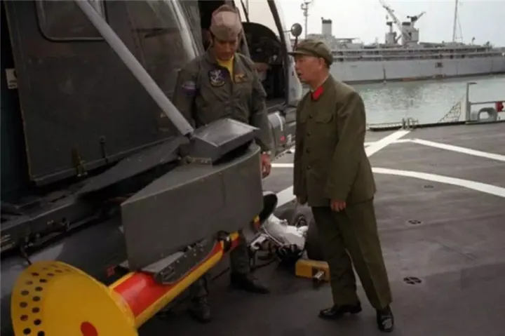

# 出乌克兰记

原创  卢克文 卢克文工作室

2023-10-30 11:17 发表于四川

这是我今年写的最满意的文章之一，也是为我们青云读书会的会员写的专属文章，今天发出来一部分

## 壹

2021年12月1日上午，北京。

雾霾如幕。

我在国贸一栋写字楼的会议室里，等来了77岁的邵淳老先生。

目前在百度能搜索到的关于邵淳的照片，大都至少是他十几年前的样子，77岁的他戴着猎鹿帽出现时，比寻常照片上显得要沧桑一些，但对比同龄人，依旧十分精神矍铄。

当我们坐在会议室里，缓缓回忆往事时，他吐词清楚、思路清晰，邵老先生依旧能把每个细节讲得十分详细。

我托人请到邵淳，主要是想了解，中国第一艘航母“辽宁舰”的前身“瓦良格号”的故事，由于目前我们能听到的关于瓦良格号的旧事，都是各路媒体的只言片语，从没有看到过第一手采访信息，更没有全面而宏大的记录，而当年参与过这件事的功臣，大都已步入暮年。

我想赶在世事消逝前，请到各位当事人重忆往事，为后人保存这一段珍贵的历史记忆。

这次在北京，我一共见到了好几位参与瓦良格号买卖及运输的当事人，他们分别从不同角度回忆了过往，将各种信息叠加在一起，才了解了事情的整体轮廓。

在见到邵淳前几天，即2021年11月26日，我已经在北京北四环外见过吴巍，和他深谈了一晚，他是促成瓦良格号交易的另一位重要男主角。

在见完邵淳后，我又去拜会了，负责将船只从乌克兰运输回国的宋家慧，听到了许多闻所未闻的事情。

这篇文章根据他们三人的回忆、他们提供的资料，以及其他信息整理而成，我相信难免有误差，但整体上应该差不了多少。

我不能保证信息的绝对正确，但尽量还原历史的本来面貌。 

现在，我们一起推开历史凛冽的大门，看看中国第一艘航母，是如何走出乌克兰的。

## 贰

在展开历史画卷之前，首先要澄清一点，瓦良格号从乌克兰来到中国，并非像传说中，由民间人士运作而成，这件事整体上，一直是国家意志的体现。

将一艘航母搞到手，绝不是个人的财力和资源可以解决的，富可敌国的李嘉诚都不可以。

再顶级的商人，他也只是商人，不可能搞得定航母采购，必须有强大的、国家级别的政治资源背书才可以。

所以整件事，起源于国家意志，结束于国家意志。 

新中国想搞航母，最早源于1970年，当时中央最高决策层，向海军党委下达了研制航母的指令，七院开始论证工作，5月时，54岁的刘华清主持完成了《关于建造航母问题的初步意见》报告。

但第二年主持大局的林彪在蒙古坠机，航母研制工作便从此搁浅，一搁就是几十年。

1982年，年已66岁、当年曾亲手起草航母文件的刘华清，升任海军司令，并重新着手搞航母，此时国家极穷，海军也太烧钱，着手到五年后的1987年军委常务会议，也只能量力而行，决定将陆军、空军、二炮、海军按序发展。

关于搞航母的规划，都安排到几十年后去了。 

建设一支现代化的海军，要拿金山银山去填，没有足够的财力和技术，想都不用想。

别说航母了，现在我们一艘052D，一个雷达系统就要5亿，总造价高达35亿，平均每年维护费用3亿多，40年生命周期，大概要花费130亿人民币。

1987年时，全国外汇储备仅仅20多亿美元，人均GDP仅1120元，城市平均月薪仅53元，1987年中国全年军费200亿人民币出头，还不够买美国一艘大型核动力航母，像2023年这样下饺子一样建海军舰艇，当年海军部门要是有这个能力，做梦都要笑醒。

但刘华清不想放弃。 

1987年3月31日，刘华清在海军机关办公大楼第一会议室，开展海军装备规划工作汇报，可能是觉得实在帮不上海军，总部首长们一个都没来，只有总参装备部部长贺鹏飞（贺龙之子），率总参装备部、作战部等相关部门领导，来听取海军装备规划问题汇报。

据海军装备技术部部长郑明回忆，刘华清面对仅是二级部部长贺鹏飞，尽管对方年龄资历差自己一截，他仍然亲自汇报，认为海军必须搞定航母和核潜艇，当时的原话是“这两项装备，不仅是为了战，平时也是为了看，看就是威慑。”

71岁刘华清的演讲，深深影响到了41岁的贺鹏飞，使贺鹏飞日后，成为航母接力的第三棒。

不过国家还是太穷了，航母此时就是个念头，想想就好。 

中国拥有航母的曙光，出现在1992年。

1991年圣诞节，苏联轰然倒下。

此时在乌克兰黑海造船厂（尼古拉耶夫造船厂）里，停泊着三艘没完全完工的航母。

这个尼古拉耶夫，就紧挨着赫尔松，是今天俄乌战争冲突的前沿地带。

苏联时期，黑海造船厂曾拥有2.5万工人，厂里6个幼儿园，能容纳4500个孩子，平均每三年能下水一艘航母，苏联解体后靠俄罗斯订单苟活，俄乌关系恶化后接不到订单，2018年破产，军工骨工大量流失，目前已一片破败。

苏联解体时，那三艘没完工的航母，分别是库兹涅佐夫号、瓦良格号、乌里扬诺夫号。

其中库兹涅佐夫号完工98%，苏联一宣布解体，被俄罗斯强行开走了。这艘老掉牙的航母现在成天趴窝，维护的时间比出任务的时间还长，2017年的维修工作，修到2023年2月才修好，2024年才能重返编组，听起来老态龙钟到有点不像话了，因此错过了2022年开始的俄乌战争。

乌里扬诺夫斯克号是核动力航母，共有600多家工厂参与建设，满载排水量近8万吨，完工了30%，龙骨即将合拢，原子蒸汽发生器已经在车间组装，1988年核反应堆通过验收，单堆功率达到了305兆瓦，是苏联航母里，最接近美国顶级航母的作品，停工后被美国设局拆解，并以废铁卖掉。

我们重点要讲的，是最后来到中国，奠定中国航母发展基石的瓦良格号。

## 叁

美国在1992年初制定了一个计划，企图用最小的成本，彻底毁掉黑海船厂未完工的乌里扬诺夫斯克号和瓦良格号，以免落入其他国家手里，使其航母能独霸天下。

他们安排了一家挪威公司，说公司要造6艘商船，需要将商船停泊在乌里扬诺夫斯克号的0号船台。

同时派出一家大型钢材公司的副总裁，来到黑海造船厂，说要收购造航母的钢材，按450美元/吨回收，比平常钢价高出许多。

苏联在制造乌里扬诺夫斯克号时，已消耗了2.9万吨航母钢材，听起来这会是一笔大买卖，足够当时穷得要死的黑海船厂撑一段时间。

俄乌两国政府联合决定，为了腾出0号船台给挪威人造商船，也为了卖钢换现金，他们从1992年2月4日，拆解乌里扬诺夫斯克号。

苏联35年的航母工业史，无数军工人才积累的心血，一个强国的威严底线，至此彻底死亡。

等到乌里扬诺夫斯克号拆解完之后，挪威人和美国人突然集体耍无赖，挪威人不下订单了，美国钢铁公司随便找了个借口，说合同无效，废钢他们也不收了。

两伙人撕掉合同，扬长而去，乌克兰人被耍得愣在当地，瓜子都掉地上了。

但幸亏美国人收网收得早，瓦良格号还没拆。

俄罗斯这时候哪来的钱继续造瓦良格号？就叫黑海船厂自行处理，黑海船厂也养不活这艘船，只好将瓦良格号当半成品对外出售。

中国和瓦良格号的缘分，由此开始。 

此时有一位哈尔滨船舶工程学院（现哈尔滨工程大学）的教授，在乌克兰造船学院做访问学者，听到这个消息，赶紧上报给相关部门。

海军装备技术部部长郑明收到消息后，即时汇报给了中船总经理潘曾锡，郑明和潘曾锡同属于中国造船工程学会，这个学会还有个名誉理事长，就是刘华清。

他俩赶紧邀请刘华清，参加当年的中国造船工程学会年会，刘华清一听是航母的事，二十多年旧事涌上心头，马上答应了。 

1992年，刘华清76岁，已经从海军司令，升任到了军委副主席。

但他依旧惦记着造航母的事。

1980年中美难得的关系缓和期时，他到美国访问时，曾参观过美军三艘军舰，包括C61突击者和CV63小鹰号两艘航母。 

在参观时，美军对其开放所有舱室，还安排了舰载机编队表演，但要求不能触摸任何物件，便留下了66岁刘华清，踮着脚观看美军设备的著名照片。

* 刘华清将军

  * 

这张照片在军迷圈里流传了好多年，说明一代一代中国人，都渴望拥有代表强国和威严标志的航母战斗群。 

所以听到关于航母的消息，刘华清是绝不会错过的。 

中国造船工程学会开年会时，刘华清便来到会场，听取了那位教授，关于瓦良格号的专题汇报，决定派人先去看一看。

3月，以第七研究院原副院长尤子平领头，郑明也随团参加的中国造船工程学会，赴乌克兰黑海造船厂访问考察。

我在采访时，拿了郑明的回忆记录，据他记载，乌克兰当时穷极了，早餐没有牛奶，晚上宾馆暖气都不够，房间里冷死人，乌方专门给他们每人加了一条毛毯。

郑明他们跟着船厂总工程师看瓦良格号，从甲板一直看到最底部，为了省电，船上连电灯都没有，只能用手电照明，总工程师还拿了一小本本，说是为了怕迷路，里面三千多间房，他走他也迷。

乌方很有诚意，说只要中国人买，他们工程师愿意来到中国，把这条船建完工。

我们说乌克兰工程师待遇太高，我们怕是养不起。

乌方说他们不要那么高待遇，就是想着帮把船造出来，瓦良格号像他们的儿子，就想着把它建完。 

考察结果应该是让人满意的，因为就在这年11月，贺鹏飞调任海军副司令员，分管海军装备建设工作。

贺鹏飞应当是从这时开始，正式接力林彪与刘华清，配合主持航母工作。

1992年，后面的大主角邵淳还在华能集团财务公司工作，而吴巍在当年7月刚刚大学毕业，在华阳金融打卡上班。

一年后，吴巍被调入公司资金计划部，而邵淳转去华夏证券任总经理、董事长。

航母的接力棒落到他们俩手里，还需要几年。

## 肆

虽然有了购买瓦良格号的初步意向，但之后三年时间，我们都没有任何进展。

就一个原因：缺钱。

一文钱难倒英雄汉，巧妇也难为无米之炊，没有经济收入，谈什么发展建设？ 

直到1995年4月，海军司令员张连忠，才收到刘华清指示，想办法引进瓦良格号。

为什么拖到1995年才动手解决呢？

很简单，1994年进行了分税制改革，中央终于有钱了。

1994年的分税制改革影响深远，地方财政大多上交给了中央，中央有了余钱办大事，而地方上乱成一团，很多城市发不出教师和公务员工资，公务员和事业编都被逼疯了，刚巧配合大下岗，民众收入处于崩盘边缘，经济困局带来暴力犯罪，抢劫杀人此起彼伏，城市治安一塌糊涂，最后地方政府被迫走上了卖地求生的财政之路，终于解决了吃饭和城市基建问题，就有了后面房地产大发展的社会经济格局，中国房价也越来越高，成了社会发展的主要矛盾。

事物的发展总是一环套着一环，但这篇文章我们不扯太远，只单讲航母归国一条分支。

1995年5月，中船副总经理黄平涛，要去乌克兰出一趟差，检查从乌克兰引进燃气轮机等项目的执行情况，但在出发前一天，突然要求到京西宾馆接受任务，在这里他见到了解放军副总参谋长曹刚川，和海军副司令贺鹏飞。

俩人告知黄平涛，军委刘副主席给他多加了一项任务，到黑海造船厂再次考察瓦良格号，看有没有购买的价值。

说再次考察，是因为此时距1992年3月的考察，已经过去了三年，鬼知道此时瓦良格号变成了什么样子。

黄平涛说他当时很兴奋，可以理解，换谁接这个任务都兴奋，哪个中华血性男儿，不想参与这么伟大的事业嘛？

黄平涛立刻拉了个班子，把考察具体事项列出来，摄像、照相、记录人员也安排好，兴冲冲跑去了乌克兰，黑海造船厂此时也越来越穷，工资都发不出来，船停在那三年，都快停成废品了，看到久违的中国买家，十分热情接待。

黑海造船厂先喊了个天价，要两亿美元，但又怕这个全球唯一买家跑了，私下里又转告给黄平涛，真想买，2000万美元就可以成交。

黄平涛回国后将材料进行了整理，准备汇报给曹刚川和刘华清，但两人一直没有回音，直到1995年10月25日，刘华清到中船参观八五科技成果展览，黄平涛一路陪同，刘华清才告诉他：以后不要再提航母的事了。

黄平涛十分失落，一直不知道具体原因，直到26年后，当我坐在吴巍家中谈及此事，吴巍才转述了刘相春（贺鹏飞秘书）的见解：

搞航母要有四大要求，国家战略、统帅意志、综合国力、技术水平，这四点都不能少，缺一个搞不成。

简单点说就是，当时的一把手二把手经过深思熟虑，在考虑当时中国绝不争霸、低调发展经济的大环境下，收敛锋芒，决定暂时不搞航母。

于是从乌克兰引进航母的事情，到这里又停止了。

## 伍

我在开篇时提到过，要搞航母绝不是个人所为，一定是国家意志。

因为故事发展到这里，才是市面上常见的关于瓦良格号媒体报道的起点，都是从一个香港商人徐增平独自去买航母开始的。

“并不是从徐增平开始的，”那天在吴巍家边吃火锅边聊天时，吴巍停下筷子，用肯定的语气说，“这件事的源头，还是从国家部门开始的。”

（全文一共14000字左右，这里是大概不到一半的内容）

......

