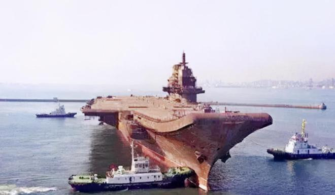

# “瓦良格”号通过土耳其海峡始末

2022-10-27 15:01:48　来源: 旧闻故史 广东  

新中国成立五十年后，中国得到了前苏联海军的一艘航母“瓦良格”号，而它的归国之路却有些坎坷，原中国驻土大使曾经谈及“瓦良格”号通过土耳其海峡的始末。

* 瓦良格号在海上

  * 

“瓦良格”号的前世今生

1991年12月26日，苏联正式解体，一代叱咤风云的超级大国就此陨落。在二战时候，虽然苏联拥有强大的陆军装备，但是海军却一直处于一般的水平，而一直对苏联虎视眈眈的美国却拥有着世界第一的海军实力，这让苏联不得不召集起来。

要想提高海军战斗力，苏联必须组织一支强大现代海军的标志性舰船——航空母舰。苏联很快就将这个项目提上了日程，先后设计建造了“莫斯科”级和“基辅”级两型航母。

1982年，为了提高海军战力殚精竭虑的苏联又作出了建造第三代“航母”的决定。1985年开始建造第二艘名为“里加”的航母，是以苏联拉脱维亚加盟共和国首府的名字命名的。

五年之后，由于拉脱维亚政局的动荡，苏联又给“里加”号起了一个新名字，“瓦良格”号。

* 用拖船拖瓦良格号

  * 

按照设计，“瓦良格”号航母满载的排水量67000吨，全长有310米，几乎可以比肩“尼米兹”号，作为美国海军远洋战斗群的核心力量，“尼米兹”号的地位不仅是在美国，甚至在世界海军史上都有着举足轻重的地位。

“瓦良格”号同样被苏联寄托了重任，苏联海军与美国海军最大的不同便是其核心是依靠核潜艇，而“瓦良格”号最主要的使命便是确保苏联弹道导弹核潜艇的安全和战斗效能的发挥。

* 岸边的瓦良格号

  * 

虽然当时苏联还将航母定义为“重型载机巡洋舰”，但是“瓦良格”号实际上已经具备了许多现代航母的特质，只要它能够顺利建造完工，苏联的海军实力一定会得到飞跃。

然而天不遂人愿，“瓦良格”号的建造仅仅过了十分之六的工期，苏联便坚持不住解体了。“瓦良格”号也就此归属于乌克兰。但乌克兰没有哪个实力和财力继续这项庞大的工程，两年之后，乌克兰决定将其转售给苏联的唯一继承国——俄罗斯。

自苏联解体之后，原苏联在海外的财产、存款、外交机构等都由俄罗斯接收了，“瓦良格”号的回归本该是一件皆大欢喜的事情。

可俄罗斯没有和乌克兰谈拢。乌克兰要求俄罗斯支付一艘完整军舰的造价来购买这艘只完成了68％的军舰，更遑论这68％还是苏联拨款建造的。由于种种原因，俄罗斯取消了购买“瓦良格”号的决定。

1998年，“瓦良格”号遇到了它生命中的“贵人”。中国澳门的创律旅游娱乐公司以两千万美元的价格拍下了“瓦良格”号，用于改造为豪华赌船。至此，“瓦良格”号便踏上了回到他的“新家”中国的道路。

然而这条路却不看似的那么平坦，“瓦良格”号远航的路上，遭遇到了许多阻拦，尤其是在土耳其境内之时。

* 瓦良格号在海上2

  * 

土耳其的阻拦

“瓦良格”号被中国澳门的公司买下时便是历经坎坷，这似乎也为它之后的道路奠定了一个基调。澳门创律旅游娱乐公司筹款之时就曾先后两次向乌克兰申请延期付款，还有人质疑澳门附近的海水那么浅，如何能停泊这艘庞然大物。

1999年7月，ITC公司的“萨布尔”号拖船开始工作，“瓦良格”号驶离尼古拉耶夫船厂，从乌克兰出发归国。一路上有惊无险，但当“萨布尔”号拖船带着“瓦良格”号抵达土耳其北部黑海水域，正准备通过博斯普鲁斯海峡时，遭到了当地政府的刁难。

土耳其政府先是勒令“瓦良格”号停船，随后送来了他们阻止“瓦良格”号的理由：“瓦良格”的通行会影响到海峡的其他船只。

本以为土耳其政府只是借机刁难中国，很快就能解决这件事情，让“瓦良格”号顺利通过博斯普鲁斯海峡，但万万没想到的是，这件事竟让中国和土耳其拉锯了长达一年半的时间。

尽管如此，创律旅游娱乐公司的创始人徐增平也未曾想过放弃对它的购买。徐增平曾经是中国海军，对能够提升中国海军实力的航母有着特殊的感情。

而且在1992年时，中国海军就曾派过代表团到乌克兰考察“瓦良格”号，但因为种种原因没能把他收入囊中。1996年时任中国海军副司令的贺龙将军之子贺鹏飞决心动用民间力量来购买，最终选择了从海军退役的徐增平。

* 徐增平

  * 

“瓦良格”号航母是按照当时世界最先进的标准建造的，中国要达到这样的水平至少还需要花几十年和巨额的科研经费，所以这艘航母对于海军的建设意义重大。

2000年11月中旬，收到中国政府指示驻土大使姚匡乙一直在与土耳其政府方面进行拉锯，他回忆说，中方曾经向土耳其政府提出过，苏联的“库兹涅佐夫”号航空母舰能够通过博斯普鲁斯海峡，为何“瓦良格”号却不行。

对此，土耳其政府方面给出回应：“库兹涅佐夫”号航母有着完整的动力系统，能够自主通过海峡，而“瓦良格”号作为一个半成品，既没有动力系统，也没有舵，让这样一个庞然大物通过海峡，他们不得不慎重考虑。

为此，姚匡乙还再三和土耳其政府保证，用拖船运输“瓦良格”号时一定会再三小心行事，但是土耳其仍然还坚持“瓦良格”号不允许通过。

土耳其方面称，“瓦良格”号长宽比普通的船大太多，如果强行通过只会发生两种可能，要么搁浅，要么沉没。那么土耳其将被迫封堵海峡，两岸奥斯曼帝国留下的宫殿、清真寺也可能被撞坏.....话里话外都在透露着一个讯息：不可能让“瓦良格”号通过海峡。

其实除了土耳其本身之外，美国、日本、印度和台湾地区都在通过不同的方式对土耳其施压，要求他们阻挠“瓦良格”号的通行。

* 建造中的瓦良格号？

  * 

两个月后，姚匡乙会见了土耳其负责海事事务的国防部长米尔扎欧鲁，他不仅是反对“瓦良格”号通行的关键人物，更是掌握着放行的权限。

他向姚匡乙提出了两个让“瓦良格”号通过的办法：一是把船拖回乌克兰的造船厂，装上动力系统和舵；二是将船一分为二，切成两个部分通过。

在事情僵持不下的时候，姚匡乙决定，从外交部门入手处理此事。在姚匡乙的推动下，中国国内派来了由交通部组成的代表团，专门会见了反对航母通过的副总理和米尔扎欧鲁。

米尔扎欧鲁依然态度坚决，而且非常傲慢，对中国的代表团表示“可以谈，但不会给你任何希望”。

米尔扎欧鲁的这番话无疑是让姚匡乙抓住了把柄，他带着米尔扎欧鲁的话直接跑到了外交部，找到土耳其副总理，土耳其副总理没有直接与姚匡乙见面，而是通过外交部传话进行了回复：还可以继续谈。得到这句话的姚匡乙放心了一大半。

趁着土耳其驻华大使回国休假，姚匡乙上门拜访了他，姚匡乙对他说，“中土两国的关系不能像一艘船一样始终停泊在一个地方，更不能后退，要让他前进，希望大使阁下能够通过自己的影响，向你的政府进一步解释中国的立场、意见，使瓦良格号能尽早过去。”

* 姚匡乙

  * 

土耳其驻华大使对此事非常积极，四处周旋帮了很多忙。

与土耳其驻华大使商谈完之后，姚匡乙很快便找了土耳其外交部的次长，向他解释了外界盛传的“瓦良格”号将被改造成军舰的传闻，次长却表示土耳其并不关心船的最终用途，但是需要中国出具一分安全上的书面保证。

此外，也是在这个月，姚匡乙还和土耳其外交部亚洲司司长进行过一次谈话。当时的土耳其正在经历亚洲金融风暴的后续影响，国内的经济状况很不理想，况且当时中国的海外旅游目的地并不多，姚匡乙的许诺让土耳其成为中国海外旅游目的地这个条件十分诱人。

看到司长有所动摇，姚匡乙进一步加码，他说，中国还可以在其他领域与土耳其合作，包括“军事领域”。这番承诺果然有了成效，土耳其方面逐渐有了松口的意思。

姚匡乙说，其实说服土耳其外交部比较容易，因为出于中土两方的友好关系考虑，让一个“瓦良格”号过博斯普鲁斯海峡根本不是什么大事，但是土耳其的军方一直在犹豫不决，他们怕开了这个先例，之后会不断有这样的麻烦找上门，恐怕对海峡的损伤很大。

在中国军方配合努力之下，当年的8月，土耳其总理埃切维特发表了书面指示，示意米尔扎欧鲁，让瓦良格号通过海峡，不过，他们还向中方提出了20个附加条件，这20个条件大体可以分成三个部门。

首先关乎的就是怎样拖“瓦良格”号出海峡，姚匡乙与专家们当时拟定了好几个方案，土耳其方面也提出了自己的要求，那就是正前方必须要有一个八千马力的大功率拖船，此外，“瓦良格”号的各个方面都需要辅助性的拖船，以保证它的平稳行驶，把安全性提到最高。

除此之外，还有一个条件姚匡乙说是他们最难以接受的，涉及到过海峡造成损失的责任方。按照土耳其的意思，这次行动所造成的一切损失都由中方来承担，此外还需要提供一个保额为十亿美金的保函，两年内不可撤销，不通过中国公司，而是直接和土耳其银行交易。

* 瓦良格号通过海峡？

  * 

“瓦良格”号当时停在黑海，每天要支付八千五百美元的拖船费用，还要给乌克兰港口缴纳近两万美元的停泊费，无论如何都不能再耗下去了。

面对土耳其的要求，我们咬牙先答应了下来，随后便开始着手准备瓦良格号回国的事宜。国防科工委副秘书长马鸿林担任组长，中国驻土外交大使姚匡乙是副组长之一。

随后姚匡乙便带领着外交人员为天价“风险保证金”开始和土方斡旋，这十亿的保证金是“瓦良格”号回国目前的最大障碍，根据姚匡乙估算，光手续费就要耗掉三千万美元。

起先这件事是由我国海洋局的同志去与土方谈判的，但是姚匡乙说，土方态度很坚决，所以最后还是由外交部出面解决。

当时国内派了两位条文法专家来协助姚匡乙谈判，在反复地推拉下，姚匡乙好不容易才将这件事解决，最终土方答应此事以创律公司为主体，但中国政府必须兜底。

姚匡乙把这个最大的障碍解决之后，之后的技术问题是由交通部救捞局局长宋家慧和洪善祥领衔的拖航团队联合解决的，虽说也遇到了很多困难，但是他们都顶住了压力。

当时洪善祥等五人完成的“无动力航母拖航技术的研究”还获得了2003年中国航海科技奖的三等奖。

2001年11月1日，在风平浪静的博斯普鲁斯海峡上，滞留在土耳其十六个月之久的“瓦良格”号终于能够启航回家。

* “瓦良格”号航母抵达大连港51区的码头

  * 

“瓦良格”号变辽宁舰

2002年3月3日下午，“瓦良格”号航母抵达大连港51区的码头，当时的总设计师朱英富回忆，瓦良格号回来的时候只有一个壳体，我们没有图纸，更不知道该从何下手，俄罗斯也拒绝为我们提供帮助。

虽然没有得到任何帮助，但是经过检查，“瓦良格”号航母甲板钢的屈服度和耐腐蚀度都是世界上最好的，即使是当时美国和日本最先进的航母都难以与之匹敌。

有着这样好的先天条件，我国也更有信心将其打造为属于中国的全新航母。2012年9月25日，“瓦良格”号正式改名，交付中国人民解放军海军。

辽宁舰创造了许多奇迹，作为航母安全的重中之重——防火，我国在这方面下了很大的功夫。在建造高峰时期，有着将近无前人在航母上面工作，却全程没有发生过火灾，在世界航母建造史上堪称是不可能完成的任务。

而今天，全副武装的辽宁舰仍然在我国海域进行训练，保卫着国家主权和领土安全。

