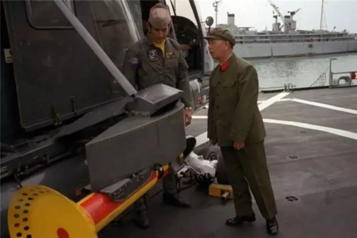

# 瓦格良号航母概览

* 为何要买？对中国有多大帮助
  * 建造航母：
    * 世界最高水平如果算：博士
    * 那瓦格良算：硕士
    * 我们：最多算小学
  * 结论：即使完成度只有68%的瓦格良，也够中国学好一阵子的
    * 能为中国节省研发经费（以亿为单位）和时间（算几十年），帮助巨大
* 希腊为何帮中国？
  * 敌人的敌人是朋友
    * 希望和土耳其是世仇，仇敌
      * 只要是让土耳其不爽的事情，希腊都愿意干
* 土耳其勒索中国的10亿美金，中国给了吗？
  * 问题本身错了：土耳其勒索中国的钱，不是10亿美金，而是10亿美金是保证金，最后还会还给中国，但是期间长达两年，中间勒索我们的钱是保管费，要2000万美金
    * 注：买个瓦格良号航母才2000万美金
  * 最后：这笔保证金（和真正勒索的保管费2000万美金）没给
    * 中国自己努力，加希腊帮忙，免去了保证金和保管费
* 据说是：“瓦良格”来中国的故事，被渲染成：一位港商，买了此舰，捐给国家。这港商也因此戴上了政治的花环
  * 其实：是受命于国家军方的任务去买，是国家掏钱，不是他掏钱。并且购买期间想要挪用买航母的专款于它用，差点得逞。最后被邵淳及时发现和采取措施才保障了买航母的钱的安全。
* 瓦格良号航母值多少钱？值2000万美元吗？
  * 非常值
    * 海军副司令员的贺鹏飞，是“瓦良格”来中国的直接推手
    * 他曾三次亲赴乌克兰，认真考察“瓦良格”。
    * 他对“瓦良格”非常了解，他认为，“瓦良格”上的四台主机，每台就值2000万美元
  * 关于价格
    * 最早1995年5月，乌克兰想卖时：公开场合出价2亿美元
      * 私下告诉去考察的中国人（黄平涛）：如果你们真想买，2000万美元就可以成交
* 瓦格良号航母
  * 原名：“里加”号
    * 里加：苏联拉脱维亚加盟共和国首府的名字
  * 1985年12月：开始建造
  * 1988年11月25日：下水
  * 1990年7月：改名为“瓦良格”号
    * 改名原因：拉脱维亚政局的动荡
    * 瓦良格
      * 以纪念1904年日俄战争中在仁川海域被日舰击沉的“瓦良格”号巡洋舰
  * 截至1991年11月，“瓦良格”的建造率已达68%
    * 舰上机炉舱已安装完毕，电站隔舱接受供电，舰上机械设备也开始试运转
  * 主要技术参数
    * 主尺寸：舰长302米(全长)、270米(水线)、水线处宽35.4米、吃水10.5米
    * 飞行甲板：长300米、宽70米
    * 机 库：长152米、宽26米、高7米
    * 排水量：43000吨(标准) 、55000吨(满载)
    * 动 力：8座КВГ－4型涡轮增压垂直水管自然循环蒸汽锅炉、4台TV12－4型蒸汽轮机、 4轴 200000马力
    * 辅 机：9座1500千瓦蒸汽轮机发电机组、6座1500千瓦柴油发电机组
    * 最大航速：29节
    * 续航力：8500海里/18节、3800海里/29节
    * 舰 员：1960名舰员 + 626名航空人员 + 40名旗舰指挥人员
* 相关人物和单位
  * 海军
    * 司令员的：刘华清 将军
      * （已故将军的）航母梦
        * 刘华清生前对国家应当建造航母的两次论证，把“瓦良格”、“辽宁舰”的出现，推到了一个战略的位置上
        * 之前去美国参观航母
          * 
    * 副司令员：贺鹏飞
      * 注：贺龙之子
      * 瓦良格来中国的直接推手
    * 装备技术部部长：郑明
  * 大连造船厂
    * 原军工副厂长：唐士源
      * 最大愿望：为国家建造航母
  * （国企）华夏证券公司
    * 董事长兼总裁：邵淳
      * 促使“瓦良格”来中国的真正的践行者
      * 当他决定借给港商上亿元的巨款时，他知道自己双肩担着道义：一边是国家的重大利益，一边是他会付出的沉重代价
        * 果然，他的壮烈情怀中，从此注入“悲壮”二字，在“以儆效尤”的严惩令下，他被审查，被停职。他负着冤案，看光阴一去十八年！
  * 澳门创律投资有限公司
    * 港商（香港富商）：徐增平
  * 中船重工集团公司 = 中国船舶工业总公司
    * （原）总工=军工局局长：胡基政
      * 最大愿望：造航母
    * （副）总经理：黄平涛
      * 瓦良格归航工程的第一个承担者
  * 国防科工委办公厅
    * 主任：马鸿琳
      * 瓦格良归航工程前方领导小组牵头人
  * 交通部救捞局
    * 局长：宋家慧
