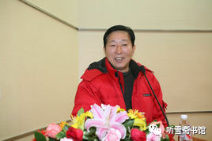

# 相关人物

“瓦良格”号航母来中国的一些重要人物

## 一、购买航母阶段（前期：1992年至1995年；后期：1996年5月至2000年3月）

### 1、早期策划主要领导人（均为时任职务）

* **刘华清**（中央军委副主席），从1992年开始，多次指示有关人员到乌克兰考察“瓦良格”号航母，并指示海军于1995年4月14日召开以引进“瓦良格”为主题的航母预研工作研讨会。
  * 图
    * 
    * 

* **张连忠**（海军司令员），1995年5月，签署海军呈报中共中央、国务院、中央军委关于引进“瓦良格”号航母的请示报告，力主建造航母。

### 2、后期策划主要当事人

**贺鹏飞**（海军副司令员），1993年至1995年，多次到乌克兰考察“瓦良格”，力主建造航母。在中央没有批复海军关于引进“瓦良格”请示报告的情况下，得知乌克兰将要以废铁价格处理“瓦良格”，于1996年5月8日提出“请香港大老板买回来”的新思路。

**姬胜德**（总参二部部长），帮助贺鹏飞寻找“香港大老板”。在香港大老板不愿参与此事的情况下，找了一个小老板（徐增平）。

### 3、投标主要当事人

庄立祥（总参二部干部），负责监督、协助投标工作。

徐增平（澳门创律公司董事长），代表中标方交付200万美元订金（有人说这笔订金是总参二部出的）。

### 4、筹款主要当事人

* **邵淳**（华夏证券公司董事长兼总经理），参与“瓦良格”项目的决策者。
  * 图
    * 

吴宇（海南隆泰源公司董事长），“瓦良格”项目的资金筹措者。

**吴巍**（北京泰信达科技发展有限公司董事长），“瓦良格”项目前期运作合作方董事长。

1998年7月至1998年10月。华夏证券公司一共为“瓦良格”项目出资2.3亿元人民币（约2800万美元）。

### 5、变更股权主要当事人

邵淳，发现徐增平挪用购船款1800万美元后，毅然决定收购徐增平所持澳门创律公司的股权。

吴宇，参与股权谈判，并在第一回合的澳门谈判中给对手造成压力。

吴巍，最先发现徐增平挪用购船款，并向邵淳汇报。接着又参与了股权谈判事宜，是华夏证券公司获得80%股权的主谈者。1999年4月29日，受吴宇委托，代表华夏证券公司与徐增平在澳门大律师楼办理股权转让手续，华夏证券公司持有澳门创律公司80%股权，徐增平持有18%股权，庄立祥持有2%股权。

徐增平，在无法还钱，又想借钱的情况下，以再向华夏证券公司借款1000万港币为条件，同意在49%股份的基础上，再转让31%股份给华夏证券公司。

注：徐增平从此与“瓦良格”项目再无股权以外的关系，即再没有让他参与该项目的运作。

### 6、变更船主主要当事人

邵淳（“瓦良格”项目联合领导小组组长），在把徐增平从“瓦良格”项目“踢”出去之后，华夏证券公司与北京东方汇中公司合作，继续推进“瓦良格”项目。

高增厦（东方汇中公司董事长、联合领导小组并列组长），积极配合华夏证券公司推进“瓦良格”项目。

戴岳（东方汇中公司总经理），受联合领导小组委派，与张勇一起两次到乌克兰黑海造船厂了解澳门创律公司与黑海造船厂的债务情况，与对方谈判。

张勇（香港达程公司总经理），和戴岳一起到黑海造船厂与对方谈判。

1999年10月24日，戴岳和张勇代表澳门创律公司与黑海造船厂签订正式购船协议，获得了船主证等十多份法律文件。从此“瓦良格”的船主变更为华夏证券公司控股的澳门创律公司。

### 7、交给国家时主要当事人

2000年3月，“瓦良格”项目发生一个“意外事件”，邵淳给中央首长写信汇报情况，国家决定从华夏证券公司收回“瓦良格”项目的处置权，交给中船重工集团公司操作。

注：把“瓦良格”交给国家的不是徐增平，是邵淳。吴巍、张勇协助邵淳到深圳了解事件情况。戴岳为重要当事人。

## 二、拖带航母阶段（2000年3月至2002年3月）

### 1、策划指挥人员

王忠禹（国务院秘书长），多次主持召开由国务院8个部委领导参加的“瓦良格”项目专题会议，多次批示与“瓦良格”项目有关的文件。

马凯（国务院副秘书长），多次主持召开由国务院8个部委领导参加的“瓦良格”项目专题会议。

尤权（国务院副秘书长），多次主持召开由国务院8个部委领导参加的“瓦良格”项目专题会议。

刘积斌（国防科工委主任），领导中船重工集团公司“瓦良格”项目的有关工作。

黄平涛（中船重工集团公司总经理），直接领导中船重工集团公司与“瓦良格”项目有关的工作。

邵淳、吴巍、张勇、戴岳。

参与单位还有外交部、公安部、国家安全部、财政部、海关总署等8个部委。

### 2、办理拖带航母人员（2000年4月3日至6月14日）

胡基政（中船重工集团公司总工兼军工部主任），直接领导“瓦良格”项目，并到乌克兰与乌方签订有关协议。

牟安成（中船重工集团公司军工部副主任），现场指挥“瓦良格”项目，几次到乌克兰和土耳其与对方洽谈有关事宜。

唐士源（大连造船厂副厂长），现场指挥“瓦良格”项目，在乌克兰工作时间长达两个月。

### 3、办理过海峡人员（2000年6月17日至2001年11月1日）

洪善祥（交通部副部长），多次到达土耳其，时间长达两个月。是到前线的国家机关职务最高的领导人。

马鸿琳（国防科工委办公厅主任），“瓦良格”过海峡任务领导小组组长，长时间在土耳其领导“瓦良格”项目工作人员开展工作。

宋家慧（交通部打捞局局长），多次到达土耳其，领导该系统多人开展工作。

胡基政、牟安成、唐士源，长时间在土耳其参与“瓦良格”过海峡工作。

在土耳其办理“瓦良格”过海峡事宜，人数最多时达40余人。

---

## 概述

综上所述，“瓦良格”项目是一个由很多部门和人员参与的重大国家行动，中央常委都有批示，各级领导批示达100多次，国务院办公厅领导批示70余次，国务院开会30余次。国家为一个项目如此重视，前所未有。

项目前期有中央军委副主席**刘华清**和多名海军高级将领策划，后期有“国家队”担纲，号称“辽宁舰第一功臣”的徐增平，只是在别人编好的电视剧第一集里面出演了参加投标和筹款两场戏，然后就屡屡犯错，甚至“搅局”，被“剧组”大股东赶走了。其他的戏份都是别人出演的。
